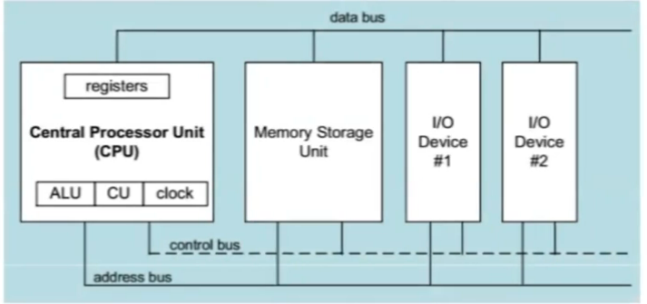
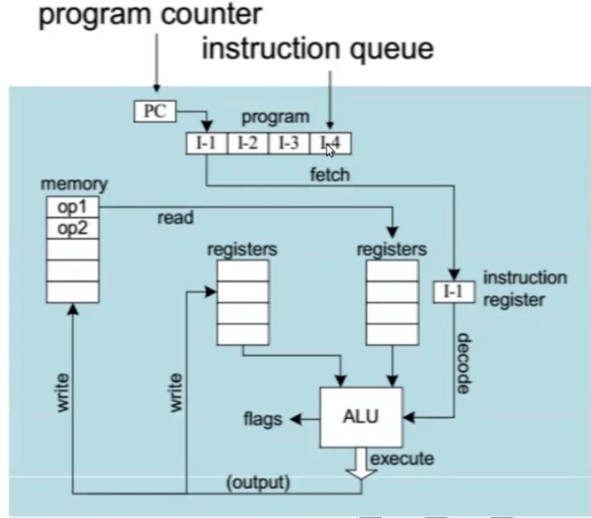

# Elastic Cloud Compute (EC2)

[AWS Doc on EC2](https://docs.aws.amazon.com/AWSEC2/latest/UserGuide/concepts.html)

## CPU Refresher

* A microcomputer has a CPU, Memory, I/O devices and business
* The clock synchronizes all CPU operations
* Control Unit (CU) coordinates the sequence of execution steps
* ALU perform the arithmetic and logic operations
* Memory storage holds the application code and data the program uses
* Buses transfer data, address information and control signals.

### The Clock
* synchronizes all CPU and BUS operations
* machine (clock) cycle measures time of a single operation
* clock is used to trigger events
* Basic unit of time, 1 GHz -> clock cycle = 1 ns
* An instruction could take multiple cycles to complete, e.g. multiply in 8088 processor takes 50cycles.

### CPU's job

* Fetch
* Decode
* Fetch operands
* Execute
* Store output

Number of vCPUs = Core count * Threads per core