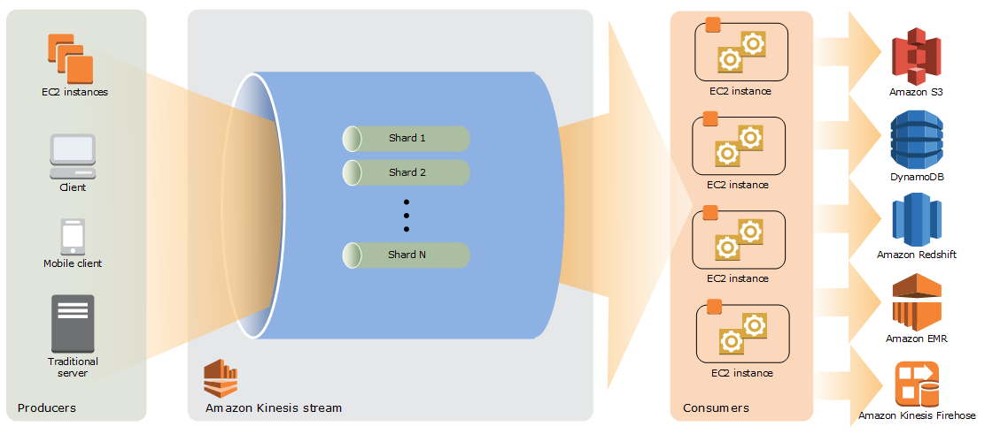

# AWS Kinesis

## Data Streams

### High-Level Architecture
The following diagram illustrates the high-level architecture of Kinesis Data Streams. The producers continually push data to Kinesis Data Streams, and the consumers process the data in real time. Consumers (such as a custom application running on Amazon EC2 or an Amazon Kinesis Data Firehose delivery stream) can store their results using an AWS service such as Amazon DynamoDB, Amazon Redshift, or Amazon S3.



### Shard
A shard is a uniquely identified sequence of data records in a stream. A stream is composed of one or more shards, each of which provides a fixed unit of capacity. Each shard can support up to 5 transactions per second for reads, up to a maximum total data read rate of 2 MB per second and up to 1,000 records per second for writes, up to a maximum total data write rate of 1 MB per second (including partition keys). The data capacity of your stream is a function of the number of shards that you specify for the stream. The total capacity of the stream is the sum of the capacities of its shards.

If your data rate increases, you can increase or decrease the number of shards allocated to your stream. **Quota on this shard is 500 shard per AWS account**.

### Kinesis Data Stream
A Kinesis data stream is a set of shards. Each shard has a sequence of data records. Each data record has a sequence number that is assigned by Kinesis Data Streams.

### Data Record
A data record is the unit of data stored in a Kinesis data stream. Data records are composed of a sequence number, a partition key, and a data blob, which is an immutable sequence of bytes. Kinesis Data Streams does not inspect, interpret, or change the data in the blob in any way. A data blob can be up to 1 MB.

### Capacity Mode
A data stream capacity mode determines how capacity is managed and how you are charged for the usage of your data stream. Currently, in Kinesis Data Streams, you can choose between an on-demand mode and a provisioned mode for your data streams. For more information, see Choosing the Data Stream Capacity Mode.

With the on-demand mode, Kinesis Data Streams automatically manages the shards in order to provide the necessary throughput. You are charged only for the actual throughput that you use and Kinesis Data Streams automatically accommodates your workloads’ throughput needs as they ramp up or down. For more information, see On-demand Mode.

With the provisioned mode, you must specify the number of shards for the data stream. The total capacity of a data stream is the sum of the capacities of its shards. You can increase or decrease the number of shards in a data stream as needed, and you are charged for the number of shards at an hourly rate. For more information, see Provisioned Mode.

### Retention Period
The retention period is the length of time that data records are accessible after they are added to the stream. A stream’s retention period is set to a default of 24 hours after creation. You can increase the retention period up to 8760 hours (365 days) using the IncreaseStreamRetentionPeriod operation, and decrease the retention period down to a minimum of 24 hours using the DecreaseStreamRetentionPeriod operation. Additional charges apply for streams with a retention period set to more than 24 hours.

### Producer
Producers put records into Amazon Kinesis Data Streams. For example, a web server sending log data to a stream is a producer.

### Consumer
Consumers get records from Amazon Kinesis Data Streams and process them. These consumers are known as Amazon Kinesis Data Streams Application.

### Amazon Kinesis Data Streams Application
An Amazon Kinesis Data Streams application is a consumer of a stream that commonly runs on a fleet of EC2 instances.
There are two types of consumers that you can develop: shared fan-out consumers and enhanced fan-out consumers. To learn about the differences between them, and to see how you can create each type of consumer, see Reading Data from Amazon Kinesis Data Streams.
The output of a Kinesis Data Streams application can be input for another stream, enabling you to create complex topologies that process data in real time. An application can also send data to a variety of other AWS services. There can be multiple applications for one stream, and each application can consume data from the stream independently and concurrently.

### Partition Key
A partition key is used to group data by shard within a stream. Kinesis Data Streams segregates the data records belonging to a stream into multiple shards. It uses the partition key that is associated with each data record to determine which shard a given data record belongs to. Partition keys are Unicode strings, with a maximum length limit of 256 characters for each key. An MD5 hash function is used to map partition keys to 128-bit integer values and to map associated data records to shards using the hash key ranges of the shards. When an application puts data into a stream, it must specify a partition key.

### Sequence Number
Each data record has a sequence number that is unique per partition-key within its shard. Kinesis Data Streams assigns the sequence number after you write to the stream with ```client.putRecords``` or ```client.putRecord```. Sequence numbers for the same partition key generally increase over time. The longer the time period between write requests, the larger the sequence numbers become.

> Sequence numbers cannot be used as indexes to "sets" of data within the same stream. To logically separate sets of data, use partition keys or create a separate stream for each dataset.

### Kinesis Client Library
The Kinesis Client Library is compiled into your application to enable fault-tolerant consumption of data from the stream. The Kinesis Client Library ensures that for every shard there is a record processor running and processing that shard. The library also simplifies reading data from the stream. The Kinesis Client Library uses an Amazon DynamoDB table to store control data. It creates one table per application that is processing data.

There are two major versions of the Kinesis Client Library. Which one you use depends on the type of consumer you want to create. For more information, see Reading Data from Amazon Kinesis Data Streams.

### Application Name
The name of an Amazon Kinesis Data Streams application identifies the application. Each of your applications must have a unique name that is scoped to the AWS account and Region used by the application. This name is used as a name for the control table in Amazon DynamoDB and the namespace for Amazon CloudWatch metrics.

### Server-Side Encryption
Amazon Kinesis Data Streams can automatically encrypt sensitive data as a producer enters it into a stream. Kinesis Data Streams uses AWS KMS master keys for encryption.

## Kinesis Firehose (Delivery Stream)
It can read from Kinesis as source. It can then
* Run transformation on source records with AWS lambda
* Convert json into parquet or orc using a schema from a table defined in AWS Glue. For records that aren't in JSON format, we would need to create a Lambda function which converts them into JSON similar to above 
It then put it back in another (or same) destination (currently supported are S3, Redshift, ElasticSearch Service or Splunk).

We need to specify buffer size (upto 128MB) and buffer interval (from 60sec to 900sec), compression(GZip, Snappy or Zip), encryption, error logging to CloudWatch, IAM role, etc.

https://docs.aws.amazon.com/streams/latest/dev/introduction.html

## Kinesis Data Analysis
* Interact with both Kinesis Data Streams and Kinesis Firehose
* Useful to process and analyze streaming data with Standard SQL and enable sql execution against streaming sources (and using Flink)
* Supports ingest data and writing data to/from Amazon Kinesis stream and kinesis firehose streaming sources
* Result persistence using destination, most 
* The source and kinesis analytics application must be SQL supported code based.

### Use cases
* Generate time series analytics
* Feed real time dashboard
* Creation of real time metrics
* Analyzing Game data

