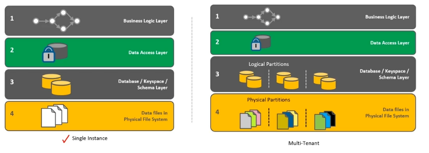

# Data Architecture and Serverless Approach

## Data Architecture

* Applications on the cloud can be classified as single tenant or multi tenant. While single tenant applications have a natural partition of data from one customer to another; multi tenant applications require a deeper architectural consideration.

* The application on the cloud needs to consider various country specific regulations that restrict data movements beyond the physical boundaries of that country. This is an important aspect to consider for applications which may have an impact to the deployment model or even the overall ROI.
* Applications that consume data from external sources need to consider appropriate security and customer partitioning handshake protocols.
* Logical partition - the onus is on developer. The data can be co-located.
* Physical partition - data is on different disks. Database can be sharded.

## Serverless approach
* Running code in the code without provisioning or managing any server
* Automatically scales application based on the trigger/call to the application by the client
* No need to pay anything when code is not running
* Examples
  * AWS Lambda functions
  * Google cloud functions

These should be short running process.

## Other components which make our application

### Define application zones
* Various components of application tiers require different attention
  * Choice of programming language
  * Choice of hardware
  * Specialized libraries
  * Scaling requirements
  * Backup and recovery mechanisms
  * Monitoring requirements
* Can "One shoe fit all?" How do we ensure "availability of customer facing services?"
* Application zones are an effective way to isolate different areas of the application and provide an environment that is optimized and tuned for that function
  * Distributed data layer
  * Microservice layer
  * Analytics layer
  * Online web application layer