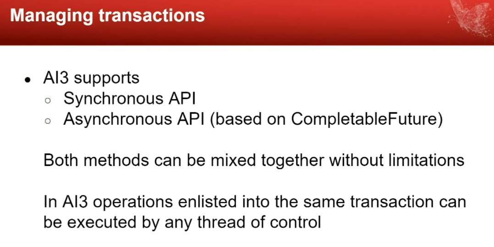
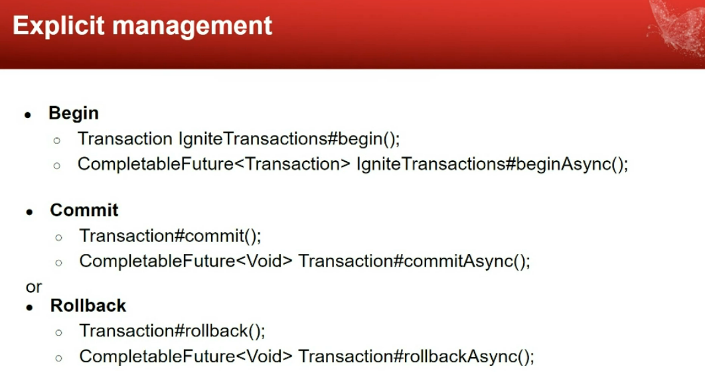
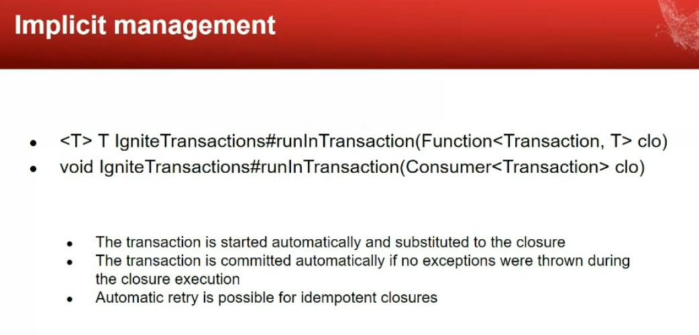
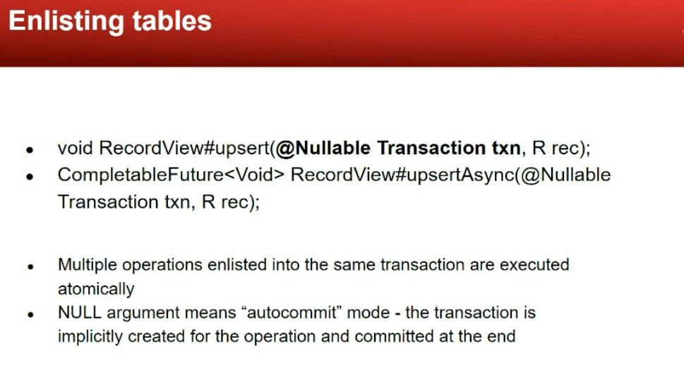

# Community Gathering - 16 Feb 2022

## 2.12 update
[Source](https://ignite.apache.org/releases/2.12.0/release_notes.html)
**Cluster snapshots** includes encrypted caches.
$ control.sh --snapshot create SNP1
$ control.sh --snapshot restore SNP1
    Automatic rebalance while start

Manual Snapshot Restore Process.
https://ignite.apache.org/docs/2.12.0/snapshots/snapshots.html

**Change Data Capture**
Useful for Async replication, post-audit, stream of changes/events, statics

DataStorageConfiguration {
    boolean cdcEnabled;
    String cdcWallPath;
    long wallForceArchitectTimeout
}

Ignite-to-Ignite and Ignite-to-Kafka

**C++ Java Compute Support**
**C++ Affinity Colocation** GetAffinityFieldName
**Index Query API** Goal is provide an opportunity to query tree indexes declared with QueryEntity. Currently, suitable for simple select query, if SQL is not application.
**Destroy Caches**
**Kubernetes discovery multiple grids**
KubernetesConnectionConfiguration {
    setDiscoveryPort(int port);
}

## Ignite 3, Alpha4: The Next Milestone
Valentin Kulichenko, Apache Ignite PMC
https://ignite.apache.org/docs/3.0.0-alpha/
https://github.com/apache/ignite-3/tree/ignite-3.0.0-alpha4

Architectural changes, Usability

### Alpha 4 Major Features

**POJO Mappings for table views**
Schema first
Tuple-s can be automatically mapped to POJO classes
Reflect

**Data Definition Language**
SQL based

**Transactions**
Brand new transactional API and protocol
Fully asynchronous
Based on CompletableFuture
Transactions are not coupled with threads

* Apache Calcite in Ignite 3

* Atomicity level after creating cache - Not yet but can be done.
* is it recommended to enable cache events listener n PROD, if yes is there a way to enable cache events listener for specific cache ONLY IF YOU KNEW

* ignite.apache.org/our-community.html#faq
* Calcite for SQL processing and RockDB for storage
* https://github.com/apache/calcite
* http://rocksdb.org/
* Is it recommended to use List as cache value type How long that list can grow

https://ignite-summit.org/

[Evgenia Gromova](egromova@gridgain.com)