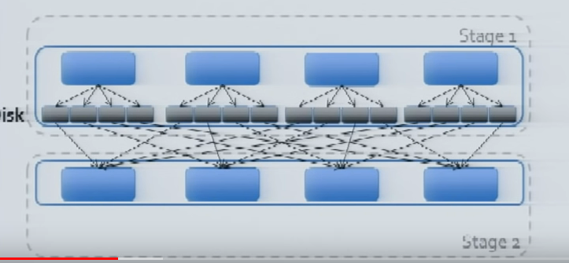

# A deeper Understanding of Spark Internals
**Dec 21, 2021** Learning from [YouTube](https://www.youtube.com/watch?v=dmL0N3qfSc8)

> A talk by Aaron Davidson, Databricks
> Goal: Understanding how Spark runs, focus on performance.
> Three core components: Execution Model, The Shuffle, Caching
> This discussion will skip caching

> Please note that this reflects **Spark version 1.1**

Sample code which will be used to run with the details of this discussion

```scala
sc.textfile("hdfs:/names")
    .map(name -> (name.charAt(0), name))
    .groupByKey()
    .mapValues(names -> names.toSet.size)
    .collect()
```

## Spark Execution Model
1. Create DAG of RDDs [Partitioned Dataset] to represent computation
2. Create logical execution plan for DAG
    * Pipeline as much as possible
    * Split into **stages** based on need to reorganize data
3. Take this logical plan and schedule so, individual tasks are executed.
    * Split each stage into tasks
    * A task (is a scala closure) is data + computation
    * Execute all tasks within a stage before moving on

## Shuffle
1. Redistributes data among partitions (same number of tasks post shuffle by default). Please note that shuffle is actually pull based, not pushed based. We write the intermediate file to disk.
2. Hash keys into bucket


Note here- each task of previous stage, stage 1, write in 4 files in disk using hash keys. Then task 1 reads from 1st partition from each previous task's output, task 2 reads from 2nd file and so in. Now for execution of a groupBy(), the program builds hash map with each partition. Please note that this can spill across keys, but a single key-value pair must fit in memory.

**Optimizations**
    * Avoided when possible, if data is already properly partitioned
    * Partial aggregation (called map side combine) when possible reduces data movement

## Common issue checklist
1. Ensure enough partition for concurrency. If you have 20 cores, have at least 20 partitions.
2. Minimize memory consumption (esp. of sorting and large keys in groupBys)
3. Minimize amount of data shuffled
4. Know the standard library

1 and 2 are about tuning the number of partititions. So, lets talk a little bit more about it.

### Importance of Partition Tuning
1. Main issue: too few partitions
    - Less concurrency
    - More susceptible to data skew. You might have one task that is taking most of your time.
    - Increased memory pressure for groupBy, reduceByKey, sortByKey, etc.

2. Secondary issue: too many partitions. It took more time to schedule the task than to actually complete it.
3. Need "reasonable number" of partition
    - Commonly between 100 and 10,000 partitions
    - Lower bound: At least ~2x number of cores in cluster
    - Upper bound: Ensure tasks take at least 100ms to complete

### Memory Problems
Almost all spark operators are able to spill to disk. Spark makes an assumption that it owns most of the memory. By default the number is 90%. So, what are the 
1. Symptions
    * Inexplicably bad performance
    * Inexplicable executor/machine failures (can indicate too many shuffle files too)
2. Diagnosis
    * Set spark.executor.extrJavaOptions to include
      - XX: +PrintGCDetails
      - XX: +HeapDumpOnOutOfMemoryError
    * Check ```dmesg``` for oom-killer logs
3. Resolution
    * Increase spark.executor.memory
    * Increase number of partitions
    * Re-evaluate program structure (!)

Qns: What is the shuffle.memory.fraction and does spark always write to disk?
Ans: shuffle.memory.fraction by default is 20% of total memory. This is not only used for shuffle but build the in-memory map on the reduce side. Once it hits 20% of the memory while doing so, it is willing to spill to the disk.

## Fixed code

```scala
sc.textfile("hdfs:/names")
    .distinct(numPartitions = 6)
    .map(name -> (name.charAt(0), 1))
    .reduceByKey(_ + _)
    .collect()
```


Qns: How can we optimize memory footprint of the RDDs?
Ans: Deserialized data in memory is much larger than you expect. If you have to cache a lot of data, do so in a serialized data off heap in something like tachyon. This can be much more compressed using ```rdd.compressed```?? something.

Qns: How can you come up with a good number of reducers and how can you assign them?
Ans: Number of reducers by default is number of mappers. It is then randamly distributed for assignment.