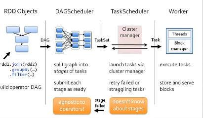

# Introduction to AmpLab Spark Internals
**Dec 21, 2012** Learning from [YouTube](https://www.youtube.com/watch?v=49Hr5xZyTEA)

> This is very old video. At this time, Spark was in its very native stage. UC Berkeley's AmpLab created spark for internal project. It is a good read to understand the initial thoughts behind Spark and how it has really grown. If you notice, there were no Yarn or Kubernetes - just Mesos and standalone !!!

## Concept of RDD
A Resilient Distributed Dataset (RDD), the basic abstraction in Spark. Represents an immutable, partitioned collection of elements that can be operated on in parallel. 

RDD itself is an abstract class with implementation as HadoopRDD (RDD which knows its path in HDFS) or FilteredRDD(RDD which is output of a filter function that we gave it and knows if it should be cached or not). We understand the dataset in terms of partitions - think of these as blocks in your file. So, the system understands the dependencies for each partition. The task, attached to each partition would try to pipeline as much data processing it can within each partition.

### Data Locality - 
First run: data not in cache, so use HadoopRDD's locality preferences (from HDFS)
Second Run: FilteredRDD is in cache, so use its locations. If something falls out of cache, go back to HDFS.

## Scheduling Process



When an action is called, it gets submitted to DAGScheduler. 
DAGScheduler builds ups the graph at the partition level, which knows the dependencies at the partition level. It is then split the graph into stages of tasks (reduce task) - it would then submit each stage as ready. It does not anything about any Spark operator.
The stage is called TaskScheduler. Its job is to run task on cluster. Its job is simple - take the task which it gets, finish and update the DAGScheduler when done. It does not care about stages (what comes before or after). Boundary of the stage is the shuffle - basically complete all the map tasks and then go for shuffle - this is where new stage would be called. Task scheduler uses cluster manager to allocate these task on a worker. It does not know any dependency between stages. Whenever we ship the task, we ship the RDD too, and then we call ```compute()``` on them. Things that you do not want to ship like sparkcontext, etc. and hence are marked ```@transient```. The way tasks are shipped is via Scala closure objects which are Java object pointer to these shipped objects.
Work is nothing but a number of threads that can run a task and cache RDD within a Block manager.

## RDD Abstraction
Goal: Wanted to support wide array of operators and let users compose them arbitrarily. Don't want to modify schedule for each one. _How to capture dependencies generally?_
This is where RDD Interface came into play. Each RDD is characterized by five main properties:
- A list of splits (partitions)
- A function for computing each split given parents
- A list of dependencies on other RDDs (parent RDD)
- Optionally, a Partitioner for key-value RDDs (e.g. to say that the RDD is hash-partitioned)
- Optionally, a list of preferred locations to compute each split on (e.g. block locations for HDFS)

All the scheduling and execution in Spark is done based on these methods, allowing each RDD to implement its own way of computing itself.

This class also contains transformation methods available on all RDDs (e.g. map and filter). In addition, PairRDDFunctions contains extra methods available on RDDs of key-value pairs, and SequenceFileRDDFunctions contains extra methods for saving RDDs to Hadoop SequenceFiles.

**See some implementations** HadoopRDD, FilteredRDD, JoinedRDD

## Dependency Types
Two dependencies 
- Narrow where data can be piped. which are like 1:1 (map, filter, union) or n:1 join with inputs co-partitioned. 
- Wide (shuffle). groupByKey or join with inputs not co-partitioned.

## DAGScheduler
Interface: receives a "target" RDD, a function to run on each partition, and a listener for results.
Roles:
- Build stages for Task objects (code + preferred loc)
- Submit them to TaskScheduler as ready
- Resubmit failed stages if outputs are lost.

### Scheduler Optimizations
Pipelines narrow ops within a stage
Picks join algorithms based on partitioning (minimize shuffle)
Reuses previously cached data

## Task Details
Stage boundaries are only at input RDDs or "shuffle" operations. So each task look like this:

Note: we write shuffle outputs to RAM/disk to allow retries. 

> It is worth noting if your code is not buggy, the only way the task will fail is if you have somehow lost input RDDs. Task is one CPU core in the cluster.

> We use LRU strategy for eviction. We estimate using ```SizeEstimator``` the sizes of the object. If there is pressure of memory, we need to figure out which ones to push. data is saved in array of bytes in memory.

## Worker
Implemented by the Executor Class
Receives self-contained Task objects and calls run() on them in a thread pool
Reports results or exceptions to master. FetchedFailedException for shuffle is a special case.
Pluggable ExecutorBackend for cluster.

## BlockManager
- "Write-once" key-value store on each worker
- Serves shuffle data as well as cached RDDs
- Tracks a StorageLevel for each block (e.g. disk, RAM)
- Can drop data to disk if running low on RAM
- Can replicate data across nodes

## CommunicationManager
- Asynchronous IO based networking library
- Allows fetching blocks from BlockManagers
- Allows prioritization / chunking across connections (would be nice to make this pluggable!)
- Fetch logic tries to optimize for block sizes

## MapOutputTracker
- Tracks where each "map" task in a shuffle ran
- Tells reduce tasks the map locations
- Each worker caches the locations to avoid refetching
- A "generation ID" passed with each Task allows invalidating the cache when map outputs are lost

## Performance sensitive
> Shuffle
> Sort
> Chaining of iterators 

## Spark Streaming
It just periodic submitting new jobs to the scheduler with a time window and it keeps the data in cache using caching implementation in node in between with some sugar coating.

## Approximate Evaluator
