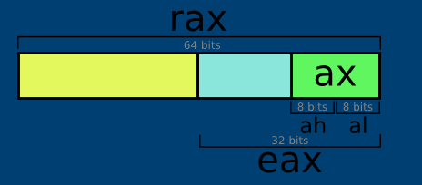
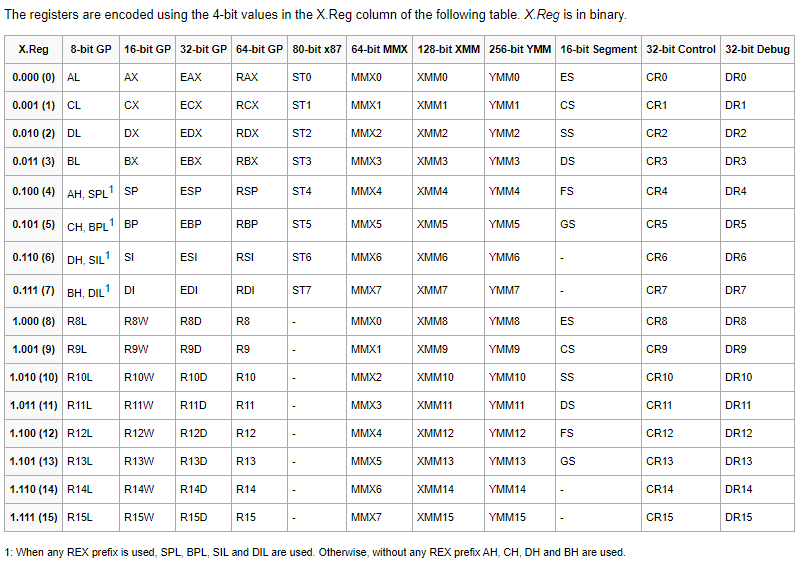

# x86_64 Linux Assembly

## Pre-requisites
* To know your if you have x86_64 processor (64bit processor) Linux architecture, you should find x86_64 GNU/Linux using ```uname -a```
* We need nasm (netwide assembler). ``sudo apt-get install nasm``

## Key concepts

### Registers
Registers are a part of the processor that temporarily holds memory. In the x86_64 architecture, registers hold 64 bits. This means, each register can hold values ```uint from 0 to 18,446,744,073,709,551,616 or signed from -9,223,372,036,854,775,808 to 9,223,372,036,854,775,807```



If you note, that eax register is half the rax register. In x86_64 bit architecture, al register acts on lower 8bits of rax register.



### System call
A system call, or a syscall, is when a program requests a service from the kernel. System calls will differ by operating system because different operating systems use different kernels. Each syscall has an ID associated with them (a number). Syscall also take arguments (meaning, a list of inputs)

| Argument | Registers |
|----------|-----------|
| ID       | rax       |
| 1        | rdi       |
| 2        | rsi       |
| 3        | rdx       |
| 4        | r10       |
| 5        | r8        |
| 6        | r9        |


```shell
; File-name: Hello
section .data
    text db "Hello World!", 10 ; "db" stands for "define bytes". It essentially means that we are going to define some raw bytes of data into our code. 10 is the new line. chr(10) will give you \n. "text" is the name assigned to the address in memory that this data is located in. Whenever we use "text" later in the code, when the code is compiled, the compiler will determine the actual location in memory of this data and replace all furture instances of "text" with that memory address.
    
section .text
    global _start
    
_start:
    mov rax, 1
    mov rdi, 1
    mov rsi, text
    mov rdx, 14
    syscall
    
    mov rax, 60
    mov rdi, 0
    syscall
```

```shell
$ nasm -f elf64 -o hello.o hello.asm
$ ld hello.o -o hello
```

## Profiling tools
