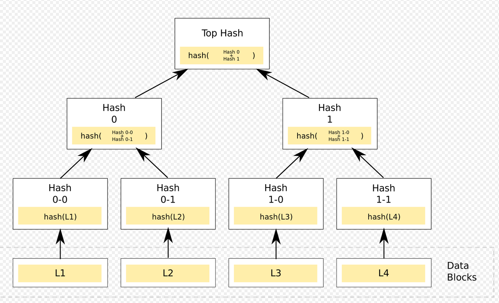

# Bitcoin and Smart Contract

Bitcoin is a cryptocurrency, or digital asset, which eliminates the need for a third party to be involved in financial transactions by action as money and a means of payment independent of any person, group, or entity.

> The world's first cryptocurrency city, a circular metropolis fueled by a volcano, was intended to be developed in this region, but it is still covered in dense jungle one year after El Salvador has made Bitcoin legal tender.

Model: Byzantine Failure assumed.
Network: Peer-2-Peer

If a new node wants to join the network, it needs to create a bitcoin wallet. A Bitcoin wallet is a digit crypto wallet that can hold Bitcoin, allowing you to send and receive Bitcoin. It is a secure means to sell, buy, trade, or use cryptocurrencies. A bitcoin wallet has a private and public key pair, with private key known to the node itself and public key known to all the nodes in the network. This wallet has an address as well, which can be used to transact.

We can have multi-party wallet as well, wherein more than one node will have the same wallet address. 

> If you lose your private key for your wallet, you will lose all the Bitcoins in the wallet.

## Bitcoin Transaction
It is bitcoin transfer from one wallet to the other. The transaction requires:
* Input address: public key of the wallet from which you are initiate the transaction (sender)
* Amount: Amount of the Bitcoin
* Output address: public key of the wallet to which you are transacting (receiver)

This whole transaction is submitted to the network, encrypted by the private key of the sender. This transaction is currently in pending transaction list (or mempool). This transaction will then be validated against the bitcoin available with the sender - this information will be available in the immutable bitcoin ledger. Unless this transaction is not mined and added to blockchain, it is not treated as confirmed. Once mined and sufficient confirmations received, it is then treated as confirmed.

> The process of converting information into a secret code that conceals its true meaning is known as encryption.

Bitcoin uses PoW, uses 1MB block size limit.

Miner gets rewards. transaction carries with itself a transaction fee. All the transaction fees which are part of the block will be awarded to the miner - this is additional incentive for the minor to keep adding new blocks in the chain.

It takes about 10 mins to add a block on the blockchain.
Average transaction size - 250bytes.
Average throughput - 5-6 transactions/sec

## Merkle tree
As blockchain increases, it would get large enough to propagate across millions of nodes in the network and storage will become a problem as well. To handle this situation, merkle tree is used. The Merkle tree, commonly referred to as the hash tree, is a type of data structure used mostly for data synchronization and verification. Merkle tree is named after Ralph Merkle, who patented the idea in 1979.

Any change in the transaction will result in change in merkle root. So, a merkle root is a representation of entire chain. Now, instead of saving all the transaction, someone can save the merkle root.

If you noted, block has merkle root, previous block's hash, nounce and block hash. This ensures that block size is small, but fully representative of all the transactions and hence easier to verify. This reduces the storage requirement signification.

> The IPFS, Btrfs, and ZFS file systems all use merkle trees.

## Issues with Bitcoin Blockchain

1. PoW is energy consuming consensus protocol. This could put survival of Bitcoin blockchain at stake. There are alternate consensus coming up - PoS and Proof of inn???, which can be tested at scale using Cloud K8S engines.
2. Possible attacks in Blockchain - 51% attack and Block withholding attack. Block withholding attack can use the longest chain.

> In the blockchain ecosystem, a consensus protocol is a set of guidelines or rules that control how two or more nodes communicate, share data, and carry out related tasks.

## Smart Contract

In a smart contract, the conditions of the agreement between the buyer and seller are directly encoded into the lines of code, making it a self-executing contract. This came in existence with Ethereum and changed the way interested parties transact with each other. Ethereum is a decentralised blockchain platform that creates a peer-to-peer network for safely executing and validating smart contract application code.

### Traditional Contract
* Specific rules and promises that are agreed upon by two or more parties
* Primarily written and examined by legal professionals
* Enforcement depends on a 3rd party - Govt, Financial institution, etc.
* Ambiguities and disputes resolved by a 3rd party (which are centralised) - Judicial system, Govt, etc.
* Manually executed based on predefined conditions or output
* Issues:
  * High legal costs
  * Dependency on both sides to honour the contract at delivery
  * Trust in a third party to enforce the contract and to hold value (escrow)
  * Ambiguity in contract stipulations, which are written in a natural language
  * Expensive reparation mechanism via the relevant judicial system

### Smart Contracts on Blockchain
* Agreement between the buyer and seller with details specified as code
* Auto-executing based on predefined conditions or triggers. By using blockchain trigger, individuals who desire to invoke a smart contract may no longer face prohibitively high entry hurdles.
* Contract code irreversibly stored on the decentralized blockchain
* No need for a trusted third party, enforcement mechanism, or external reparation system
* Multi-steps contracts with auto-triggers possible
* Benefits
  * Lower creation cost
  * Automatically honoured based on pre-committed currency and delivery validation semantics
  * No external trusted source needed, parties can also be anonymous to each other
  * No ambiguity as conditions are specified in computer code
  * No need for escrow or a reparation mechanism
  * Immediate execution and closure, reduces delays
  * Irreversible, traceable, tamper-proof and transparent
  * Underlying blockchain security makes it practically impossible to alter

> The market of smart contracts is anticipated to develop at a 32% CAGR during the next few years, reaching $300 million by the end of 2023.

### Smart Contact Details
* Collection of code (functions) and data (state)
* A type of account on the blockchain with specific address(es). Please note that everything that happens in a blockchain is a transaction. Everything including smart contract has an address and wallet. Smart contract can act as an escrow between the transacting parties.
* Generally written in special-purpose languages
* Solidity and Vyper on Ethereum, for example
* Deployment and subsequent execution requires transactions fees. Every loop can incur cost - hence code needs to be super efficient. The contract is immutable. Once deployed, it cannot be changed. Each deployment requires a fee or gas.
* Composability - Multiple contracts can act in concert to implement a complex agreement. Example - DAO, decentralised autonomous organization executes a series of tasks using composability without human intervention based on blockchain triggers.
* Uses "oracles" as a bridge to ingest data from outside the chain
  * Examples - Weather data, event results, currency exchange ratios, tamper-proof IoT scanned delivery confirmations
  * Oracles post data on the blockchain thereby making it immutable
  * You can create your own Oracles using your own source of trusted data.
  * [Chainlink](https://chain.link/) as a data source is one such collection of oracles. This has many trigger parameters. 
    * Deviation threshold is when there is a change in value by this threshold, it would send updated value, so you do have stale data.
    * Oracle responses - if it states a minimum of 11, it means it needs minimum 11 numbers of trusted sources before classify this data as trusted data and provide the response for. It would otherwise throw an error.
    * Heartbeat: 
    * It can provide real-time data as well.
  * You can consider Oracle like Data APIs

> Solidity is a high-level, contract-oriented programming language used to construct smart contracts.
> Neo is an open-source, decentralised blockchain network that is operated by a Chinese community.
> Nick Szabo first introduced smart contracts in early 1990s.

### Smart Contract - Current Challenges
* Inability of non-technical people to draft, review, and negotiate smart contracts
  * Replaces a lawyer with a programmer
  * This can be helped with templated documents can be used with parameterized values, for "routine" agreements
* Legal standing
  * Governments and legal institutions are still behind on the understanding and acceptance of smart contracts as legal binding agreements
  * To mitigate, we can use traditional textual agreement as the base and smart code contract as the implementation. However, this increases cost and adds potential ambiguity
* Dependence on oracles
  * Getting off-chain data is crucial for a large section of contracts
  * Introduces trust and reliance on the oracle
  * Oracle or the original data source can be potentially attacked or manipulated. This can be mitigated by implementing higher Oracle responses, wherever possible and required.
* Irreversibility makes bug-fixes much harder

### Examples
* ERC-20 fungible tokens (Heavily used in Ethereum as well)
  * Special currencies on top of a blockchain
  * Distinct from the underlying cryptocurrency
  * Heavily used in ICOs, asset equivalence, IOUs, etc.
* ICOs (Initial coin offerings) - can is 2013 but become very popular in 2017.
  * Crowdfunding providing growth/equity based value
  * Tied to organization's growth
  * Can become a democratized equity model
* NFTs (Non-fungible tokens) ERC-721
  * Represents a unique and non-interchangeable digital asset
  * Proof of ownership or digital right
  * Used in digital art, games/sports, collectibles, music, etc. 
* Building block for distributed apps (dapps) and decentralized autonomous organizations (DAOs)
* Gaining traction in insurance, health, finance, supply chain operations, real estate, and more

> "Colored coins" is one idea for utilising Bitcoin for contract execution and replicated asset registration.
> One kind of smart legal contract is Ricardian contract.
> Belarus become the first nation to legalise smart contacts in 2017 by putting into effect the Decree on Development of Digital Economy

### Simple Demo
* Warning is okay, error is not. It is recommended to remove all warning.
* Test Ethereum can be taken from faucet.
* Write will take gas. Get typically does not incur gas.

## More Learning
* [Bitcoin Transaction Networks](https://www.frontiersin.org/articles/10.3389/fphy.2020.00286/full)
* [Bitcoin Book](https://github.com/bitcoinbook/bitcoinbook/blob/14a25a6fd9e97002c57a46f1fe9faf48cd5d6e46/ch07.asciidoc)
* [Merkle Tree](https://bitcoindev.network/calculating-the-merkle-root-for-a-block/)
* [Smart Contract](https://bitcoindev.network/calculating-the-merkle-root-for-a-block/)
* 