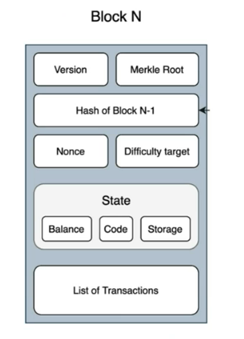

# Blockchain Transaction

## What is a transaction?
* An agreement or communication between a buyer and a seller
* Could be related to transfer of assets or financial entities
* Both the buyer and the seller can verify the transfer
* Financial transactions always include a financial asset - Bonds, money, shares, mortgages etc.
* Bitcoin Blockchain - An effective and distributed way of conducting financial transactions

### Properties of a Transaction
* **A**tomicity: The total number of atoms in a molecule is known as its atomicity. In transaction world, it means to execution all the instructions or none. It is managed by typically by log, which is managed by Transaction Manager.
* **C**oncurrency: The simultaneous execution of several instruction sequences is known as concurrency. In such cases, when both transactions are acting on same entity, there is a possibility of losing one of the changes made by a transaction. We need to ensure that this does not happen and systems always remains in a consistent state. This is where serializability of transactions comes into play - one transaction must complete before the other, even though they are running concurrently. The idea of serializability in a transaction aids in determining which non-serial schedule is appropriate and will preserve database consistency.
* **I**solation: The transaction integrity visibility for other users and systems is governed by isolation. The effect of one transaction does not cause side effect on the other. For example, if transaction 1 is in progress and is change an entity. The other transaction should not be reading this data unless the transaction 1 has committed the change.
* **D**urability: The committed transactions will endure indefinitely.

In a distributed Transaction, multiple parts of the transaction is executed in different parts of the nodes. Here we need to ensure that either all parts of the transactions are committed or none of them to meet atomicity property of the transaction. To ensure atomicity, commit protocols are used. One such protocol is 2-phase commit.

In a 2-phase commit protocol, there is a co-ordinator who initiate a commit protocol along side the participating nodes. In the first phase, co-ordinator initiates the prepare message and the participants have to respond with ready message when they are ready to commit. Post acknowledgement from all, co-ordinator initiates commit message in the 2-phase and participants have to acknowledge after committing the transaction.

2-phase commit is resilient to any failure in 1st phase.
* In case of a node failure, the co-ordinator can decide to send abort transaction post timeout period.
* In case of co-ordinator failure, the nodes can run leader election algorithm (explains how a group of nodes without a leader can communicate with one another to select one of them as leader) post timeout. The transaction begins all over again.

2-phase commit is also resilient to any failure in 2nd phase, but in a slightly different way.
* In case of a node failure, when the failed node comes back in action, it would check and act per co-ordinators decision for the transaction.
* In case of co-ordinator failure, the nodes can run leader election algorithm (explains how a group of nodes without a leader can communicate with one another to select one of them as leader) post timeout. The nodes already have the decision from the previous co-ordinator, which is then used to get to consistent state.

2-phase commit will have problem if -
* One of the participating nodes have failed along with co-ordinator and the other live nodes have not heard from the co-ordinator and the failed node did receive the message from the co-ordinator and acted on it before it failed.

The 2-phase commit protocol is a standardised protocol that ensures that a transaction either commits or aborts at all the resource managers that it accessed. It avoids the undesirable result that the transaction commits at one resource manager and aborts at another.
* Advantage: The information is reliable and always accessible.
* Disadvantage: It is blocking protocol

This protocol is meant for fail-stop failures. Fail-stop failure imitates crash failure where process behavior becomes arbitrary. Implementations of fail-stop behavior helps in detecting which processor has failed. If a system is not able to tolerate fail-stop failure, then it cannot tolerate crash.

> Byzantine Fault Tolerance is a consensus algorithm introduced in the late 90s by Barbara Liskov and Miguel Castro. It is a feature of a distributed network to obtain consensus even when some nodes in the network respond with incorrect information or fail to respond.
> Generally software failures are known as byzantine failures while hardware failures are fail-stop failures.

Solving byzantine failure is slightly tricky and requires trust to be built. This is where Blockchain transactions differ from tradition distributed transactions.


## Main Phases of Blockchain Transaction
Transaction dissemination
Block Generation
Consensus

Blockchain facilitates transaction between trust-less parties and without a commonly trusted party.

## Other properties of Blockchain Transaction

* Provides a probable solution for Two Generals’ problem with the Consensus algorithm
* Facilitates transaction between trustless parties without a commonly trusted third party
* No special node for commit acceptance - Proportionate voting based consensus
* Consensus building takes time - Dependent on propagation and acceptance


Blockchain Network is a P2P network. Peer 2 Peer is a decentralized network communications model consisting of a group of devices (aka nodes) that collectively saves and share files where each node behaves as an individual peer. P2p communication doesn't have a centralized administration or server, hence all nodes have equal power and perform the same tasks.

A client would submit a transaction to the network using his private key. A node having the public key of the client would be able to verify the ownership and content of the transaction. Once the transaction is submitted, it is submitted in the pool of transactions called mempoool which are yet to be committed. The nodes in the network can pick up set of transactions to create block. The nodes can chose the transactions, say on the basis of fee they would get. Once the block is generated, it would want to add this block in existing blockchain. To add, they need to run a consensus protocol (since there can other nodes picking similar set of transactions). Once they agree (meaning the miner has completed the PoW and the block has been has been broadcasted to other nodes to validate and then agree), the block is consistently added to blockchain by keeping the hash of the previous block.

One of the consensus protocol is **proof of work**.In blockchain mining, miners validate transactions by solving a difficult mathematical puzzle called proof of work (PoW). In this protocol, the miners have to come up with a hash with specific property and n-number of leading zeros.

Note: If the block is large, the propagation of the block to all the nodes can be significant. Hence the block size should be limited. It cannot be too small because that would mean very less number of transactions into a block. Mind that solving the PoW takes around around 10min. So, small block size can significantly drop the network throughput. Keep the previous hash, PoW and then publish the new block with new hash. PoW takes around 10mins and with 1 mb of hash, throughput can be 5-6 transactions per sec. In traditional network, the throughput would be 1600 to 2000 transactions per sec.

> Private key is a 256-bit alphanumeric secure code that enables the holders to make cryptocurrency transactions and prove ownership of their holdings.
> A public key is crytographic code that permits users to receive crytocurrencies into their accounts/wallets.
> Private key to Public key is a one-way function. You can generate the public key based on private key and never vice-versa.
> Consensus mechanism is a fault-tolerant mechanism utilized in a blockchain to achieve an agreeement on a single state of the network among distributed nodes.
> Private key can be changed each 10 mins making it impossible even for the known quantum computer to crack the keys.
> A bitcoin wallet is a digital crypto wallet that can hold Bitcoin allowing you to send and receive Bitcoin. A secure means to sell, buy, trade, and use cryptocurrencies.
> Quantum computing is a novel form of computation that uses "quantum states" to solve logic puzzles that would require either an extraordinary amount of processing power or be virtually impossible for conventional supercomputer to solve. Quantum computers are also capable of simultaneously analysing enormous amounts of potential puzzle pieces and solutions.

## Blockchain solution for Transactions
* **Initiation**: You request a transaction (typically from a wallet)
* **Broadcasting**: Your transaction is broadcasted to a P2P network, which has many nodes
* **Validation**: The network of nodes validates your transaction and your status using an algorithm. A verified transaction can involve cryptocurrency, contracts, records and other information. (PoW or PoS)
* **Blockchain**: The new block is then added to the existing blockchain that is permanent. No one can temper it. Once verified, your transaction is combined with other transactions to create a new block of data for the ledger.
* **Completion**: Your transaction is complete.

## Lifecycle of Transaction
Let’s take an example to understand the life cycle of transaction. Suppose we have 2 users
sending money between each other. They have access to a application which is built on top of
a node so that both the users can interact with Blockchain.
* Now let’s take a scenario where a new transaction is created by the first user, so send some
  money to the other.
* As blockchain is acting as the backend, the transaction is first send to the node on which the application is running.
* Within Blockchain each node has a copy of Blockchain data, but the node who received this
  transaction do not process the same yet.
* The first thing the node does is to add the transaction into a transaction memory pool.
* Transaction memory pool is a shared pool between all the nodes. Take it more of like a table
  inside the blockchain database.
* The transactions inside transaction memory pool are called unconfirmed transactions as these
  are not processed yet.
* Validators/Miners also have access to the same memory pool. Once the transaction reaches
  memory pool. The validators start working over the same. 
* The job of validators is to take the transaction out, verify the same and then start building up
  a block including its merkle root. 
* The block parameters are dependent on the Blockchain for example in Bitcoin you can only
  add up to 1MB of transaction inside a block.
* Once the transaction is added into a block. In public Blockchains. Validators perform a
  mathematical calculation to confirm a block. The techniques used to validations are - digital signature, hashing, and encryption.
* This block is broadcasted to all the participants, where all the other participants can verify the transaction and provide consensus. 
* Once the consensus is achieved the transaction is confirmed over the blockchain.

### Verification of transaction
* If you notice that the transaction verification is an important part of the transaction life-cycle. Both the Blockchain validators and nodes need to verify the transaction before processing the same. 
* In case of Blockchain we primarily utilize three different techniques to help us verify the
transactions - Hashing, Digital Signature and Encryption.
* When we create a new transaction in Blockchain, we also include the signature from the sender in input and the address for the receiver in output.
* In case of Bitcoin the data of the whole transaction is hashed twice in little endian format to
get the actual transaction id/hash.
* If somebody wants to verify the transaction, they can take the public key of the sender and
verify the signature.
* If the receiver wants to get the transaction, he/she also needs to provide a signature and
public key. Signature is used to verify that he/she is the rightful owner of the output and the
public key is used to verify that the address specified in the transaction belongs to the receiver.

**In short**
* Transaction initiated
* Unconfirmed transaction pool, called memory pool, mempool (or transaction mempool)
* Miners work and block is formed
* Block is broadcasted across network
* Block get validated by the other nodes. **consensus**
* Blockchain is then formed.

## General Format of Blockchain Transaction
| Field           | Description                                                                                         |
|-----------------|-----------------------------------------------------------------------------------------------------|
| Version no      | Currently set to 1 - Defines the version of Bitcoin                                                  |
| Flag            | If witness present for transaction, always set to 0001. This indicates the presence of witness data |
| In-counter      | Total number of input transactions                                                                  |
| list of inputs  | All the transactions taken as Input for this transaction                                            |
| Out-counter     | Total number of output transactions                                                                 |
| list of outputs | All the transactions taken as Output once this transaction is processed.                            |
| Witnesses       | A list of witnesses, 1 for each input, omitted if flag above is missing                              |
| lock_time       | The time period after which the validators can include the transaction in Block.                    |

```
Input:
Previous tx: bbbb8ca877edc03b5a1d3e2ee9f7dfdac71d24c955d05585bc1e9d87f8281d48
Index: 0
scriptSig:
304502206e21798a42fae0e854281abd38bacd1aeed3ee3738d9e1446618c4571d1090db022100e2ac980643b0b82c0e88ffdfec6b64e3e6ba35e7ba5fdd7d5d6cc8d25c6b241501

Output:
Value: 1000000000
scriptPubKey: OP_DUP OP_HASH160 1KePhdGYYR8mnw8rV9gDhvbcsLHiZuvWs2 OP_EQUALVERIFY OP_CHECKSIG
```

## Important aspects of blockchain transactions
* Every type of node on the blockchain network may not be able to verify transactions - usually full nodes do this job because others may not have all UTXOs in their knowledge to verify ownership. 
* A coinbase transaction is one where the block reward is given to the miner.
* A block will always have a coinbase transaction, even if it doesn't contain any other transactions.
* In Bitcoin, a coinbase transaction is the only type of transaction which doesn't have an Input, and is the first transaction in every block.
* Typically, every action on a blockchain network is termed as a "transaction". For eg: an IoT sensor pushing temperature data to the blockchain will be called a transaction.
* In case a transaction is valid but is part of an orphaned block (more on this later), that transaction will be added in the next valid block on the network.
* In the case of Bitcoin transactions, 6 confirmations (which takes around 1 hour) is considered secure; while in the case of Ethereum, 10-12 confirmations (which takes around 3 minutes) is considered secure.

? **Confirmation and its meaning**

## Structure of Block
* A typical structure of block looks like this:
  * **Block Header** - Has the information about merkle root, timestamp (epoch), nounce, difficulty target and the previous block hash.
    * **Merkle Root**: Hash of all the child nodes get you the parent hash. Going all the way up where there are no further parent (i.e. the root) is a hash which is called the merkle root. This is a special type of hash generated in order to facilitate the verification of data within a Merkle tree. A node with partial blockchain can use this information to verify the correctness of the chain.
    * **Hash of previous block**: This is used to linking.
    * **Nounce**: It stands for "Number Only Used oNCE" is a one-time randomly generated 32-bit number added to a hashed or encrypted block in a blockchain and assists in created a new block or validating a transaction. Only nounce in the miner's control to solve the crypto puzzle.
    * **Difficulty target**: Based on different considerations. It is a measure of how difficult it is to mine a bitcoin block. A high difficulty implies that it would take more computing power to mine the same number of blocks, hences making the network more immune towards attacks.
    * **State**: current balance, code and storage implemented in the smart control and others defines the state of the node (which is essence is the state of the blockchain).
  * **Block Identifiers** - These are used to identify blocks. For example block hash or block height.
  * **Transactions** - Complete list of all transactions part of the block.
* A block could also include protocol information like version, size, transaction counter etc.
  * **Version**: This is the protocol version that this block conforms to.




### Example block structure
| Field               | Description                                                                                                |
|---------------------|------------------------------------------------------------------------------------------------------------|
| Magic No            | Identifier for the Blockchain network. Set to 0xD9B4BEF9 for all blocks.                                   |
| Blocksize           | total size of the block                                                                                    |
| Blockheader         | Contains the information about 6 major items: Version,hashPreviousBlock, hashMerkleRoot, Time, Bits, Nonce |
| Transaction Counter | Total number of transactions inside the block                                                              |
| Transactions        | List of all the transactions in the block.                                                                 |

## Genesis Block
* A genesis block is the first block of blockchain. It is also regarded as block 0.
* Mostly the genesis block is hard coded by the creator.
* Genesis block defines how the blockchain is going to operate. All the major protocols, versions, creation of tokens or data storage is defined with genesis block.
* The blockchain in its lifetime has to follow the genesis block. 
* In Bitcoin blockchain the genesis block was created by Satoshi Nakamoto with a block reward of 50 BTC.
* There is also a message included in genesis block for Bitcoin, which is “The Times 03/Jan/2009 Chancellor on brink of second bailout for banks.” This message verifies that the bitcoin blockchain is created on this specific date and not before that.

## Block Identifiers
* The primary identifier for a block in Blockchain is the cryptographic hash value, which is taken by passing the block data over a hashing function.
* In bitcoin blockchain we use SHA256 algorithm twice to get the block hash which can be used as a unique identifier.
* As the hash value changes even if single bit of data is changed, that means no two hashes for blocks will have the same value. Thus making them unique.
* Another entity, which is used for identifiers is block height.
* Block height is defined as how many blocks are behind the current block. It is to either the location of a particular block in the blockchain relative to the first block or also referred to as a measure of the entire blockchain's length. It’s like a floor in a building. For example, if we say block height is 100, that means 99 blocks are behind it.

## Block Linking
* Each block in blockchain has a unique hash and that is one of the most important aspect of blockchain.
* We can use these hashes to form a chain, similar to Linked List.
* When a genesis block is created, a hash value is generated for the same. This hash value can be included in the next block as previous block hash., thus forming a link.
* This process keeps on going across throughout the lifecycle of blockchain.
* Block Linking also provides with security as blocks have information included for the previous blocks. 
* For example the blockchain is currently at 100 blocks and an attacker decides to change the 50th block. To make it a successful attack, attacker needs to change hashes for all the blocks coming after 50th block.


? Nounce

Explore more on Transaction and blocks: [Link](https://blockchair.com/bitcoin?from=bitcoin.com)