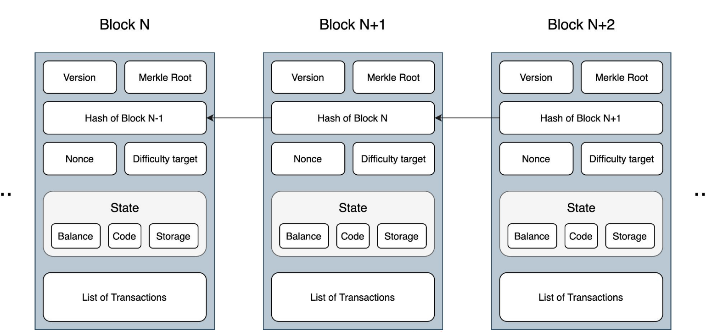

# Blockchain Transaction

## What is a transaction?
* An agreement or communication between a buyer and a seller
* Could be related to transfer of assets or financial entities
* Both the buyer and the seller can verify the transfer
* Financial transactions always include a financial asset - Bonds, money, shares, mortgages etc.
* Bitcoin Blockchain - An effective and distributed way of conducting financial transactions

## Main Phases of Blockchain Transaction
Transaction dissemination
Block Generation
Consensus

Blockchain facilitates transaction between trust-less parties and without a commonly trusted party.

## Other properties of Blockchain Transaction

* Provides a probable solution for Two Generals’ problem with the Consensus algorithm
* Facilitates transaction between trustless parties without a commonly trusted third party
* No special node for commit acceptance - Proportionate voting based consensus
* Consensus building takes time - Dependent on propagation and acceptance

Keep the previous hash, PoW and then publish the new block with new hash. PoW takes around 10mins and with 1 mb of hash, throughput can be 5-6 transactions per sec. In traditional network, the throughput would be 1600 to 2000 transactions per sec.

> Quantum computing is a novel form of computation that uses "quantum states" to solve logic puzzles that would require either an extraordinary amount of processing power or be virtually impossible for conventional supercomputer to solve. Quantum computers are also capable of simultaneously analysing enormous amounts of potential puzzle pieces and solutions.

## Blockchain solution for Transactions
* **Initiation**: You request a transaction (typically from a wallet)
* **Broadcasting**: Your transaction is broadcasted to a P2P network, which has many nodes
* **Validation**: The network of nodes validates your transaction and your status using an algorithm. A verified transaction can involve cryptocurrency, contracts, records and other information.
* **Blockchain**: The new block is then added to the existing blockchain that is permanent. No one can temper it. Once verified, your transaction is combined with other transactions to create a new block of data for the ledger.
* **Completion**: Your transaction is complete.

## Lifecycle of Transaction
Let’s take an example to understand the life cycle of transaction. Suppose we have 2 users
sending money between each other. They have access to a application which is built on top of
a node so that both the users can interact with Blockchain.
* Now let’s take a scenario where a new transaction is created by the first user, so send some
  money to the other.
* As blockchain is acting as the backend, the transaction is first send to the node on which the application is running.
* Within Blockchain each node has a copy of Blockchain data, but the node who received this
  transaction do not process the same yet.
* The first thing the node does is to add the transaction into a transaction memory pool.
* Transaction memory pool is a shared pool between all the nodes. Take it more of like a table
  inside the blockchain database.
* The transactions inside transaction memory pool are called unconfirmed transactions as these
  are not processed yet.
* Validators/Miners also have access to the same memory pool. Once the transaction reaches
  memory pool. The validators start working over the same. 
* The job of validators is to take the transaction out, verify the same and then start building up
  a block. 
* The block parameters are dependent on the Blockchain for example in Bitcoin you can only
  add up to 1MB of transaction inside a block.
* Once the transaction is added into a block. In public Blockchains. Validators perform a
  mathematical calculation to confirm a block. The techniques used to validations are - digital signature, hashing, and encryption.
* This block is broadcasted to all the participants, where all the other participants can verify the transaction and provide consensus. 
* Once the consensus is achieved the transaction is confirmed over the blockchain.

### Verification of transaction
* If you notice that the transaction verification is an important part of the transaction life-cycle. Both the Blockchain validators and nodes need to verify the transaction before processing the same. 
* In case of Blockchain we primarily utilize three different techniques to help us verify the
transactions - Hashing, Digital Signature and Encryption.
* When we create a new transaction in Blockchain, we also include the signature from the sender in input and the address for the receiver in output.
* In case of Bitcoin the data of the whole transaction is hashed twice in little endian format to
get the actual transaction id/hash.
* If somebody wants to verify the transaction, they can take the public key of the sender and
verify the signature.
* If the receiver wants to get the transaction, he/she also needs to provide a signature and
public key. Signature is used to verify that he/she is the rightful owner of the output and the
public key is used to verify that the address specified in the transaction belongs to the receiver.

**In short**
* Transaction initiated
* Unconfirmed transaction pool, called memory pool, mempool (or transaction mempool)
* Miners work and block is formed
* Block is broadcasted across network
* Block get validated by the other nodes. **consensus**
* Blockchain is then formed.

## General Format of Blockchain Transaction
| Field           | Description                                                                                         |
|-----------------|-----------------------------------------------------------------------------------------------------|
| Version no      | Currently set to 1 - Defines the version of Bitcoin                                                  |
| Flag            | If witness present for transaction, always set to 0001. This indicates the presence of witness data |
| In-counter      | Total number of input transactions                                                                  |
| list of inputs  | All the transactions taken as Input for this transaction                                            |
| Out-counter     | Total number of output transactions                                                                 |
| list of outputs | All the transactions taken as Output once this transaction is processed.                            |
| Witnesses       | A list of witnesses, 1 for each input, omitted if flag above is missing                              |
| lock_time       | The time period after which the validators can include the transaction in Block.                    |

```
Input:
Previous tx: bbbb8ca877edc03b5a1d3e2ee9f7dfdac71d24c955d05585bc1e9d87f8281d48
Index: 0
scriptSig:
304502206e21798a42fae0e854281abd38bacd1aeed3ee3738d9e1446618c4571d1090db022100e2ac980643b0b82c0e88ffdfec6b64e3e6ba35e7ba5fdd7d5d6cc8d25c6b241501

Output:
Value: 1000000000
scriptPubKey: OP_DUP OP_HASH160 1KePhdGYYR8mnw8rV9gDhvbcsLHiZuvWs2 OP_EQUALVERIFY OP_CHECKSIG
```

## Important aspects of blockchain transactions
* Every type of node on the blockchain network may not be able to verify transactions - usually full nodes do this job because others may not have all UTXOs in their knowledge to verify ownership. 
* A coinbase transaction is one where the block reward is given to the miner.
* A block will always have a coinbase transaction, even if it doesn't contain any other transactions.
* In Bitcoin, a coinbase transaction is the only type of transaction which doesn't have an Input, and is the first transaction in every block.
* Typically, every action on a blockchain network is termed as a "transaction". For eg: an IoT sensor pushing temperature data to the blockchain will be called a transaction.
* In case a transaction is valid but is part of an orphaned block (more on this later), that transaction will be added in the next valid block on the network.
* In the case of Bitcoin transactions, 6 confirmations (which takes around 1 hour) is considered secure; while in the case of Ethereum, 10-12 confirmations (which takes around 3 minutes) is considered secure.

? **Confirmation and its meaning**

## Structure of Block
* A typical structure of block looks like this:
  * **Block Header** - Has the information about merkle root, timestamp (epoch) and the previous block hash.
  * **Block Identifiers** - These are used to identify blocks. For example block hash or block height.
  * **Transactions** - Complete list of all transactions part of the block.
* A block could also include protocol information like version, size, transaction counter etc.

### Example block structure
| Field               | Description                                                                                                |
|---------------------|------------------------------------------------------------------------------------------------------------|
| Magic No            | Identifier for the Blockchain network. Set to 0xD9B4BEF9 for all blocks.                                   |
| Blocksize           | total size of the block                                                                                    |
| Blockheader         | Contains the information about 6 major items: Version,hashPreviousBlock, hashMerkleRoot, Time, Bits, Nonce |
| Transaction Counter | Total number of transactions inside the block                                                              |
| Transactions        | List of all the transactions in the block.                                                                 |

## Genesis Block
* A genesis block is the first block of blockchain. It is also regarded as block 0.
* Mostly the genesis block is hard coded by the creator.
* Genesis block defines how the blockchain is going to operate. All the major protocols, versions, creation of tokens or data storage is defined with genesis block.
* The blockchain in its lifetime has to follow the genesis block. 
* In Bitcoin blockchain the genesis block was created by Satoshi Nakamoto with a block reward of 50 BTC.
* There is also a message included in genesis block for Bitcoin, which is “The Times 03/Jan/2009 Chancellor on brink of second bailout for banks.” This message verifies that the bitcoin blockchain is created on this specific date and not before that.

## Block Identifiers
* The primary identifier for a block in Blockchain is the cryptographic hash value, which is taken by passing the block data over a hashing function.
* In bitcoin blockchain we use SHA256 algorithm twice to get the block hash which can be used as a unique identifier.
* As the hash value changes even if single bit of data is changed, that means no two hashes for blocks will have the same value. Thus making them unique.
* Another entity, which is used for identifiers is block height.
* Block height is defined as how many blocks are behind the current block. It’s like a floor in a building. For example, if we say block height is 100, that means 99 blocks are behind it.

## Block Linking
* Each block in blockchain has a unique hash and that is one of the most important aspect of blockchain.
* We can use these hashes to form a chain, similar to Linked List.
* When a genesis block is created, a hash value is generated for the same. This hash value can be included in the next block as previous block hash., thus forming a link.
* This process keeps on going across throughout the lifecycle of blockchain.
* Block Linking also provides with security as blocks have information included for the previous blocks. 
* For example the blockchain is currently at 100 blocks and an attacker decides to change the 50th block. To make it a successful attack, attacker needs to change hashes for all the blocks coming after 50th block.



? Nounce

Explore more on Transaction and blocks: [Link](https://blockchair.com/bitcoin?from=bitcoin.com)