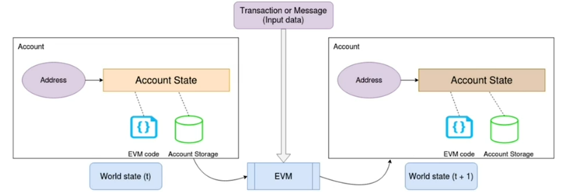
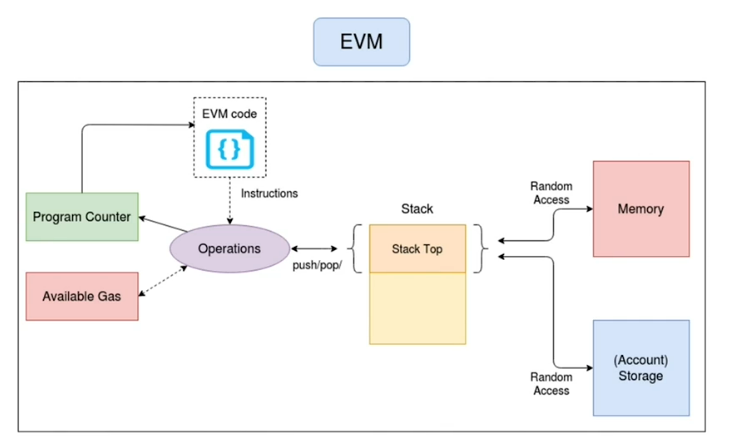

# Ethereum Virtual Machine

## Introduction
* EVM is the specification for the underlying code and state engine running Ethereum network
* A turing-complete virtual machine, computationally limited (artificially) by gas availability
* Huge, decentralized transaction-based state machine
* Implemented by various open-source groups in multiple languages - Geth (Go), Aleth (C++), EthereumJS (Javascript), Trinity (Python), Parity (Rust), EthereumJ (Java), Hyperledger Besu (Java)



## Internals

* Stack-based architecture (LIFO). Its components are -
  * Everything is 256-bit in length to match common attributes
  * Stack: Size 1024, 256-bit item length
  * Memory: Volatile (ROM or vROM), word (256 bit) addressable
  * Storage: Persistent, part of world state, 256 bits to 256 bits key-value store per account 
  * Virtual ROM: Stores generic and contract code, provides special access, and is immutable
* EVM bytecode (similar to Java bytecode)
  * Special purpose virtual machine bytecode
  * It allows basic arithmetic, comparison, and memory manipulation opcodes
  * Special blockchain specific opcodes like ```ADDRESS```, ```BALANCE```, ```GASLIMIT```, ```NUMBER```
  * Contract code manipulation opcodes like ```CALL```, ```CODECOPY```, ```DELEGATECALL```
  * General contract programming in higher-level languages like Solidity/Vyper
  * Converted to bytecodes and run on EVM
  * Important to understand that every transaction is limited by gas limit, especially due to gas cost
  * Each opcode will have its own cost in gas units
    * ADD - 3, DIV - 5, EQ - 3
    * PUSH1- 3, MLOAD - 3, SLOAD (Storage load) - 800
    * GASLIMIT - 2, BLOCKHASH - 20, CREATE (contract) - 32000*



## Specifics
* Deterministic state machine, has to behave the same on all nodes across all programming language
* Runs completely isolated and sandboxed - No access to network, other processes or the general file system
* Storage holds all persistent state - each account is a key-value store
* Important exception state - Insufficient gas
* Higher level languages (Solidity/Vyper) are also specialized and specific, due to gas cost of each opcode and immutability of a contract once deployed
* Storage reads and writes are extremely costly - controls the code structure
* EVM is stack-based, not register-based (hence, parallel access to operation is not possible)
  * Easier to implement but slower
  * Simple implementations lead to consistency
  * Will require more memory access 
  * Due to gas cost, writing contract code becomes particularly specialized

## Further studies
* [Ethereum Virtual Machine Opcodes](https://www.ethervm.io/)
* [EVM Opcodes and Instruction Reference](https://github.com/crytic/evm-opcodes)
* [Consensys-Quorum](https://consensys.net/quorum/)