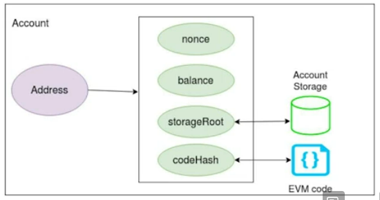

# Ethereum
Bitcoin is a generation 1 blockchain while Ethereum is a generation 2 blockchain.

## Introduction
* A blockchain network with smart contract functionality (via scripting). This is how generation 2 blockchain differs from generation 1. 
* Permissionless, public, PoW-based blockchain. It is now moving to PoS in its second version.
* Proposed (2013) by Vitalik Buterin
* Live since 2015 and did an ICO subsequently 
* Ether (ETH) is the native cryptocurrency of the network. There are alternate currency based on ERC-20 and is hinged around ETH.
* 1 ETH varies around $2000 (currently) with high variability
* Current blockchain value exceeds $200 billion dollars
* More than 1 billion transactions have been confirmed
* 12-15 seconds block rate with ~15 TPS
* Current block formation reward is 2 ETH. This is in addition to transaction fee that goes to the miner.

## Differentiation
Bitcoin have been viewed as primarily a store of value (cryptocurrency) with no major changes. However, Ethereum founders saw blockchain as base for multiple applications in various domains

Ethereum's focus has been on decentralized application development with flexible scripting capability. It's scripting flexibility allows development of new innovative applications. Ethereum has continuous planned protocol upgrades as hard forks as compared to Bitcoin which has not undergone major changes.

> Hard forks - Breaks compatibility with old versions to allow major features

Ethereum has had 8 planned and 3 unplanned upgrades done. Ethereum 2.0 is planned for major upgrades for tps increase and consensus mechanism change from PoW to PoS.

Detailed definition of the underlying computation machine - EVM
* Described in Ethereum Yellow Paper
* Implemented in multiple languages

All computational efforts are taxed by Gas (fee charged based on effort) to limit unnecessary computational load.

## Ether - The currency
* Ether is the underlying currency for the whole Ethereum network
* Multiple subunits with wei being the lowest
  * 1 Wei = 10⁻¹⁸ Ether
  * 1 Gwei (Shannon) = 10⁻⁹ Ether
  * 1 Micro-ether (Szabo) = 10⁻⁶ Ether
  * 1 Milli-ether (Finney) = 10⁻³ Ether
* Different subunits might be referred to in different contexts like rewards, gas (expressed in Gwei), transactions, account balances (expressed in Wei)
* Used for all payments - transaction fees, gas for computational resources, etc.

## Accounts
* Two types - Externally Owned Accounts (EOAs) and Contracts
* Both can
  * send, receive, and store value (Ether and tokens)
  * interact with smart contracts
* EOAs (these are simple ethereum addresses)
  * Free to create
  * Controlled by private keys
  * No associated code
  * Can initiate transactions to any account
  * Only ETH transfer between EOA<->EOA
* Contracts
  * Deployment has some associated cost, paid in gas. More complex code would need more gas to be deployed.
  * Can take action only in response to transactions/messages received from others
  * Contract to contract interaction - Messages or internal transactions
* Requires gas to deploy and execute
* Fields
  * nonce - Counter for number of transactions sent from EOA or number of contracts created by a contract
  * balance - Amount of wei (10⁻¹⁸ ETH) stored in the account. GUI based wallets, like MetaMask and MEW (MyEtherWallet) will show you the balance in ETH.
  * codeHash - hash of the EVM code for contract, hash of an empty string for EOA. Immutable once deployed
  * storageRoot - 256-bit root node hash of a Merkle Patricia Tree, hash of all storage in the account

> ERC-20: The technical specification for fungible tokens produced on Ethereum network is called ERC-20
> ERC-721: It is a more complicated standard than ERC-20, with a lot of potential expansions, and it divided into several contracts. Cryptographic assets are called non-fungible token (NFTs) are distinguished from one another by having special identifying numbers and metadata. 
> According to the definitions of Patricia and Merkle, a Merkle-Patricia tree is a tree with a root node that stores the hash value for the entire data structure.

## Ethereum - Transactions and Messages
* Transactions
  * Cryptographically signed actions Initiated only by EOAs
  * Value transfer or contract creation (when a smart contract is constructed, its deployment is always done by EOA)
  * Follow the normal cycle - created, broadcasted, mined, validated, confirmed
  * Change the state of the EVM
  * Generally require a fee to be mined
  * Unlike bitcoin, it’s a single interaction between two accounts
* Messages
  * Similar to transactions but initiated by contracts
  * Code "calling" other code
  * Triggers a specific function in the recipient contract
  * Initiated by CALL or DELEGATECALL opcodes in the sender contract
  * Allows multi-option decision flow for complex considerations
  * Allows a possible upgrade path by proxying the actual logic
  * Can help separate storage and computation structures
* Fields
  * nonce
    * Property of account, not the transaction
    * Number of transactions or contract creations from the sender account
    * Instrumental in ordering multiple transactions still to be mined
    * Prevents replay attacks - signed hash is different every time so same transaction can’t be replayed by someone else
  * to - Recipient address
  * v,r,s - Used to generate signature to identify sender
  * value - Wei transferred to the receiver or initial value store in the contract
  * data/init
    * EVM code in contract creation
    * function call and parameters in message calls
  * gasLimit - Maximum units of gas that can be spent including all sub-executions
  * gasPrice - Per unit gas price defined

## Gas
* Every computation in a transaction and contract execution has a cost. Cost differs based on how complex the computation is
* Prevents overload attacks and mistakes by developer
* Gas is the unit to measure the computations
* Typically, measured in Gwei (10⁻⁹ Ether)
* Gas price is the price of each unit of gas, set by the sender
* Gas limit is the maximum number of units that can be spent, set by the sender
* Gas limit should cover all computational cost including all sub-executions
* Normal transaction requires 21,000 gas
* Smart contract execution might require much more, based on complexity
* gasLimit * gasPrice has to be preloaded.
* If less is spent, unused gas value is returned to the sender
* If gas limit is reached before execution finishes, the transaction is rolled back. However, the sender would have lost the gas used so far which would equal to gas limit.
* Higher gas price you set, better the chance of transaction pick-up

## Blocks
* Similar to bitcoin, a block is mined based on Proof-of-work protocol
* Includes
  * Block header
  * Transaction list with details
  * Block headers from ommer blocks
> Ommer/Uncle blocks are valid blocks created at the same time as the main accepted block, but they are not part of the main chain but are stored since they are rewarded a small amount.
* Bounded in size by an overall limit on the gas limit that a block can have
  * Currently, around 15 million gas units
* Much smaller than bitcoin but generated much more frequently
* Each transaction generates a receipt as a response which is also stored
* logsBloom allows storage of logged events by contracts in a bloom filter
* Block header
  * parentHash - Previous block's hash
  * timestamp - unix timestamp
  * beneficiary - miner account who received the reward
  * difficulty - difficulty level of the block
  * number (block height) - count of current block, genesis block being 0
  * gasLimit - Gas limit that a block can have including all transactions and resulting computations
  * gasUsed - Total gas actually used in block creation
  * stateRoot - Root hash of the state information
  * transactionsRoot - Root hash of the transactions 
  * receiptsRoot - Root hash of the transaction receipts (response received of transaction)
  * ommersHash - Hash of list of ommer blocks
  * logsBloom
  * extraData (details developer can put)
  * mixHash
  * nonce (this is nounce used by miner to get the target hash)

> Ethereum 2.0 would use PoS and concept of sharding and Sidechain would come into play.
> A Sidechain is a separate blockchain that is connected to the Mainchain by a 2-way peg.

## Wallets
* Basis of any blockchain account is a private/public key pair
* Cryptocurrency Wallets (like MetaMask) allow
  * storing the keys for availability from different machines
  * redundant storage to keep key backups
  * secure access to various blockchain accounts without mandatory local storage
  * additional services like transaction creation and signage, currency exchange, etc.
* Multi-signature wallets - Needs multiple parties to sign a transaction forcing a joint agreement for transaction initiations. One of such examples is escrow account.
* Types
  * Deterministic - All keys generated from a seed (a long phrase in practice), allowing for complete key recreation just from the seed
  * Non-deterministic - Each pair is independent and necessitates storing all of them
* Forces trust on the wallet provider, examples of embezzlement and loss

> Binance Chain Wallet: The official cryptocurrency wallet for BNB Smart Chain (BSC), Binance Chain, and Ethereum is called Binance Chain Wallet
> Poloniex: A digital asset exchange called Poloniex offers a trading platform for cryptocurrencies, non-fungible tokens, and cryptocurrency futures

You can explore everything on Ethereum blockchain at [Etherscan](https://etherscan.io/)

You can see a [Metamask](https://metamask.io/) wallet. Metamask is software cryptocurrency wallet used to communicate with the Ethereum network.

## More learning
* [Ethereum](https://crypto.marketswiki.com/index.php?title=Ethereum_(ETH))
* [Introduction to Ethereum](https://bitsonblocks.net/2016/10/02/gentle-introduction-ethereum/)
* [Ethereum Gas and Fees](https://ethereum.org/en/developers/docs/gas/)
* [Ethereum Whitepaper](https://ethereum.org/en/whitepaper/)
* 