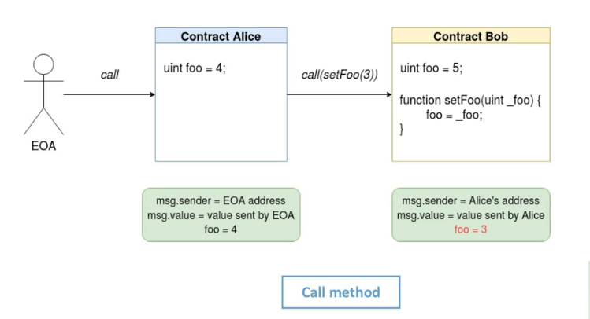
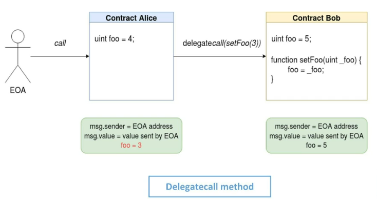
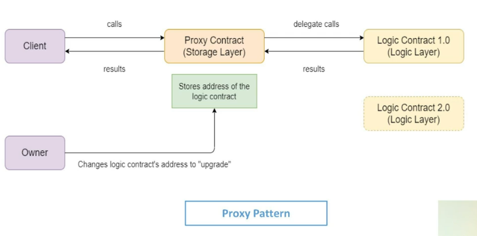

# Solidity and Smart Contracts

## Solidity - Introduction
* Special turing-complete language for defining contracts on the EVM (computation engine that functions like a decentralized computer with millions of projects that may be carried out)
* High-level, object-oriented, and curly-bracketed
* Influenced by C++, Python, and ECMAScript/Javascript
  * C++: Variable declarations, For loops, Overloading functions, Type conversions
  * Python: Modifiers (Decorators), Value and reference semantics, super keyword, Inheritance semantics 
  * Javascript: function keyword, import semantics
* Statically typed: Predetermined variable types at compile time
* Multiple compiler options
  * Remix - Web-based IDE, compiler and VM
  * solcjs - NPM package
  * solc - Standalone installation on various OSes 
* Release and Versioning
  * Current version - 0.8.6
  * Non-rebreaking minor releases every 2-6 weeks - 0.8.5 -> 0.8.6
  * Breaking major releases every 6-12 months - 0.7.6 -> 0.8.0

## Sample Example

```
// SPDX-License-Identifier: UNLICENSED
pragma solidity >=0.7.0 <0.9.0;
// Importing another file
import * as Utility from 'Utility.sol';
contract Demo {
    uint storageData1;
    address public creator;

    constructor(uint _storageData1) payable {
        storageData1 = _storageData1;
        creator = msg.sender;
    }
    
    modifier onlyCreator() {
        require(msg.sender == creator, "Only creator can do this action");
        _;
    }

    function addStorage(uint inputData1) public view onlyCreator returns (uint) {
        return storageData1 + inputData1;
    }
}
```

## Basic Layout

* SPDX License Identifier
  * // SPDX-License-Identifier: UNLICENSED
  * UNLICENSED means private code
  * Example public licenses: Apache-2.0, CC-BY-NC-SA-4.0, GPL-3.0-only, LGPL-3.0-or-later, MIT
* Pragmas
  * pragma keyword used to enable compiler checks or features
  * pragma solidity <version information> limits compiler versions
    * 0.7.6 -> Only this version
    * ">=" 0.7.0 -> Greater than or equal to this version
    * <0.9.0 -> Less than this version 
    * ^0.8.1 -> Greater or equal to 0.8.1, but less than next breaking version (0.9.0)
    * ">="0.7.0 <0.9.0 -> Can combine two controls
* Comments
  * Single line: // Single line comment 
  * Multi-line: /* Multi-line
                comment */
* Import
  * import * as Utility from 'Utility.sol';
  * Imports global variable and function symbols from "Utility.sol" 
  * Preferred method, doesn't pollute namespace 
  * Used as Utility.variable1 or Utility.function2() in the importing file 
* Contract structure
  * Contracts defined with _contract_ keyword, analogous to a class. 
  * Starts with variable declarations
  * _constructor_ keyword used for the contract creation
  * _function_ keyword defines functions within and outside a contract
  * _modifier_ keyword defines additional behavioural modifications
    * Can be applied to any function
    * Similar to, but less powerful than, python decorators

## Variables and Types
* Variables
  * State - Part of contract, value stored in blockchain storage. This is slightly costlier than others.
    * Visibility - internal / private / public
    * Private - Only visible inside the contract, not even in derived contracts
    * Internal - Can be used inside the contract or derived contracts, default visibility level
    * Public - Can be called externally or internally, automatic getter function is generated
  * Local - Part of a function scope, temporary, declare with memory keyword to explicitly store dynamic types in memory
  * Global - Special variables in global namespace - blockchain, block, message and transaction properties
  * constant modifier fixes value at compile time, immutable fixes value declaration/construction
* Types
  * Integers
    * Signed and unsigned: int and uint
    * int8/uint8 to int256/uint256 in steps of 8, int/uint are aliases of int256/uint256
    * Comparison, bit, shift, and arithmetic operations
  * Addresses
    * address - 160-bit Ethereum addresses
    * address payable - Has additional transfer and send members, can be sent Ether
    * Explicit conversions from address to address payable -> payable(<address>)
    * Equality operations
* Booleans - bool, true/false, Logical and equality operations
* Literals
  * Integer - 34, 3.45, 4e10, 323_122 (underscore just for separation like comma in English numbers)
  * String - ASCII and escape characters only
  * Unicode - Any valid UTF-8 character sequences
  * Hexadecimal - hex"10024FE", hex"100_24_FE" 
* Strings
  * string keyword
  * string company = "Acme"
* Arrays
  * Homogenous - Type-mixing not allowed
  * Compile-time fixed size - uint[5], int[2][3]
  * Dynamic size, initialized at run-time - int[], uint[][4]
  * bytes and strings are special array types
  * Slicing - a[1:4], from 1 to 3
* Enums (Same as C/C++)
  * enum ContractState = {Initiated, Pending, Finished, Failed};
  * ContractState currentState = ContractState.Finished;
* Structs (Same as C/C++)

```
struct AccountDetails {
    address accountOwner;
    uint accountBalance;
}
AccountDetails ac_receiver = {address <address>, 24}
```

* Mapping (Similar to Hashmaps and Dictionaries)
  * mapping(key => value)
  * key type can be built-in types like string, bytes, enum, but not other complex types 
  * value type can be any types including arrays, structs, mappings
* Globally Available Variables
  * Special variables available in global namespace about the blockchain environment
  * Blockchain and Block variables
    * block.chainid - ID of the current blockchain 
    * block.number - Current block number
    * block.timestamp - Current block's timestamp in seconds since epoch 
    * block.coinbase - Address of current block's miner
    * block.gaslimit - Current block's gaslimit
    * block.difficulty - Current block's difficulty
    * blockhash(blocknumber) - Hash of the blocknumber block, from the latest 256 blocks
  * Message variables
    * msg.sender - Address of the message sender
    * msg.value - Amount of wei sent with the message
    * msg.data - Complete calldata
    * msg.sig - Function identifier (first 4 bytes of calldata)
  * Transaction variables
    * tx.gasprice - Transaction's gas price
    * tx.origin - Transaction's sender (Original sender of the call chain), not to be confused with msg.sender
    * gasleft - Remaining gas

## Functions

* Function declaration - function <function name> (<parameter types>) { internal / external / private / public } [pure / view / payable] [modifier list] [returns (<return types>)]
* Parameter types: All built-in and custom types
* Visibility: internal / external / private / public
  * Private - Only visible inside the contract, not even in derived contracts
  * Internal - Can be used inside the contract or derived contracts
  * External - Part of contract interface, can be called from transactions and other contracts
    * Can’t be called internally, unless through ```this.<function>```
  * Public - Can be called externally or internally
* Function types: pure / view / payable
  * Pure - No state or global variable are read or written to, only local variables used. No calls to non-pure functions
  * View - Can read state but no state modification including writing to state variables, emitting events, creating contracts, calling other non view/pure functions, sending Ether, etc.
  * Payable - If used, function can receive Ether
* Modifier List - Multiple modifiers can be added to modify behaviour before or after execution
* Return list is defined in the function declaration with the type of values returned, can also specify the variable names
* Special function - ```receive()``` or ```external payable { ... }```
  * No arguments or return values, has to be external and payable
  * At most one instance per contract
  * Called when .send or .transfer calls are received
* Special function - ```fallback()``` or ```external payable(optional) { ... }```
  * Called when nothing else matches the incoming function call signature
* Function overloading based on parameter list possible
* Special keyword ```this``` for referring to the current contract instance
* Calls to "functions" in other contracts are possible, given the external contract instance is defined internally first
* Special function - ```constructor()``` called during contract creation
* Control Structures
  * if, else, do, while, for, break, continue, return - Similar to C and Javascript
  * No automatic type conversion to boolean in if, so explicit conversion needed for checks

## Modifiers
It defines access control rules to validate and manage who has control of data and functions to establish trust and privacy.
* Modifiers are used to change function behaviour.
* Defined separately so that same modifiers can be applied on multiple functions as needed
* Example:
```
modifier onlyCreator() {
    require(msg.sender == creator, "Only creator can do this action");
    _;
}
function setStorage(uint _storageData1) public onlyCreator {
    storageData1 = _storageData1;
}
```

  * **_** is a special variable which get replaced by the main function call, in its own context
  * Anything can be checked in the modifier. Here, it’s checking that the current caller (msg.sender) is same as the creator state variable, which might have been set at contract creation time
  * Behaviour addition or modification can be done before and after function execution

Example:

```
modifier onlyAbove(uint addValue) {
    if (addValue > 5) {
        _;
    } else {
        revert("You have to increase the data value by more than 5");
    }
}

function addAndSetStorage(uint inputData1) public onlyCreator onlyAbove(inputData1) {
    storageData1 = storageData1 + inputData1;
}
```

* Modifiers can be chained -> onlyCreator onlyAbove(inputData1)
* Parameters from the original function can be passed to modifiers
* Conditional processing can be done in modifiers including reverting the overall call

## Events and Errors
* Events, referred to as global in the contracts and invoked within their functions.
  * Abstraction on EVM logging information
  * Applications can subscribe and listen to events
  * Information stores in the transaction's log when events are triggered
  * event Payment {address sender, uint value};
  * Can be emitted in functions - emit Payment(msg.sender, 14 gwei)
  * event.watch defined with a callback to trigger on event emit
* Error handling
  * Built-in errors: Error(string) and Panic(string)
  * Exceptions in try/catch blocks - Follow standard semantics of bubbling up, except in send, call, delegatecall, staticcall. It generates Errors or Panics as Exception types
  * require built-in function is used to create Errors, used for validations in run-time
  * assert built-in function is used to create Panics, to check for invariants, should never create Panic in production bug-free code
  * revert built-in function takes in a custom error string, stops execution immediately and rolls back current progress before returning

## Units

* Ether units
  * wei == 1
  * gwei == 1e9
  * ether == 1e18
  * Saying something is "2 gwei" is equivalent to saying "2e9"
* Time units
  * seconds, minutes, hours, days, weeks
  * Can be suffixed after any number
  * 1 week, 2 days

## Inheritance
* Solidity allows contracts to inherit from each other.
* Multilevel inheritance support
  * B can inherit from A, C can inherit from B.
* Multiple inheritance support
  * C can inherit from both A and B.
* Benefits
  * Inheritance provides similar benefits as inheritance in Object-Oriented Languages.
  * Common functionality can be shared, avoiding duplication.
  * Behaviour change can be done at one place.
  * Multiple inheritance allows for inheritance of different feature sets from different contracts.
  
### Specifics
* Everything, other than private functions and variables, is inherited.
* Solidity also allows defining interfaces
  * Can be defined using the interface keyword instead of contract
  * Can only contain external function definitions without implementations
  * Cannot include state variables or a constructor
  * Cannot inherit from another interface or contract
  * All interface functions are implicitly considered virtual (A function that allows an inheriting contract to override its behaviour is considered virtual)
* Functions without any implementation should be marked as virtual.
* Contracts with even one unimplemented function have to be marked abstract.
* **super** keyword allows calling functions from the parent contract.
* Functions in base class can be overridden only if:
  * both have the exact same function signature
  * the base function is marked as virtual
  * the derived function is marked as override
* Modifiers can also be overridden with similar considerations.

```java
interface SimpleInterface {
    enum State {Initiated, Running, Finished, Failed}
    
    function getDifference (int a, int b, int c) external returns (int);
}

contract BaseImpl is SimpleInterface {
    
    uint storageData1;
    
    function getDifference (int a, int b, int c) external pure virtual override returns (int) {
        return (a - b - c);
    }
  
    function setStorage (uint _storageData1) external {
        storageData1 = _storageData1;
    }
}

contract DerivedImpl is BaseImpl {
    
    constructor (uint _storageData1) {
        storageData1 = _storageData1;
    }
    
    function getDifference (int a, int b, int c) external pure override returns (int) {
        return (a + b - c);
    }

    function getStorage() external view returns (uint) { 
        return storageData1;
    }
}
```

## Contract ABI & Interaction

* Contract ABI -- Application Binary Interface -- is how contracts interact with each other
* Different contracts are deployed on different addresses.
* Can call a particular function of a contract from an EOA (Externally owned accounts are accounts controlled by private keys, commonly generated using a seed phrase) transaction or a contract message.
* **Calldata** specifies the function and arguments
* First four bytes match the first four bytes of ```Keccak-256 hash``` (using by Ethereum) of the function signature - name and parameter type list.
* Fifth byte onward encodes the parameter values with specific encoding for different types.
* An example:

```java
        bytes memory calldata = abi.encodeWithSignature("getDifference(int, int, int)", 10, 5, -2);
        (bool success, bytes memory result) = address(contract_address).call(calldata)
        
        // With gas and value modifiers:
        (bool success, bytes memory result) = address(contract_address)
        .call{value: 0.5 ether, gas: 100000000}(calldata)
```

* Three main call types:
* **call**
  * Normal call to another deployed contract
  * "msg.sender" and "msg.value" are of the calling contract or EOA
  * Any storage action will be in the contract owning the called function
* **staticcall**
  * Similar to call method but doesn't allow any state change.
  * It’ll immediately revert if any state change is attempted.
* **delegatecall**
  * Useful
    * To call contracts behaving as libraries and utilities
    * For storage (which is attached to calling contract) and computation (which is attached to called contract) separation
    * For Proxy pattern
  * "msg.sender" and "msg.value" are of the original caller
  * Any storage action is done on variables of the calling contract
  * Code essentially runs in the context of the calling contract







## Oracles
* What?
  * Oracles are special contracts that can inject external data into the blockchain.
  * Other contracts can consume this data to build more meaningful applications.
* Why?
  * All data, that a contract can use, must pre-exist on the blockchain.
  * You can’t call **out** of the blockchain world.
  * No support in the language and no support in the overall environment.
* How? - One of many flows
  * Your contract emits an event which details what off-chain information you want.
  * It’s picked up by an off-chain service like chainlink, listening to events via JSON-RPC (It is used on Ethereum to describe various data structures. It also specifies the rules on how data structures are processed in the network).
  * The service collects the data.
  * The service uses an EOA to call your contract with the data requested.
* Chainlink (It is a decentralized oracle network that provides secure transmissions between various off-chain data and ethereum projects) has improved the process by defining pseudo-api calls using their libraries and services.

## Further Reading

* [Solidity](https://docs.soliditylang.org/en/v0.8.6/)
* [Solidity Lang](https://soliditylang.org/)
* [Javascript VM](https://ethereum-blockchain-developer.com/004-blockchain-networks/03-javascript-vm/)
* [Smart Contract](https://ethereum-blockchain-developer.com/004-blockchain-networks/01-simple-smart-contract-example/)
* 