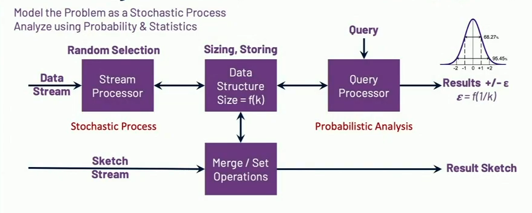

# Introduction

## Problematic Queries of Big Data

All Non-Additive

* Unique Identifiers with Set Expressions: (AUB) intersect (CUD) \ E
* Fractical Rank
* Histograms, PMFs
* Frequent Items / Heavy Hitters
* Vector & Matrix Operations: SVD, etc.
* Graph Analysis
* Reservoir Sampling

If we can allow for approximation, along with some accuracy guarantees, we can achieve orders-of-magnitude improvement in

* speed, and
* reduction of resources

## Approximate Analysis and Sketch

Sketch aka Stochastic Streaming Algorithm

Major Sketch Properties

* Small Stored Size.
* Sub-linear in Space. Example, Sketch size growth is logarithm to stream size.
* Single-pass, "one-touch"
* Data insensitive
* Mergeable
* Approximate, probabilistic
* Mathematically proven error properties

It may look similar to sampling. There are some overlap since there are few sketches which are based on sampling. Some sketches are not related to sampling at all.

## Advantages of Sketches

### Small Query Space

Sketches start small. It stays small. Single pass simplifies processing. Minimal or no sorting required! Ideal for streaming and batch.

O(k) ~ kb

### Mergeability

Mergeability enables parallelism .. with no additional loss of accuracy!

Sketches transform non-additive metrics into additive objects

The result of a sketch merge is another sketch .. enabling set expressions for selected sketches

### Near-Realtime Query speed and Simpler architecture

Intermediate Hyper-Cube Staging enables query speed

Addivity Enables Simpler Architecture

Stored Sketches can be merged by any dimensions, including time! Query only the rows and dimensions required!

### Simplified time windowing plus late data processing

Every data item is processing once for a rolling N day window. Late-data processing is now possible

### Lower System Cost

4 to 10 times cheaper

## Apache Datasketches

* **Cadinality, 4 Families**
  * **HLL (on/off Heap):** A very high performing implementation of this well-known sketch
  * **CPC:** The best accuracy per space
  * **Theta Sketches:** Set Expressions (e.g. Union, intersection, difference), on/off Heap
  * **Tuple Sketches:** Generic, Associative Theta Sketches, multiple derived Sketches
* **Quantile Sketches, 2 Families**
  * **Quantiles**, Histograms, PMRs and CDFs of streams of compareable objects, on/off Heap.
  * **Relative Error Quantities**
* **Frequent Items (Heavy-Hitters) Sketches, 2 Families**
  * **Frequent items:** Weighted or Unweighted
  * **Frequent directions:** Approximate SVD (a Vector Sketch)
* **Sampling: Revoir and VarOpt (Edith Cohen) Sketches, 2 Families**
  * **Uniform Sampling** to fixed-k bucket size
  * **Weighted Sampling** to fixed-k bucket size
* **Speciality Sketches**
  * **Customer Engagement**
  * **Frequent Distinct Tuples, Maps,**

Languages Supported:

* Java, C++, Python
* Binary Compatibility
