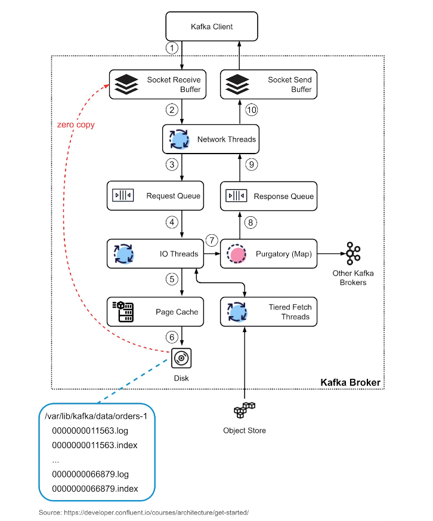

# Architecture

In a typical scenario where Kafka is used as a pub-sub messaging middleware, there are 3 important components: producer, broker, and consumer. The producer is the message sender, and the consumer is the message receiver. The broker is usually deployed in a cluster mode, which handles incoming messages and writes them to the broker partitions, allowing consumers to read from them.

Note that Kafka is positioned as an event streaming platform, so the term “message”, which is often used in message queues, is not used in Kafka. We call it an “event”.


## The Compute Layer

The compute layer, or the processing layer, allows various applications to communicate with Kafka brokers via APIs.

The producers use the producer API. If external systems like databases want to talk to Kafka, it also provides Kafka Connect as integration APIs.

The consumers talk to the broker via consumer API. In order to route events to other data sinks, like a search engine or database, we can use Kafka Connect API. Additionally, consumers can perform streaming processing with Kafka Streams API. If we deal with an unbounded stream of records, we can create a KStream. The code snippet below creates a KStream for the topic “orders” with Serdes (Serializers and Deserializers) for key and value. If we just need the latest status from a changelog, we can create a KTable to maintain the status. Kafka Streams allows us to perform aggregation, filtering, grouping, and joining on event streams.

```java
final KStreamBuilder builder = new KStreamBuilder();
final KStream<String, OrderEvent> orderEvents = builder.stream(Serdes.String(), orderEventSerde, "orders");
```

While Kafka Streams API works fine for Java applications, sometimes we might want to deploy a pure streaming processing job without embedding it into an application. Then we can use ksqlDB, a database cluster optimized for stream processing. It also provides a REST API for us to query the results.

We can see that with various API support in the compute layer, it is quite flexible to chain the operations we want to perform on event streams. For example, we can subscribe to topic “orders”, aggregate the orders based on products, and send the order counts back to Kafka in the topic “ordersByProduct”, which another analytics application can subscribe to and display.

## The Storage Layer

This layer is composed of Kafka brokers. Kafka brokers run on a cluster of servers. The data is stored in partitions within different topics. A topic is like a database table, and the partitions in a topic can be distributed across the cluster nodes. Within a partition, events are strictly ordered by their offsets. An offset represents the position of an event within a partition and increases monotonically. The events persisted on brokers are immutable and append-only, even deletion is modeled as a deletion event. So, producers only handle sequential writes, and consumers only read sequentially.

A Kafka broker’s responsibilities include managing partitions, handling reads and writes, and managing replications of partitions. It is designed to be simple and hence easy to scale. We will review the broker architecture in more detail.

Since Kafka brokers are deployed in a cluster mode, there are two necessary components to manage the nodes: the control plan and the data plane.

### Control Plane

The control plane manages the metadata of the Kafka cluster. It used to be Zookeeper that managed the controllers: one broker was picked as the controller. Now Kafka uses a new module called KRaft to implement the control plane. A few brokers are selected to be the controllers.

**Why was Zookeeper eliminated from the cluster dependency?** With Zookeeper, we need to maintain two separate types of systems: one is Zookeeper, and the other is Kafka. With KRaft, we just need to maintain one type of system, which makes the configuration and deployment much easier than before. Additionally, KRaft is more efficient in propagating metadata to brokers.

We won’t discuss the details of the KRaft consensus here. One thing to remember is the metadata caches in the controllers and brokers are synchronized via a special topic in Kafka.

### Data Plane

The data plane handles the data replication. The diagram below shows an example. Partition 0 in the topic “orders” has 3 replicas on the 3 brokers. The partition on Broker 1 is the leader, where the current data offset is at 4; the partitions on Broker 2 and 3 are the followers where the offsets are at 2 and 3.

**Step 1:** In order to catch up with the leader, Follower 1 issues a FetchRequest with offset 2, and Follower 2 issues a FetchRequest with offset 3.

**Step 2:**: The leader then sends the data to the two followers accordingly.

**Step 3:**: Since followers’ requests implicitly confirm the receipts of previously fetched records, the leader then commits the records before offset 2.


## Record

Kafka uses the Record class as an abstraction of an event. The unbounded event stream is composed of many Records.

There are 4 parts in a Record：

* Timestamp
* Key
* Value
* Headers (optional)

The key is used for enforcing ordering, co-locating the data that has the same key, and data retention. The key and value are byte arrays that can be encoded and decoded using serializers and deserializers (serdes).

## Broker

We discussed brokers as the storage layer. The data is organized in topics and stored as partitions on the brokers. Now let’s look at how a broker works in detail.

**Step 1:** The producer sends a request to the broker, which lands in the broker’s socket receive buffer first.

**Steps 2 and 3:** One of the network threads picks up the request from the socket receive buffer and puts it into the shared request queue. The thread is bound to the particular producer client.

**Step 4:** Kafka’s I/O thread pool picks up the request from the request queue.

**Steps 5 and 6:** The I/O thread validates the CRC of the data and appends it to a commit log. The commit log is organized on disk in segments. There are two parts in each segment: the actual data and the index.

**Step 7:** The producer requests are stashed into a purgatory structure for replication, so the I/O thread can be freed up to pick up the next request.

**Step 8:** Once a request is replicated, it is removed from the purgatory.  A response is generated and put into the response queue.

**Steps 9 and 10:** The network thread picks up the response from the response queue and sends it to the corresponding socket send buffer. Note that the network thread is bound to a certain client. Only after the response for a request is sent out, will the network thread take another request from the particular client.


