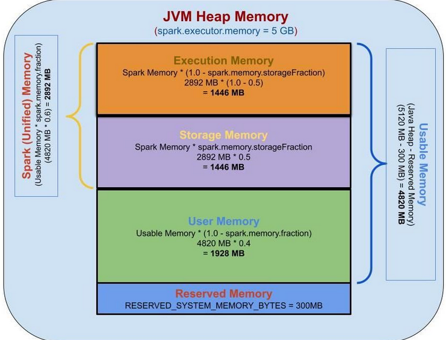

# Memory Management Overview

Memory usage in Spark largely falls under one of two categories: execution and storage. Execution memory refers to that used for computation in shuffles, joins, sorts and aggregations, while storage memory refers to that used for caching and propagating internal data across the cluster. In Spark, execution and storage share a unified region (M). When no execution memory is used, storage can acquire all the available memory and vice versa. Execution may evict storage if necessary, but only until total storage memory usage falls under a certain threshold (R). In other words, R describes a subregion within M where cached blocks are never evicted. Storage may not evict execution due to complexities in implementation.

This design ensures several desirable properties. First, applications that do not use caching can use the entire space for execution, obviating unnecessary disk spills. Second, applications that do use caching can reserve a minimum storage space (R) where their data blocks are immune to being evicted. Lastly, this approach provides reasonable out-of-the-box performance for a variety of workloads without requiring user expertise of how memory is divided internally.

Although there are two relevant configurations, the typical user should not need to adjust them as the default values are applicable to most workloads:

* ```spark.memory.fraction``` expresses the size of M as a fraction of the (JVM heap space - 300MiB, also called Usable Memory) (default 0.6). The rest of the space (40%) is reserved for user data structures, internal metadata in Spark, and safeguarding against OOM errors in the case of sparse and unusually large records.
* ```spark.memory.storageFraction``` expresses the size of R as a fraction of M (default 0.5). R is the storage space within M where cached blocks immune to being evicted by execution.

The value of ```spark.memory.fraction``` should be set in order to fit this amount of heap space comfortably within the JVM’s old or “tenured” generation.

When we mention ```spark.executor.memory=5g```, we are really mentioning Java Heap Memory to be allocated to 5GB



```java
long systemMemory = Runtime.getRuntime().maxMemory();
long usableMemory = systemMemory - RESERVED_SYSTEM_MEMORY_BYTES;
long sparkMemory = convertDoubletLong(usableMemory * SparkMemoryFraction);
long userMemory = convertDoubletLong(usableMemory * (1 - SparkMemoryFraction));

long storageMemory = convertDoubletLong(sparkMemory * SparkMemoryStorageFraction);
long executionMemory = convertDoubletLong(sparkMemory * (1 - SparkMemoryStorageFraction));
```

## Determining Memory Consumption

The best way to size the amount of memory consumption a dataset will require is to create an RDD, put it into cache, and look at the “Storage” page in the web UI. The page will tell you how much memory the RDD is occupying.

To estimate the memory consumption of a particular object, use ```SizeEstimator```’s ```estimate``` method. This is useful for experimenting with different data layouts to trim memory usage, as well as determining the amount of space a broadcast variable will occupy on each executor heap.

## Tuning Data Structures

The first way to reduce memory consumption is to avoid the Java features that add overhead, such as pointer-based data structures and wrapper objects. There are several ways to do this:

* Design your data structures to prefer arrays of objects, and primitive types, instead of the standard Java or Scala collection classes (e.g. HashMap). The ```fastutil``` library provides convenient collection classes for primitive types that are compatible with the Java standard library.
* Avoid nested structures with a lot of small objects and pointers when possible.
* Consider using numeric IDs or enumeration objects instead of strings for keys. 
* If you have less than 32 GiB of RAM, set the JVM flag -XX:+UseCompressedOops to make pointers be four bytes instead of eight. You can add these options in spark-env.sh.
* If your objects are still too large to efficiently store despite this tuning, store them in serialized form like MEMORY_ONLY_SER. In such case, please use Kryo since it leads to small size.
