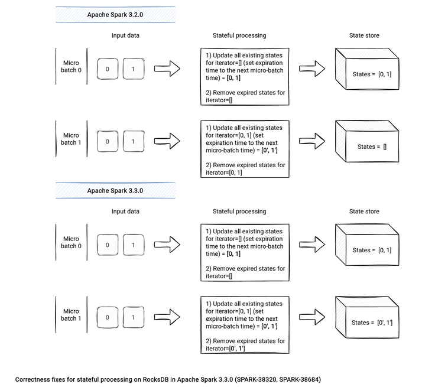

# Structured Streaming

## Introduction

New streaming processing can be understood as an unbounded table, growing with new incoming data, i.e. can be thought as stream processing built on Spark SQL. Thus, it uses optimization methods coming from Project Tungsten and similar programming model. Thanks to processing changes, structured streaming also reduces the implementation effort related to high availability (fault tolerance, exactly-once processing semantics).

More concretely, structured streaming brought some new concepts to Spark - at least in terms of project's keywords:

* **exactly-once guarantee (semantic)** - structured streaming focuses on that concept. It means that data is processed only once and output doesn't contain duplicates.
* **event time** - one of observed problems with DStream streaming was processing order, i.e the case when data generated earlier was processed after later generated data. Structured streaming handles this problem with a concept called event time that, under some conditions, allows to correctly aggregate late data in processing pipelines.
* **sink** - generally in programming, a sink is a class or a function receiving events from another object or function. Spark uses sinks as a place where results of computations are stored (output sink). In Spark 2.1 we can find following output sinks: file, foreach loop, console or memory (2 last sinks are marked as for debugging purposes).
* **Result Table** - represents the place where result of the query applied on input data is sent. Result from Result Table goes directly to output sink.
* **output mode** - every regular interval of time some output is generated by streaming process. The output is grouped in concept called output mode and it can be: **complete** (all data returned to sink), **append** (only new elements sent to sink) or **update** (only updated elements outputted to sink).
* **watermark** - this process is used to handle data arrived in late. It tracks current event time and defines a delay during which late events have the chance to be aggregated with events arrived on time and sent together to Result Table. It can be thought in terms of events window, closed after defined max, that after closing is returned to Result Table.
* **checkpoint** - tracks the progress of a query in persistent storage. It can be used to restart the query if there is a failure

To put mentioned improvements in place, structured streaming makes some new assumptions:

* **re-playable sources** - streaming sources should be able to send again unprocessed data because of processing failures. It means that they need to track reading state. As an example of re-playable source we could mention Apache Kafka that stores an offset indicating which messages were already consumed from given partition.
* **idempotent sinks** - output sinks should handle duplicate writes, i.e. do not add already saved data.
* **schema** - since the streaming is now structured and based on DataFrame/Dataset, it's obvious that data must follow schema. It simplifies a lot of processing and guarantees types safety.

An example of consuming csv

```scala
val sparkSession = SparkSession.builder().appName("Structured Streaming test")
  .master("local").getOrCreate()

val csvDirectory = "/tmp/spark-structured-streaming-example"

before {
  val path = Paths.get(csvDirectory)
  val directory = path.toFile
  directory.mkdir
  val files = directory.listFiles
  if (files != null) {
    files.foreach(_.delete)
  }
  addFile(s"${csvDirectory}/file_1.csv", "player_1;3\nplayer_2;1\nplayer_3;9")
  addFile(s"${csvDirectory}/file_2.csv", "player_1;3\nplayer_2;4\nplayer_3;5")
  addFile(s"${csvDirectory}/file_3.csv", "player_1;3\nplayer_2;7\nplayer_3;1")
}

private def addFile(fileName: String, content: String) = {
  val file = new File(fileName)
  file.createNewFile
  val writer = new BufferedWriter(new FileWriter(file))
  writer.write(content)
  writer.close()
}

"CSV file" should "be consumed in Structured Spark Streaming" in {
  val csvEntrySchema = StructType(
    Seq(StructField("player", StringType, false),
    StructField("points", IntegerType, false))
  )

// maxFilesPerTrigger = number of files - with that all files will be read at once
// and the accumulator will store aggregated values for only 3 players
val entriesDataFrame = sparkSession.readStream.option("sep", ";").option("maxFilesPerTrigger", "3")
.option("basePath", csvDirectory)
.schema(csvEntrySchema)
.csv(csvDirectory)

// Below processing first groups rows by field called 'player'
// and after sum 'points' property of grouped rows
val summedPointsByPlayer = entriesDataFrame.groupBy("player")
.agg(sum("points").alias("collectedPoints"))

val accumulator = sparkSession.sparkContext.collectionAccumulator[(String, Long)]
val query:StreamingQuery = summedPointsByPlayer.writeStream
.foreach(new ForeachWriter[Row]() {
  // true means that all partitions will be opened
  override def open(partitionId: Long, version: Long): Boolean = true

  override def process(row: Row): Unit = {
    println(s">> Processing ${row}")
    accumulator.add((row.getAs("player").asInstanceOf[String], row.getAs("collectedPoints").asInstanceOf[Long]))
  }

  override def close(errorOrNull: Throwable): Unit = {
    // do nothing
  }
})
.outputMode("complete")
.start()

// Shorter time can made that all files won't be processed
query.awaitTermination(20000)

accumulator.value.size shouldEqual 3
accumulator.value should contain allOf (("player_1", 9), ("player_2", 12), ("player_3", 15))
}

case class CsvEntry(player: String, points:Int)
```

## Watermarking

Watermark - moving threshold of how late data is expected to be and when to drop old state.

Trails behind max event time seen by the engine.

Watermark delay = trailing gap

Data newer than watermark may be late, but allowed to aggregate. Data older than watermark is "too late" and is dropped.

Windows older than watermark automatically deleted to limit the amount of intermediate state.

```scala
parsedData
        .withWatermark("timestamp", "10 minutes")
        .groupBy(window("timestamp", "5 minutes"))
        .count()
```

It is used only in stateful operations and ignored in non-stateful streaming queries and batch queries.

Trade off between lateness tolerance and state size. The more late data processed, the more memory consumed.

### Streaming Deduplication

Drop duplicate records in a stream. Specify columns with uniquely identifies a record. Spark SQL will store past unique column values as state drop any record that matches the state.

```scala
userActions
        .dropDuplicates("uniqueRecordId")
```

You can use watermark here. Timestamp as a unique column along with watermark allows old value in the state to be dropped. Records older than watermark delay is not going to get any further duplicates.

Timestamp must be same for duplicate records.

```scala
userActions
        .withWatermark("timestamp")
        .dropDuplicates("uniqueRecordId", "timestamp")
```

## Arbitrary Stateful Operations

Many use cases require more complicated logic than SQL ops.

Two APIs - ```MapGroupsWithState``` and ```FlatMapGroupsWithState``` - General APIs for per-key user-defined stateful processing.

### How to use MapGroupsWithState

* Define the data structures - Input event, state data and output event.
* Define functions to update state of each grouping key using the new data - grouping key, new data and previous state.

```scala
case class UserAction(userId: String, action: String)
case class UserStatus(userId: String, active: Boolean)

def updateState(userId: String, actions: Iterator[UserAction], state: GroupState[UserStatus]) : UserStatus = {
  val prevStatus = state.getOption.getOrElse {
    new UserStatus()
  }
  
  actions.foreach {
    action => prevStatus.updateWith(action)
  }
  
  state.update(prevStatus)
  
  return prevStatus
}
```

* User the user-defined function on a grouped Dataset

```scala
userActions
        .groupByKey(_.userId)
        .mapGroupsWithState(updateState)
```

> This works with both batch and streaming queries. In batch query, the function is called only once per group with no prior state

#### Timeout

When a group does not get any event for a while, then the function is called for that group with an empty iterator

Must specify a global timeout type, and set per-group timeout timestamp / duration

Ignored in a batch queries.

##### How to use EventTime timeout?

* Enable EventTimeTimeout in mapGroupsWithState
* Enable watermarking
* Update the mapping function -
  * every time function is called, set the timeout timestamp using the max seen event timestamp + timeout duration
  * Update state when timeout occurs

watermark is calculated with max event time across all groups.

For a specific group, if there is no event till watermark exceeds the timeout timestamp,

* then function is called with empty iterator, and hasTimedOut is set to true.
* else function is called with new data, and timeout is disabled. Needs to explicitly set timeout timestamp everytime.

Let's see with an example.

```scala

case class UserAction(userId: String, action: String)
case class UserStatus(userId: String, active: Boolean)

def updateState(userId: String, actions: Iterator[UserAction], state: GroupState[UserStatus]) : UserStatus = {
  if(!state.hasTimedOut) {
    val prevStatus = state.getOption.getOrElse {
      new UserStatus()
    }

    actions.foreach {
      action => prevStatus.updateWith(action)
    }

    state.update(prevStatus)

    state.setTimeoutTimestamp(maxActionTimestamp, "1 hour")
  } else {
    userStatus.handleTimeout()
    state.remove()
  }
  return prevStatus
}

userActions
        .withWatermark("timestamp")
        .groupByKey(_.userId)
        .mapGroupsWithState(EventTimeout)(updateState)
```

##### How to use Processing-time timeout?

Instead of setting timeout timestamp, function sets timeout duration (in terms of wall-clock-time) to wait before timing out. It is independent of watermark.

> Note, query downtimes will cause lots of timeout after recovery.

Let's see with an example.

```scala
case class UserAction(userId: String, action: String)
case class UserStatus(userId: String, active: Boolean)

def updateState(userId: String, actions: Iterator[UserAction], state: GroupState[UserStatus]) : UserStatus = {
  if(!state.hasTimedOut) {
    val prevStatus = state.getOption.getOrElse {
      new UserStatus()
    }

    actions.foreach {
      action => prevStatus.updateWith(action)
    }

    state.update(prevStatus)

    state.setTimeoutDuration("1 hour")
  } else {
    userStatus.handleTimeout()
    state.remove()
  }
  return prevStatus
}

userActions
        .groupByKey(_.userId)
        .mapGroupsWithState(ProcessTimeTimeout)(updateState)
```

### How to use FlatMapGroupsWithState

More generic version where the function can return any number of events, possibly none at all.

Let's see with an example.

```scala
case class UserAction(userId: String, action: String)
case class UserStatus(userId: String, active: Boolean)

def updateState(userId: String, actions: Iterator[UserAction], state: GroupState[UserStatus]) : Iterator[SpecialUserAction] = {
}

userActions
        .groupByKey(_.userId)
        .flatMapGroupsWithState(outputMode, timeoutConf)(updateState)
```

Function output mode gives spark insights into the output from this opaque function - these can be Update mode or Append mode. This allows spark SQL planner to correctly compose flatMapGroupsWithState with other operations.

> Please note this output mode is not the same as query output.

## How to architect a structured streaming pipeline

### Pattern 1: ETL

* **What**: Convert unstructured input to structured tabular data with Latency of few minutes
* **Why**: Query the latest structured data interactively or with periodic jobs
* **How**:
  * **Process**: Use structured streaming query to transform, dirty data. Run 24/7 on a cluster with default trigger
  * **Store**: Save structured scalable storage that supports data skipping, etc. like parquet, ORC, or delta lake. Delta lake enables read with snapshot guarantees while writes are in process. It concurrently reprocesses data with full ACID guarantees - also allows coalesce small files into larger files and fix mistakes in existing data.

### Pattern 1: Cheaper ETL

* **What**: Convert unstructured input to structured tabular data with Latency of few hours and do not have a cluster up 24/7
* **Why**: Query the latest structured data interactively or with periodic jobs
* **How**:
  * **Process**: Use structured streaming query to transform, dirty data. Run streaming query with ```trigger.once``` for processing all available data since the last batch. Set up external scheduler, like airflow (every few hours?) to periodically start a cluster and run one batch.
  * **Store**: Save structured scalable storage that supports data skipping, etc. like parquet, ORC, or delta lake. Delta lake enables read with snapshot guarantees while writes are in process. It concurrently reprocesses data with full ACID guarantees - also allows coalesce small files into larger files and fix mistakes in existing data.

### Pattern 1: Query faster than ETL

* **What**: Latency of few seconds
* **Why**: Query the latest up-to-last seconds structured data interactively
* **How**:
  * **Process**: Query data in Kafka directly using Spark SQL. Can process up to the last seconds received by Kafka when the query was started.

### Pattern 2: Key-value output

* **What**: Input: new data for each key. Output: updated values for each key (say, aggregations, arbitrary stateful operations like sessionizations, etc)
* **Why**: Lookup the latest value for key (dashboards, websites, etc.)
* **How**:
  * **Process**: Use structured streaming with stateful operations for aggregation
  * **Store**: Save in key-values stores optimized for single key lookups

### Pattern 2: Key-value output

* **What**: Input: new data for each key. Output: updated values for each key (say, aggregations, arbitrary stateful operations like sessionizations, etc) with latency few minutes
* **Why**: Summary tables for querying interactively or with periodic jobs
* **How**:
  * **Process**: Use structured streaming with stateful operations for aggregation. Stateful aggregation requires setting watermark to drop very late data. Dropping some data leads to some inaccuracies.
  * **Store**: save in delta lake. Delta lake supports upserts using SQL MERGE

```scala
streamingDataFrame.foreachBarch(
  spark.sql('''
        MERGE INTO deltaTable using batchOutput
          WHEN MATCHED THEN UPDATE ...
          WHEN NOT MATCHED THEN INSERT ...
  ''')
).start()
```

### Pattern 2: Key-value aggregation for analytics

* **What**: generate aggregated values for keys with latency of hours and do not drop any late data
* **Why**: Summary tables for analytics
* **How**:
  * **Process**: Use structured streaming to structured table (no stateful aggregation).
  * **Store**: save in delta lake. In post-processing, aggregate after all delayed data received.

### Pattern 3.1: Joining multiple inputs (fast fact and slow dimension)

* **What**: input: multiple data streams based on common key. In the first of pattern, input can be one fast stream of facts and one slow stream of dimension changes and output is a fast stream enriched by data from slow stream
* **Why**: Output is a combined information
* **How**:
  * **Process**: ETL slow stream to a dimension table. Join fast stream with snapshots of the dimension table

**Caveats**

* Structured streaming by default does reload dimension table snapshot and use till the entire processing is complete. Changes by slow ETL would not be seen until restart. A suggestion is to store dimension table in delta lake. Delta Lake's version allows changes to be detected and the snapshot is automatically reloaded without restart.
* Delays in updates to dimension table can cause joining with stale dimension data. A better solution it to treat the solution as "joining fast and fast data"

### Pattern 3.2: Joining multiple inputs (fast fact and dimension as fast)

* **What and why**: input: two fast streams where either stream maybe delayed. Output is a combined information even if one is delayed over the other
* **How**:
  * **Process**: Use stream-stream joins in structured streaming. Data will be buffered as state using time constraint and watermarks. Watermarks define how long to buffer before giving up on matching

Let's understand with an example.

* Impressions can be 2 hours late. ```val impressionWithWatermark = impressions.withWatermark("impressionTime", "2 hours")```
* Clicks can be 3 hours late. ```val clickWithWatermark = clicks.withWatermark("clickTime", "3 hours")```
* A click can occur within 1 hour after the corresponding impression

```scala
impressionWithWatermark.join(
  clickWithWatermark,
  expr(
    """
      clickAdId = impressionAdId AND
      clickTime >= impressionTime AND
      clickTime <= impressionTime + interval 1 hour
      """
  ),
  joinType = "letOuter" // can be inner (default) / leftOuter / rightOuter
)
```

Left and right outer joins are allowed only with time constraints and watermarks. Needed for correctness, Spark must output nulls when an event cannot get any future match.

Spark can calculate that

* impressions need to be buffered for 4 hours
* clicks need to be buffered for 2 hours

Spark drops events older than these thresholds.

### Pattern 4: Change data capture

* **What**: input: change data based on a primary key. Output is the final table after the changes
* **Why**: End-to-end replication of transactional tables into analytical tables
* **How**:
  * **Process**: Use structured streaming and delta lake. In each batch, apply changes to delta table using merge. Merge supports update, insert and delete.

```scala
streamingDataFrame.foreachBarch(
  spark.sql('''
        MERGE INTO deltaTable using batchOutput
          WHEN MATCHED THEN UPDATE ...
          WHEN MATCHED THEN INSERT ...
          WHEN NOT MATCHED THEN INSERT ...
  ''')
).start()
```

### Pattern 5: Writing to multiple outputs

* **What and Why**: input: one event row. Output is multiple final tables after transformation. Example, raw logs and summaries, table change log and updated table, or summary for analytics and summary for lookup
* **How**:
  * **Process** - **Serial**: writes table 1 and reads it again. Cheap or expensive depends on the size and format of first output table. Has higher latency.
  * **Process** - **Parallel**: reads the input twice, may have to parse the data twice. Cheap or expensive depends on size of raw input + parsing cost.
  We may need to have combination.
  * **Combo 1**: **Multiple streaming queries**. Do expensive parsing once, write to table 1. Do cheaper follow-up processing from table 1. Good for ETL + multiple levels of summaries e.g. change log + updated table. It still does write + read of table1.
  * **Combo 2**: **Single query + foreachBatch**. Compute once, write multiple times - see below. This is cheaper, but looses exactly-once guarantee

```scala
streamingDataFrame.foreachBatch( batchSummaryData =>
    //write summary to delta lake
    //write summary to key value store
).start()
```

## Productionizing structured streaming jobs

### Test

#### Strategy 1

Don't care about sources and sinks. Just test your business logic, using batch DataFrames. Pros: Easy to do in scala / python. Cons: Not all batch operations are supported in streaming

#### Strategy 2

Leverage the StreamTest test harness available in Apache Spark. Use MemorySource and MemorySink to test business logic.

```scala
val input = MemoryStream[Array[Byte]]
val stream = input.toDS().toDF("value").groupBy('value.cast("string") as ' key).agg(count(*) as 'value)

testStream(stream, OutputMode.Update) (
  AddData(input, "a".getBytes(), "b".getBytes()),
  CheckAnswer(("a" -> 1), ("b" -> 1))
)
```

Available actions in StreamTest:

* StartStream: Allows you to provide a trigger, checkpoint location, or SQL configuration for your system
* AddData: adds data to your source
* CheckAnswer: check the current data available in your sink
* CheckLastBatch: check data that was written to your sink in the last epoch / micro-batch
* StopStream: stop you stream to mimic failures / upgrades
* ExpectFailure: allow you to test failure scenarios on the last batch based on input data

How to use StreamTest?

* Copy the code from the spark repository to your project (recommended)
  * Isolates you from changes in open source that may break your build
* Or, Import the spark-sql test jars.

sbt: "org.apache.spark" %% "spark-sql" % "2.4.0" % "test" classifier "test"

Maven

```maven
<dependency>
    <groupId>org.apache.spark</groupId>
    <artifactId>spark-sql_2.11</artifactId>
    <version>2.4.1</version>
    <scope>test</scope>
    <type>test-jar</type>
</dependency>
```

Pros: It is a great test harness for free. It is a quick and cheap way to test business logic.
Cons: It is only available in scala

#### Strategy 3

Integration testing using Databricks jobs

* Have a replica of production in a staging account
* Use Databricks REST APIs / Airflow / Azure Data Factory to kick off a single-run job
* Verify data output, data latency, job duration

Pros: Closest option to mirror production. Cons: Hard to set up and is expensive

#### What else to watch out for?

* Table schemas: Changing the schema/logic of one stream upstream can break cascading jobs
* Dependency hell: The environment your local machine or continuous integration service may differ from Production. Think containerization here.
* Stress Testing: Most times Spark isn't the bottleneck. In fact, throwing more money at your Spark clusters make the problem worse!.
  * Do not forget to tune your kafka brokers (num.io.threads, num.network.threads) or S3
  * Most cloud services have rate limits, make sure you avoid them as much as you can

### Monitor

Get last progress of the streaming query

* Current input and processing rates
* Current processed offsets
* Current state metrics

This can be run by

```scala
streamingQuery.lastProgress()

{
  ...
  "inputRowsPerSecond": 10024,
  "processedRowsPerSecond": 10063
  "durationMs" : { .. }
  "sources" : [ .. ]
  "sink" : { .. }
  ...
}
```

This should be done asynchronously using StreamQueryListener API

```scala
new StreamingQueryListener {
  def onQueryStart(...)
  def onQueryProgress(...) //every epoch
  def onQueryTermination(...)
}
```

Once you have this, you can push the data to AWS CloudWatch or Apache Kafka

Even if you are running a map-only job, you can add a watermark. This allows you to collect event time min, max, average in metrics.
You can add current_timestamp() to keep track of ingress timestamps - ```udf(() => new java.util.Timestamp(System.currentTimeMillis))``` to get accurate processing timestamp

Start streams on your tables for monitoring and building streaming dashboards. Use ```display(streaming_df)``` to get live updating displays in Databricks. Use foreach/foreachBatch to trigger alerts.

### Deployment

* **Multiplex** many streams on a single cluster
  * Pros:
    * Better cluster utilization
    * Potential Delta cache re-use
  * Cons:
    * Driver becomes a bottleneck. This happens primarily due to:
      * Locks
        * JSON serialization of offsets in streaming (Jackson)
        * Scala compiler (Encoder creation)
        * Hadoop Configuration (java.util.Properties)
        * Whole Stage Codegen (ClassLoader.loadClass)
      * Garbage Collection
      * So, how many streams can you run on a single driver?
        * This really depends on your streaming sources and sinks. Efficient Sources Delta Lake > Event based file sources > Kafka/Azure EventHub/Kenesis > Other file formats (JSON / CSV) can handle more streams. Similarly, efficient sinks kafka > delta lake > other file formats
    * Determining how many streams on a clusters is difficult
    * Load balancing streams across clusters also difficult

### Updating structured streaming jobs

Most important thing here is checkpoint.

* The checkpoint location is the unique identity of your stream
* Contains:
  * The id of the stream (json file named metadata)
  * Source offsets (folder names sources, contains json files)
  * Aggregation state (folder named state, contains binary files)
  * Commit files (folder named commits, contains json files)
  * Source Metadata (folder named sources)

Based on files stored in a checkpoint, what can you change?

* Sinks
* Input/Output schema (in the absence of stateful operations)
* Triggers
* Transformations
* Spark Versions

Based on files stored in a checkpoint, what cannot you change?

* Stateful operations: agg, flatMapGroupsWithState, dropDuplicates, join, etc. Neither below can be changed.
  * Schema: key, value
  * Parallelism: spark.sql.shuffle.partitions
  * Can't add or remove stateful operators
* OutputMode (will work, but semantics of stream has changed)
* Sources

To workaround these:

* Restart stream from scratch
  * Use new checkpoint location - avoid eventual consistency on S3
  * Partition source tables by date, restart stream from a given date

## Spark 3.3.0 improvements

### Trigger.Once in multiple batches

The first important feature is a new trigger called ```AvailableNow```.

* AvailableNow and Once triggers run only once. Their execution takes all data available at the moment of query execution.
* However, as spotted by Bo Zhang who is the author of the feature, the Once trigger processes all the data in the single micro-batch. It leads to several problems, such as scalability or operational complexity. The AvailableNow trigger behaves differently. It still processes all the available data but with respect to the rate limit, such as maxFilesPerTrigger for file stream, or maxOffsetsPerTrigger for Apache Kafka.

Besides the new trigger, Apache Spark 3.3.0 has a new interface called ```SupportsTriggerAvailableNow```. Any source supporting the trigger must implement it to return the data available for processing within the trigger scope. Apache Kafka returns the last available offset:

```scala
private[kafka010] class KafkaMicroBatchStream
// ...
    override def prepareForTriggerAvailableNow(): Unit = {
        allDataForTriggerAvailableNow = kafkaOffsetReader.fetchLatestOffsets(
        Some(getOrCreateInitialPartitionOffsets()))
    }
```

Next, the MicroBatchExecution running the streaming job uses a MultiBatchExecutor that remains active as long as there is data left to process:

```scala
case class MultiBatchExecutor() extends TriggerExecutor {
  override def execute(batchRunner: () => Boolean): Unit = while (batchRunner()) {}
}
```

The difference with the Trigger.Once is visible pretty clearly if you compare the MultiBatchExecutor with SingleBatchExecutor:

```scala
case class SingleBatchExecutor() extends TriggerExecutor {
  override def execute(batchRunner: () => Boolean): Unit = batchRunner()
}
```

And why does Trigger.Once ignore the rate limits? Because of this condition applied while planning the Structured Streaming job:

```scala
class MicroBatchExecution(
// ...
    override lazy val logicalPlan: LogicalPlan = {
      // ...
      uniqueSources = triggerExecutor match {
        case _: SingleBatchExecutor =>
          sources.distinct.map {
            case s: SupportsAdmissionControl =>
              val limit = s.getDefaultReadLimit
              if (limit != ReadLimit.allAvailable()) {
                logWarning(s"The read limit $limit for $s is ignored when Trigger.Once is used.")
              }
              s -> ReadLimit.allAvailable()
            case s => s -> ReadLimit.allAvailable()
          }.toMap
      }
    }
                         )
```

### Rate per micro-batch source

Another high-level change concerns a new data source called rate micro-batch. Why this new input looking similar at first glance to the rate data source? Jungtaek Lim, who is the author of the feature, explained that in the JIRA ticket:

* The "rate" data source has been known to be used as a benchmark for streaming query.
* While this helps to put the query to the limit (how many rows the query could process per second), the rate data source doesn't provide consistent rows per batch into stream, which leads two environments be hard to compare with.

To solve the issue, Jungtaek added a new data source that:

* generates a consistent number of rows per micro-batch
* supports a custom event time; you can define the start time of the job and time change by each micro-batch

## RocksDB

RocksDB is the state store added in the Spark 3.2.0 release. A new configuration entry, ```spark.sql.streaming.stateStore.rocksdb.trackTotalNumberOfRows``` to control the tracking of the writing operations, addresses the double lookup on the key for the write operations made by RocksDB. If you prefer performance against observability, you can set this config to false.

New metrics ``block-cache-usage`` is also added.



## Distribution and ordering for DataSource V2 writes

Apache Spark 3.3.0 also includes some catch-up for the ```RequiresDistributionAndOrdering``` interface. This interface is present when the data source requires a specific ordering or partitioning on the writing side. So far, it only has been implemented for the batch workloads. The 3.3.0 release extends the scope to the streaming writers with this addition to the V2Writes logical rule:

```scala
object V2Writes extends Rule[LogicalPlan] with PredicateHelper {
    override def apply(plan: LogicalPlan): LogicalPlan = plan transformDown {
    // ...
        case WriteToMicroBatchDataSource(
        relation, table, query, queryId, writeOptions, outputMode, Some(batchId)) =>
        
            val writeBuilder = newWriteBuilder(table, writeOptions, query.schema, queryId)
            val write = buildWriteForMicroBatch(table, writeBuilder, outputMode)
            val microBatchWrite = new MicroBatchWrite(batchId, write.toStreaming)
            val customMetrics = write.supportedCustomMetrics.toSeq
            val newQuery = DistributionAndOrderingUtils.prepareQuery(write, query, conf)
            WriteToDataSourceV2(relation, microBatchWrite, newQuery, customMetrics)
            // ...`
```

Note the ```val newQuery = DistributionAndOrderingUtils.prepareQuery(write, query, conf)``` is where Apache Spark adds an extra **RepartitionByExpression** and **Sort** node if any of them is required by the data source.

## Sources

* [Structured Streaming](https://www.waitingforcode.com/apache-spark-structured-streaming/structured-streaming/read)
* [What new in Spark 3.3.0](https://www.waitingforcode.com/apache-spark-structured-streaming/what-new-apache-spark-3.3.0-structured-streaming/read#trigger_once_multiple_batches)

## Open queries

* How to find bottlenecks in a pipeline

* [Spark Structured Streaming Performance Test](https://en.blog.businessdecision.com/spark-structured-streaming-performance-testing/)
