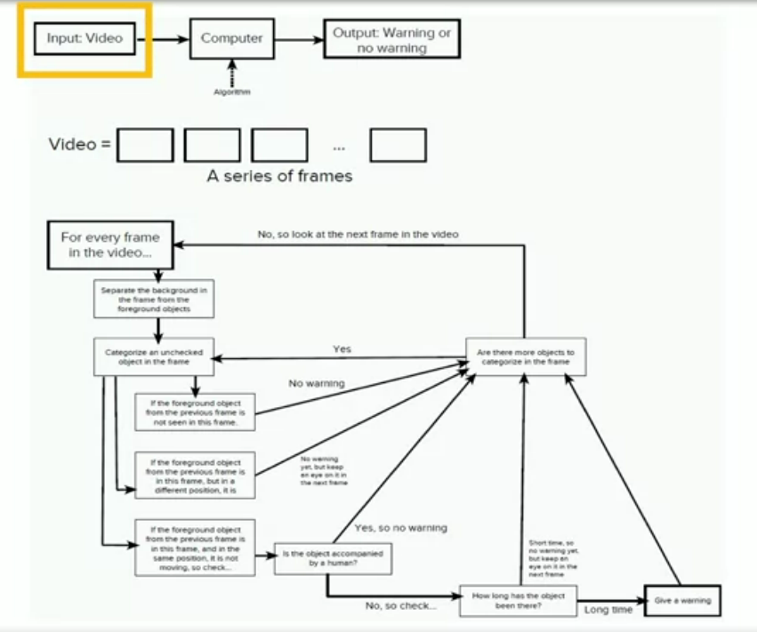
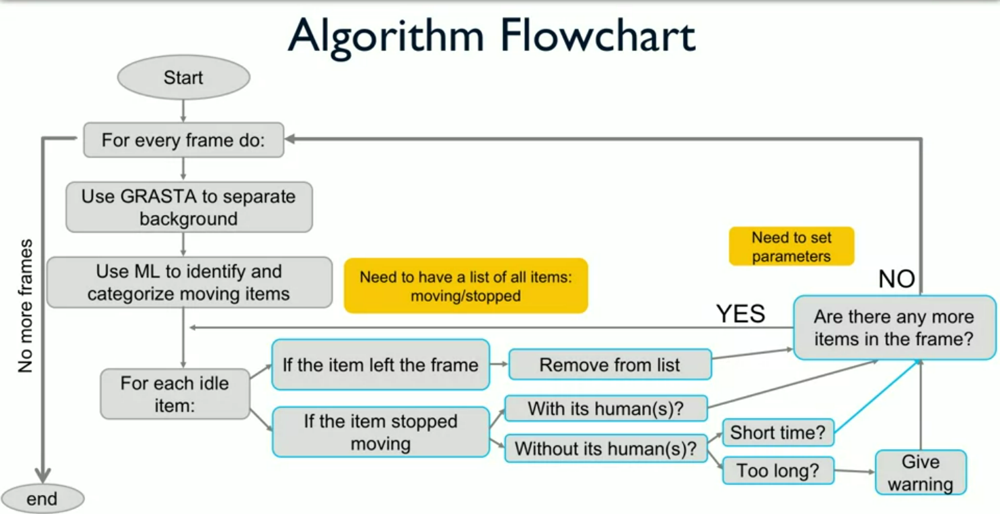

# Computational Thinking
These four pieces are all practices -
* **Identifying** your problem,
* **Decomposing** your problem into smaller pieces, 
* **Trying to find patterns** that you can use to solve your problems, 
* and **Abstracting** - trying to think about what kind of data is important and not important

* It may seem that they go in this order or that it's a very linear process, but a lot of times you're going to iterate through different drafts, so to speak, different attempts to solve your problem, and you're going to go into non-linear fashion.

> There's no single right way to do this,

These practices represent things to think about as you work to develop a plan to solve your problem in a way that you can then start writing the computer program.

## Graphic Organization

One iteration per page

Each page has sections of problem identification, decompositions, pattern recognition and abstraction.

## Case Study: Surveillance using Image processing
Videos are basically a sequence of images (about 24 fps and above). Image is simply a series of numbers that represent the colors. Grassmanian Robust Adoptive Subspace Tracking Algorithm aka **GRASTA** is an algorithm that can separate fixed, means background objects from moving in the real-time.

Artificial Intelligence aka AI is the field of study that gives computers the ability to learn without being explicitly programmed. Machine Learning is one subject of AI.

To track an object or person, you are really tracking numbers in a matrix.

A flowchart is a type of diagram that represents an algorithm, workflow or process.



### Turning an image into numbers
An image of m by n pixels is represented mathematically by an m by n matrix. An m by n matrix is an array of numbers with exactly m rows and n columns. We can take each column of that matrix and stack them on top of each other to turn it into a tall vector, of length ```m * n``` - now each of pixels are in the vector.

> Each cell of the matrix represents contains a number, which represents a color.

### Turning a video into matrix
Because you have the n columns and the m rows and that what is called vectorizing an image. So, if you now see a video becomes a matrix because each of the frames is a very, very, very long vector and if you stack it together you will get an m*n times K matrix, where K is a number of frames you have.



### Ho do we know if our algorithm is going to work?

* A successful algorithm requires a lot of tests
  * Test each element first (GRASTA, ML)
    * We have now made code for each of the steps in the flowchart
      * Check separating background
      * Characterizing Objects successfully
  * How do we know an element worked?
    * Not issuing false positives
    * What kind of tests are we doing?
      * Identifying dangerous things, not identifying things
* When you are sure all elements work, combine them in simple tests"
  * Use short videos, with low resolution
  * Few items
  * Increase complexity slowly
  * Your testing strategy must identify the possible outcomes. You can't identify all the edge cases, but you should think of as many as you can.

### Summing it up
In this case study, we identified a large, complex problem: How can we analyze surveillance video so we can identify potentially suspicious packages at an airport (to warn a security officer)? In the first iteration of this problem, we decomposed it into sub-problems. Some of these sub-problems included: separating background and foreground images to detect movement, identifying packages and people, and tracking packages and people. In the second iteration of this problem, we decomposed our problem again by asking "how long is too long for a package to be left alone?"

To help solve these sub-problems, we engaged in pattern recognition. In the first iteration of pattern recognition, we noticed that unattended packages should qualify as suspicious behavior. In the second iteration, we needed to determine how long is "too long" for a package to be left alone. By looking back at previous surveillance videos, we could establish a normal amount of time for people to leave their luggage.

In the abstraction phase of iteration one, we identified what information was relevant to our problem, and what information could be ignored. For instance, we could ignore some stationary objects and background posters, but we couldn't ignore packages and people.

In the attachment below, we have provided a graphic organizer example for the case-study so far. Because computational thinking is a complex process, this is just one example of how to organize this information. When you are creating your own graphic organizer for this case-study, you should organize the information in a way that makes sense to you. 

## Case-Study: Introduction to Epidemiology
Computational Health Science (CHS), as we define it, represents the interdisciplinary application of innovative computer science tools, including social network analysis and data mining, to address health-related questions and problems. It integrates the analytical strengths and skills of health scientists and computer scientists, supported by complementary expertise from other researchers and practitioners as applicable (e.g., psychologists, sociologists). The case for CHS includes a number of team learning opportunities arising from the post digital revolution where technology is more ubiquitous. It also calls for learning how to “think together,” as a fundamental ingredient for success in solving complex problems.  