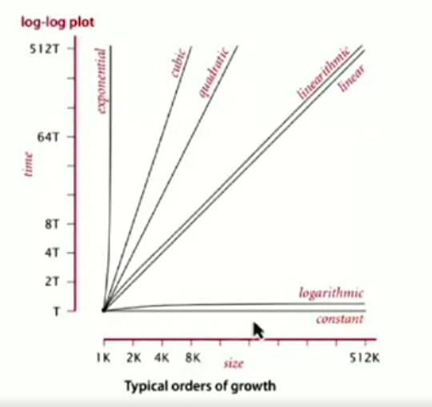
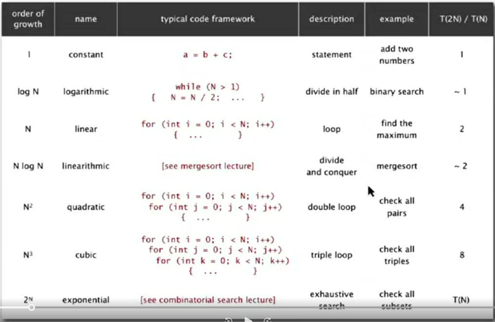
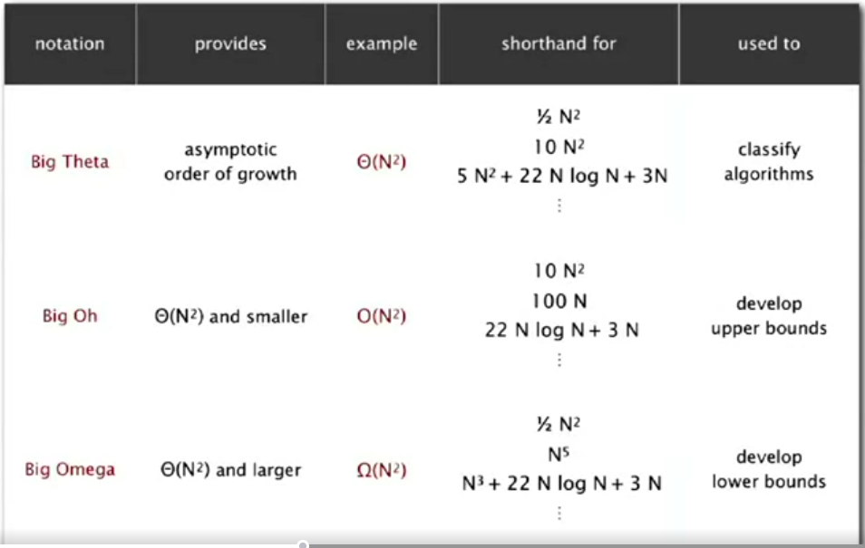

# Fundamentals of algorithms

## Why is algorithm important?

## Cast of characters
* Programmer needs to develop a working solution
* Client wants to solve problem efficiently
* Theoretician wants to understand
* Team - Basic blocking and tackling is sometimes necessary

## Reasons to analyze algorithms
* Predict performance
* Compare algorithms
* Provide guarantees
* Understand theoretical basis
* Avoid performance bugs

> Client get poor performance because programmer did not understand performance characteristics.

## Some algorithm successes
* Discrete Fourier transform using FFT algorithm: N log N steps.
* N-body simulation using Barnes-Hut algorithm: N log N steps.

## Scientific method applied to analysis of algorithms
Insight [Donald Knuth, 1970] - The art of computer programming

A framework for predicting performance and comparing algorithms.
* **Observe** some feature of the natural world (running time of the computer)
* **Hypothesize** a model that is consistent with the observations
* **Predict** events using the hypothesis
* **Verify** the predictions by making further observations
* **Validate** by repeating until the hypothesis and observations agree

Principles
* Experiments must be **reproducible** (someone else should be able to run and agree)
* Hypothesis must be **falsifiable**

## Experimental algorithms
* System Independent effects
  * Algorithm
  * Input data
* System dependent effects
  * Hardware: CPU, memory, cache,..
  * Software: compiler, interpreter, garbage collector,...
  * System: operating system, network, other apps,...

> Both of these determines constant in the power law. It is difficult to get precise measurements. It is much easier and cheaper than other sciences.

Power law: T(n) = a*n^b

## Mathematical model for running time
Concept was envisioned by Donald Knuth. In principle, accurate mathematical models are available.

**Total Running time**: sum of cost x frequency of all operations.
* Need to analyze program to determine set of operations
* Cost depends on machine, compiler
* Frequency depends on algorithm, input data

Tn = c1A + c2B + c3C + c4D + c5E

However, it can become very complex to analyze and come up with detail. It is envisioned that if we can simplify the cost model and yet make sense of the costing model.

* Simplification 1: Use some basic operation as a proxy for running time.
* Simplification 2: Tilde notation `$f(N) ~ g(N) = lim(N->\infinity)f(N)/g(N) = 1$`
  * Estimate running time (or memory) as a function of input size N.
  * Ignore lower order terms.
    * when N is large, terms become negligible
    * when N is small, we don't care
    
| Operation              | frequency                    | tilde notation     |
|------------------------|------------------------------|--------------------|
| variable declaration   | N + 2                        | ~ N                |
| assignment declaration | N + 2                        | ~ N                |
| less than compare      | 1/2 * (N+1) * (N+2)          | ~ 1/2 N^2          |
| equal to compare       | 1/2 * N * (N-1)              | ~ 1/2 N^2          |
| array access           | N * (N-1)                    | ~ N^2              |
| increment              | 1/2 * N * (N-1) to N * (N-1) | ~ 1/2 N^2 to ~ N^2 |

Ex: 1 + 2 + ... + N ~ 1/2 * N^2
Ex: 1 + 1/2 + 1/3 + ... + 1/N ~ ln N
Ex. 3-sum triple ~ 1/6* N^3

## Common order-of-growth classification

The small set of functions: 1, log N, N, NlogN, N^2, N^3, and 2^N suffices to describe order-of-growth of typical algorithms. We ignore the leading constant here.

We strive for 1, log N, N, NlogN. Linear or linearithmetic algo is required to keep pace with Moore's law (which crudely states that processing power doubles every two years). Let's see some examples.

### Binary Search: Mathematical analysis
Proposition: Binary searches uses at most 1 + logN compares to search in a sorted array of size N.

Def. T(N) = # of compares to binary search in a sorted sub-array of size <= N

Binary search recurrence. T(N) <= T(N/2) + 1 for N > 1, with T(1) =1

So, it is possible to get to N2*logN for algorithm for 3-sum using a sorting-based algorithm.
* `Sort` the N distinct number.
* For each pair of number a[i] and a[j], `binary search` for -(a[i] + [aj]) to sum to zero.

Analysis:
Step1: N^2 with insertion sort
Step2: N2logN with binary search

## Theory of analyses
* **Best case**: Lower bound on cost
  * Determined by "easiest" input
  * Provides a goal for all inputs
* **Worst case**: Upper bound on cost
  * Determined by "most difficult" input
  * Provides a guarantee for all inputs
* **Average case**: Expected cost for random input
* Need a model for "random" input
* Provides a way to predict performance

**Qn: Actual data might not match input model?**
* Need to understand input to effectively process it
* Approach 1: design for the worst case. Ideal
* Approach 2: randomize, depend on probabilistic guarantee

### Goals for theory of algorithm
* Establish "difficulty" of a problem
* Develop "optimal" algorithms
  * Performance guarantee (to within a constant factor) for any input
  * No algorithm can provide a better performance guarantee

### Approach
* Suppress details in analysis: analyze "to within a constant factor"
* Eliminate variability in input model by focusing on the worst case

### Notations

Big Theta -> Just a way to describe the order of growth
Big Oh -> Upper bounds on performance
Big Oh -> Lower bounds on performance

And then there is Tilde, which is used for approximate model and focuses on leading term. 

### Design approach
* Start
  * Develop an algorithm
  * Prove a lower bound
* Gap?
  * Lower the upper bound (discover a new algorithm)
  * Raise the lower bound (more difficult)
* Caveats
  * Overly pessimistic to focus on worst case?
  * Need better than "to within a constant" factor to predict performance.

Since 1970, people have worked to steadily decreasing upper bounds for many important problems. There are many known optimal algorithms, but many are yet to be solved.

## Memory
We also need to understand how much memory will our program need.

### Basics
* Bit: 0 or 1
* Byte: 8bits
* Megabyte (MB): 1 million or 2^20 bytes
* Gigabyte (GB): 1 billion or 2^30 bytes

**Old machine**: We used to assume a 32-bit machine with 4byte pointers

**Modern machine**: We now assume a 64-bit machine with 8byte pointers
* Can agree more memory
* Pointers use more space - some JVMs "compress" ordinary object pointers to 4bytes to avoid this cost.

In Java, for example -

| Data types | bytes   |
|------------|---------|
| boolean    | 1       |
| byte       | 1       |
| char       | 2       |
| int        | 4       |
| float      | 4       |
| long       | 8       |
| double     | 8       |
| char[]     | 2N + 24 |
| int[]      | 4N + 24 |
| double[]   | 8N + 24 |
| char[][]   | ~ 2M*N  |
| int[][]    | ~4M*N   |
| double[][] | ~8M*N   |

* Object Overhead: 16bytes
* Reference: 8bytes
* Padding: Each object uses a multiple of 8 bytes
****
* Shallow memory usage: Don't count referenced objects 
* Deep memory usage: If array entry or instance variable is a reference, add memory(recursively) for reference object.

## Summary
* Empirical analysis.
  * Execute program to perform experiments.
  * Assume power law and formulate a hypothesis for running time.
  * Model enables us to _make predictions_.
* Mathematical analysis
  * Analyze algorithm to count frequency of operations. 
  * Use tilde notation to simplify analysis. 
  * Model enables us to _explain behavior_.
* Scientific method.
  * Mathematical model is independent of a particular system; applies to machines not yet built.
  * Empirical analysis is necessary to validate mathematical models
    and to make predictions.