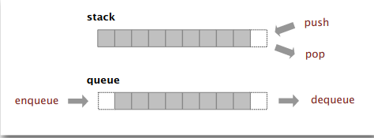

# Bags, Queues and Stacks

* Fundamental data types.
  * Value: collection of objects.
  * Operations: Simple like insert, remove, iterate, test if empty. 
  * Intent is clear when we insert. 
  * Which item do we remove?



* Stack. Examine the item most recently -> LIFO
* Queue. Examine the item least recently added -> FIFO

## Stack
### Linked-list representation
Maintain point to first node in a linked list; insert/remove from front.

```java
public class LinkedStackOfStrings {

  private Node first = null;

  private class Node {
    String item;
    Node next;
  }
  
  public boolean isEmpty() {
      return first == null;
  }

  public String pop() {
    String item = first.item;
    first = first.next;
    return item;
  }
  
  public push(String element) {
      Node oldFirst = first;
      first = new Node();
      first.item = element;
      first.next = oldFirst;
  }
}
```

### Array implementation
* Use array s[] to store N items on stack
* push(): add new item at s[N]
* pop(): remove item from s[N-1]

> Please consider
> > Stack overflows when N exceeds capacity. Use resizing array for array implementation

> > Stack underflows if pop from an empty stack.

> > Should not allow null item to be inserted

> > We should not hold a reference to an object when it is no longer needed

```java
public class FixedCapacityStackOfStrings {
  private String[] s;
  private int N = 0;
  
  public FixedCapacityStackOfStrings(int capacity) {
      s = new String[capacity];
  }
  
  public boolean isEmpty() {
      return N == 0;
  }

  public String pop() {
    return s[--N];
  }
  
  public push(String element) {
      s[N++] = item;
      
//      No loitering
//      String item = s[--N];
//      s[N] = null;
//      return item;
  }
}
```

This implementation has an issue, because client has to pass the size of the array. We should implement this within code. There can be a couple of strategies:
* Increase or decrease the size of array by 1 when push or pop command is called. This is expensive, since avg time would be N^2/2
* If the array is full, create a new array of twice (repeated doubling) the size, and copy items. Inserting first N items takes time proportional to N (not N^2). This is amortized cost analysis, which is average running time per operation over a worst-case sequence of operations. Similar, halve size of the array, when array is one-quarter full. Now, we can make the proposition: Starting from an empty stack, any sequence of M push and pop operations takes time proportional to M.

## Queue

### Linked-list representation
```java
public class QueueOfStrings {

  private Node first = null;
  private Node last = null;

  private class Node {
    String item;
    Node next;
  }
  
  public boolean isEmpty() {
      return first == null;
  }

  public String dequeue() {
    String item = first.item;
    first = first.next;
    if (isEmpty()) last = null;
    return item;
  }
  
  public enqueue(String element) {
      Node oldFirst = last;
      last = new Node();
      last.item = element;
      last.next = null;
      if (isEmpty()) first = last;
      else oldFirst.next = last;
  }
}
```

### Array implementation
* Use array q[] to store N items in queue
* enqueue(): add new item at q[tail]
* dequeue(): remove item from q[head]
* Update head and tail modulo the capacity
* Add resizing array
