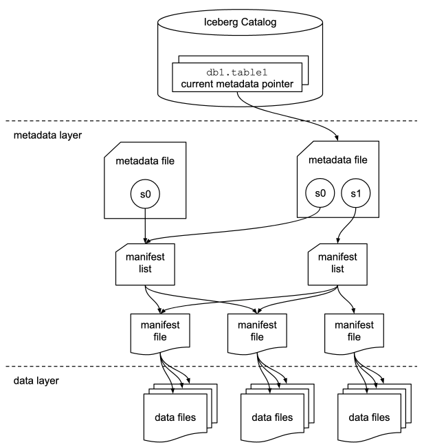

## Format versioning

Version 1: Analytic Data Tables -> Defines how to manage large analytic tables using immutable file formats: parquet, avro, and ORC

Version 2: Row-level deletes -> Adds row-level updates and deletes for analytic tables with immutable files. The primary change adds delete fules to encode rows that are deleted in existing data files. This version can be used to deleted or replace individual rows inimmutable data files with rewrting the files. This vesion also makes some requirements stricter for writers.

## Goals

* Serializable isolation – Reads will be isolated from concurrent writes and always use a committed snapshot of a table’s data. Writes will support removing and adding files in a single operation and are never partially visible. Readers will not acquire locks. 
* Speed – Operations will use O(1) remote calls to plan the files for a scan and not O(n) where n grows with the size of the table, like the number of partitions or files. 
* Scale – Job planning will be handled primarily by clients and not bottleneck on a central metadata store. Metadata will include information needed for cost-based optimization. 
* Evolution – Tables will support full schema and partition spec evolution. Schema evolution supports safe column add, drop, reorder and rename, including in nested structures. 
* Dependable types – Tables will provide well-defined and dependable support for a core set of types. 
* Storage separation – Partitioning will be table configuration. Reads will be planned using predicates on data values, not partition values. Tables will support evolving partition schemes. 
* Formats – Underlying data file formats will support identical schema evolution rules and types. Both read-optimized and write-optimized formats will be available.

## Overviews

This table format tracks individual data files in a table instead of directories. This allows writers to create data files in-place and only adds files to the table in an explicit commit.

Table state is maintained in metadata files. All changes to table state create a new metadata file and replace the old metadata with an atomic swap. The table metadata file tracks the table schema, partitioning config, custom properties, and snapshots of the table contents. A snapshot represents the state of a table at some time and is used to access the complete set of data files in the table.

Data files in snapshots are tracked by one or more manifest files that contain a row for each data file in the table, the file’s partition data, and its metrics. The data in a snapshot is the union of all files in its manifests. Manifest files are reused across snapshots to avoid rewriting metadata that is slow-changing. Manifests can track data files with any subset of a table and are not associated with partitions.

The manifests that make up a snapshot are stored in a manifest list file. Each manifest list stores metadata about manifests, including partition stats and data file counts. These stats are used to avoid reading manifests that are not required for an operation.

### Optimistic Concurrency

**An atomic swap** of one table metadata file for another provides the basis for serializable isolation. Writers create table metadata files **optimistically**. The conditions required by a write to successfully commit determines the isolation level. Writers can select what to validate and can make different isolation guarantees.

### Sequence Number

The relative age of data and delete files relies on a **sequence number** that is assigned to every successful commit. 

* When a **snapshot** is created for a commit, it **is optimistically assigned the next sequence number**, and it is written into the snapshot’s metadata. **All** manifests, data files, and delete files created for a snapshot **inherit the snapshot’s sequence number**.
* Manifest file metadata in the manifest list stores a manifest’s sequence number. New data and metadata file entries are written with null in place of a sequence number, which is replaced with the manifest’s sequence number at read time. When a data or delete file is written to a new manifest (as “existing”), the inherited sequence number is written to ensure it does not change after it is first inherited.

Inheriting the sequence number from manifest metadata allows writing a new manifest once and reusing it in commit retries. To change a sequence number for a retry, only the manifest list must be rewritten – which would be rewritten anyway with the latest set of manifests.

### Row-level deletes

Row-level deletes are stored in delete files. There are two ways to encode a row-level delete:

* Position deletes mark a row deleted by data file path and the row position in the data file 
* Equality deletes mark a row deleted by one or more column values, like id = 5

Like data files, delete files are tracked by partition. In general, a delete file must be applied to older data files with the same partition; see Scan Planning for details. Column metrics can be used to determine whether a delete file’s rows overlap the contents of a data file or a scan range.

### File System Operations

Iceberg only requires that file systems support the following operations:

* In-place write – Files are not moved or altered once they are written. 
* Seekable reads – Data file formats require seek support. 
* Deletes – Tables delete files that are no longer used.

These requirements are compatible with object stores, like S3. 

Tables do not require random-access writes. Once written, data and metadata files are immutable until they are deleted.

Tables do not require rename, except for tables that use atomic rename to implement the commit operation for new metadata files.

## Specifications

### Terms

* Schema – Names and types of fields in a table. 
* Partition spec – A definition of how partition values are derived from data fields. 
* Snapshot – The state of a table at some point in time, including the set of all data files. 
* Manifest list – A file that lists manifest files; one per snapshot. 
* Manifest – A file that lists data or delete files; a subset of a snapshot. 
* Data file – A file that contains rows of a table. 
* Delete file – A file that encodes rows of a table that are deleted by position or data values.

Since the writer needs to support both v1 and v2 version of the spec, v2 writer behavior is inline to whether the field should be omitted (blank) or optional or required. However, for v2 reader, the read behavior is "ignore" the field if marked so, or read optionally if it optional in v2 irrespective of v1 behavior or if it was optional or blank in v1. It is only marked as required, if it was required in both v1 and v2.

### Schemas and Data Types

A table’s schema is a list of named columns. All data types are either primitives or nested types, which are maps, lists, or structs. A table schema is also a struct type.

| Block     | Data Type    | Description                                                      | Requirements                                                                                                                                                                                                                                                      | Notes                                                                      |
|-----------|--------------|------------------------------------------------------------------|-------------------------------------------------------------------------------------------------------------------------------------------------------------------------------------------------------------------------------------------------------------------|----------------------------------------------------------------------------|
| Primitive | boolean      | 	True or false                                                   |                                                                                                                                                                                                                                                                   |                                                                            |
| Primitive | int          | 	T32-bit signed integers                                         | Can promote to long                                                                                                                                                                                                                                               |                                                                            |
| Primitive | long         | 	64-bit signed integers                                          |                                                                                                                                                                                                                                                                   |                                                                            |
| Primitive | float        | 	32-bit IEEE 754 floating point                                  | Can promote to double                                                                                                                                                                                                                                             |                                                                            |
| Primitive | double       | 	64-bit IEEE 754 floating point                                  |                                                                                                                                                                                                                                                                   |                                                                            |
| Primitive | decimal(P,S) | 	Fixed-point decimal; precision P, scale S                       | Scale is fixed, precision must be 38 or less                                                                                                                                                                                                                      | scale cannot be changed by schema evolution. Precision can only be widened |
| Primitive | date         | 	Calendar date without timezone or time                          |                                                                                                                                                                                                                                                                   |                                                                            |
| Primitive | time         | 	Time of day without date, timezone                              | Microsecond precision [2]                                                                                                                                                                                                                                         |                                                                            |
| Primitive | timestamp    | 	Timestamp without timezone                                      | Microsecond precision [2]                                                                                                                                                                                                                                         |                                                                            |
| Primitive | timestamptz  | 	Timestamp with timezone                                         | Stored as UTC [2]                                                                                                                                                                                                                                                 |                                                                            |
| Primitive | string       | 	Arbitrary-length character sequences                            | Encoded with UTF-8                                                                                                                                                                                                                                                | Character strings must be stored as UTF-8 encoded byte arrays.             |
| Primitive | uuid         | 	Universally unique identifiers                                  | Should use 16-byte fixed                                                                                                                                                                                                                                          |                                                                            |
| Primitive | fixed(L)     | 	Fixed-length byte array of length L                             |                                                                                                                                                                                                                                                                   |                                                                            |
| Primitive | binary       | 	Arbitrary-length byte array                                     |                                                                                                                                                                                                                                                                   |                                                                            |
| Nested    | struct       | 	tuple of typed values                                           | Each field in the tuple is named and has an integer id that is unique in the table schema. Each field can be either optional or required, meaning that values can (or cannot) be null. Fields may be any type. Fields may have an optional comment or doc string. | Fields can have default values.                                            |
| Nested    | list         | 	collection of values with some element type                     | The element field has an integer id that is unique in the table schema. Elements can be either optional or required. Element types may be any type.                                                                                                               |                                                                            |
| Nested    | map          | 	 collection of key-value pairs with a key type and a value type | Both the key field and value field each have an integer id that is unique in the table schema. Map keys are required and map values can be either optional or required. Both map keys and map values may be any type, including nested types.                     |                                                                            |

* All time and timestamp values are stored with microsecond precision. 
* Timestamps with time zone represent a point in time: values are stored as UTC and do not retain a source time zone (2017-11-16 17:10:34 PST is stored/retrieved as 2017-11-17 01:10:34 UTC and these values are considered identical). 
* Timestamps without time zone represent a date and time of day regardless of zone: the time value is independent of zone adjustments (2017-11-16 17:10:34 is always retrieved as 2017-11-16 17:10:34). Timestamp values are stored as a long that encodes microseconds from the unix epoch.

### Default Values