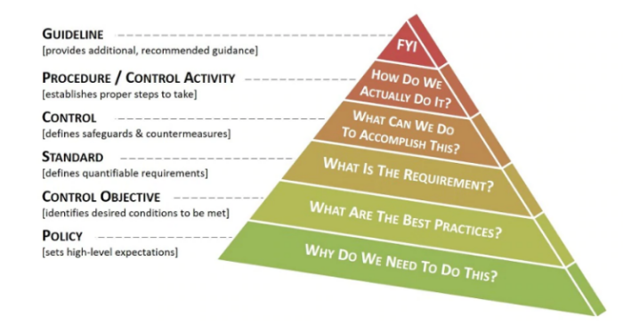

# Policy vs Standard vs Control vs Procedure

## Policy

A policy is a high-level statement of management intent that formally establishes requirements to guide decisions and achieve rational outcomes.

Essentially, a policy is a statement of expectation, that is enforced by standards and further implemented by procedures.

External influencers, such as statutory, regulatory, or contractual obligations, are commonly the root cause for a policy’s existence.

## Control Objective

Control Objectives are targets or desired conditions to be met that are designed to ensure that policy intent is met.

Control Objectives help to establish the scope necessary to address a policy.

Where applicable, Control Objectives should be directly linked to an industry-recognized practice (e.g., statutory, regulatory or contractual requirements).

## Standard

Standards are formally-established requirements in regard to processes, actions, and configurations.

Standards are finite, quantifiable requirements that satisfy Control Objectives.

> **Exceptions are always to Standards and never to Policies.** If a standard cannot be met, it is generally necessary to implement a compensating control to mitigate the risk associated with that deficiency.

## Control

Unlike Standards, Controls define the actual safeguards and countermeasures that are assigned to a stakeholder (e.g., an individual or team) to implement.  

Controls testing is designed to monitor and measure specific aspects of a Standard to ensure a Standard is properly implemented.

Controls are the technical, administrative or physical safeguards that exist to prevent, detect or lessen the ability of a threat to exploit a vulnerability.

## Procedure

Procedures are a formal method of doing something based on a series of actions conducted in a certain order or manner.

Procedures are the responsibility of the asset custodian to build and maintain in support of standards and policies.

## Guideline

Unlike Standards, Guidelines allow users to apply discretion or leeway in their interpretation, implementation, or use.

Guidelines are generally recommended practices that are based on industry-recognized practices or cultural norms within an organization.

Guidelines help augment Standards when discretion is permissible.
