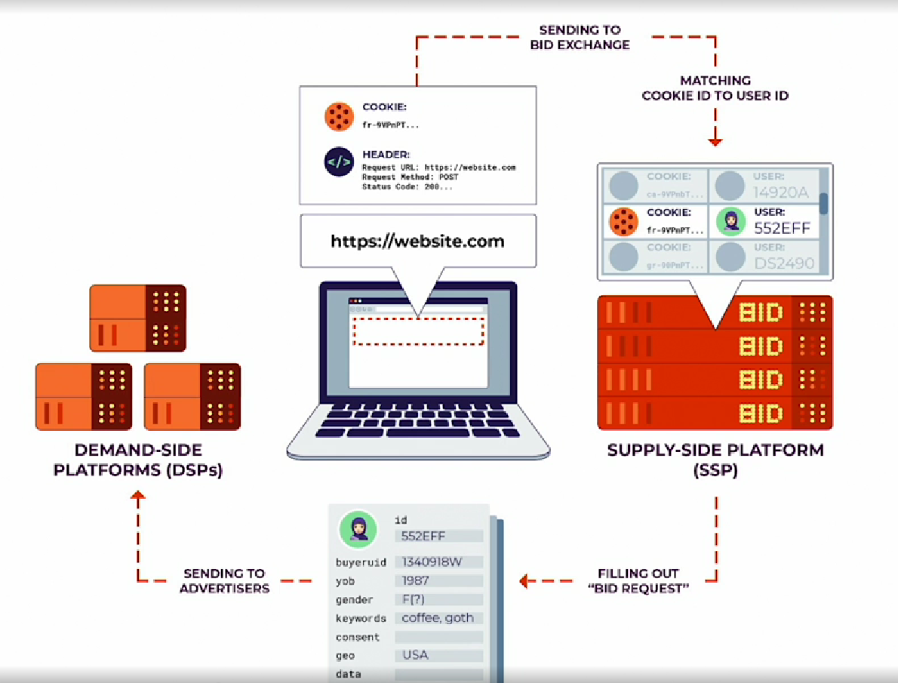
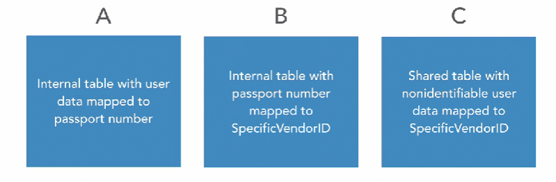
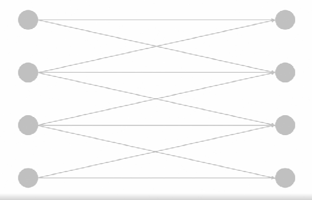
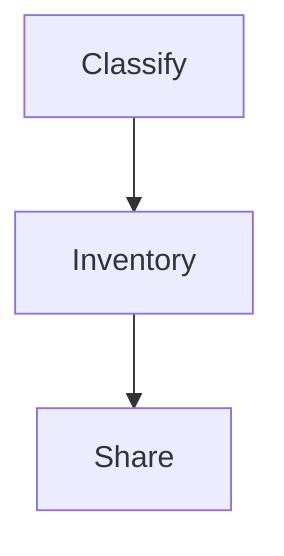

# Privacy and Data Sharing

## Introduction

### Privacy and data sharing
Data sharing can often create privacy risks. We handled all that data ethically, the partner you share data with may make different decisions. However, we will be held accountable for those. And that is why we need a privacy architecture for data sharing.

### What you should know about this course

Implementing a Privacy, Risk, and Assurance Program, focused on building a cross-functional privacy program. 

Privacy Architecture: How to Classify an Inventory of Data Focused on Building a Privacy Architecture Geared Towards Responsible Data Collection and Data Governance. 

Modern companies share data with business partners, vendors, governments, etc. for business growth, engagement, personalization, regulation, etc., just to name a few reasons. 

This document is to learn how data-sharing works, the underlying risks, and how we can reduce those risks using several privacy techniques and is aimed at chief information security officers, or CISOs, chief privacy officers, or CPOs, privacy architects, privacy engineers, and anyone in charge of making decisions around protecting user data. It will also be helpful to privacy attorneys, regulators, and policy makers so they can understand how privacy is impacted, and can be protected when data moves from one domain to another. 

Can help journalists who cover data privacy. This will help them understand what building technical systems looks like from someone on the inside who has been there and done it.

## Data Sharing

### How data sharing works
Let's look at an example of how data sharing works. Recently, the Electronic Frontiers Foundation, or the EFF, published research that showed how we get served ads on the internet. This is the most foundational example of data sharing, so let's take a look. Before we do so, let's get some concepts in place, specifically three concepts. 
* **Publisher** refers to a Website you may visit, and that can display ads. For example, the New York Times Website, where you see ads often, is a publisher. 
* Second, **Supply-side platform, or SSP**. This refers to an ad network that helps decide which specific advertiser can place an ad on the Website so you, as a user, may see it. 
* Third, a demand-side platform, or a DSP, refers to companies that will work with SSP's to try and display ads to you when you visit a Web page that is a publisher. 

Now, this image on shows how people, who owns Websites, and a series of advertising networks, decide what ads you see, and how. Here are the key points you need to remember. First, data flows from your browser to the ad networks, also known as supply-side platforms. Each SSP receives your identifying information, usually in the form of a cookie. The SSP then generates a bid request, as you can see on the bottom side of your screen, based on what it knows on your past behavior. Next, the SSP sends this bid request to all advertisers who have expressed interest in showing ads. This is on the left hand side where you see the bid request being sent to the advertisers, or the DSP's. These advertisers, collectively, make up the demand-side platforms, or the DSP's, again, you see on the left hand side of the diagram. The image that you see in the middle of your screen, right now, with the list of these attributes, the table, basically, that has the attribute type and definition columns, shows what a bid request looks like. As you can see, it contains several pieces of extremely sensitive information. Example, your location, your interests and your device. It also includes your unique ID. On the one hand, this information allows companies to decide whether the bid request, and the data it contains, is worth spending money on to show you an ad. On the other hand, as a privacy leader, you must remember that the bid request is not an abstract entity. There is a real person behind that data. That person deserves privacy, and transparency, as their data is shared. Finally, this diagram is important as well. Based on the bid request, an advertiser may decide to bid so that they can show you an ad. Based on all such bids, the SSP picks a winner. This diagram shows how the winner, the DSP, shows you the ad on the Website. Remember, all this movement of data and money happens without most users understanding how the back-end really works. Also, the data is shared before anyone makes a bid, or a winner is picked. There is, often, no guarantee that a company placing a bid really intends to display an ad, it could be that they just want to collect data for a different purpose. This is why data sharing is powerful. For consumers, this is an area that needs tooling so as to protect their privacy. You must hence learn so that any data sharing can be done using privacy preserving techniques.

### How data sharing can go wrong
Let's look at an example about how the heat map feature from the fitness tool STRAVA caused privacy issues. U.S. military service members uploaded their runs to STRAVA which were then made available for display online in the STRAVA heatmap. Based on publicly available information, external observers were able to identify the military bases, supply routes, and even the specific service members themselves. But here's the real privacy angle. In the years since the incident researchers have confirmed something even more ominous. You could identify the soldiers even when you blurred out the start and the end of their runs. 

Here are some key lessons, data sharing is not just about sharing data between one company and another. Any time data you have collected from someone else leaves your company, as a practical matter you are essentially sharing that information with outside entities. In the age of social media, publicly available information, data on the dark web obtained by way of breaches and ML based tools to combine data identifying people has become easier than ever before. So for privacy, you need to think of data sharing any time data leaves your domain. This is true when you are a company collecting user data. This is also true when you are just an individual broadcasting your data via your cell phone. It may take only minutes with the assistance of publicly available information for any expert attack to deanonymize location data and track your whereabouts. 

Data sharing is effective not just because of what you or a company shares about you, shared data when combined with data already available is what makes data sharing effective and potentially problematic. We will look at ways to make data sharing privacy-friendly, while still enabling innovative data analysis. 

 **First** once data leaves your company chances are you can exert very little control over what happens to that data as the Facebook-Cambridge Analytica experience will tell you. **Second**, the entities you shared data with may not be as transparent and honest as you are. **Third**, whoever you shared data with could have more sophisticated abilities than you do to process that data. **Finally**, it often takes awhile to understand the full implications of data sharing, so in this case no news is not necessarily good news. 
 
Remember, while you minimize the risk inherent to data sharing, there is ransomware. Ransomware is malicious software that spreads quickly across computer networks and encrypts them holding sensitive documents hostage until victims decide to pay the hackers. These attacks have only increased in frequency as attackers realize how weak cyber defense capabilities are and how much sensitive data companies and governments hold. The key lesson here is that when you share data with someone you are also sharing their security and privacy weaknesses, and then when those weaknesses are exploited you will share the consequences.

While designing and creating apps, one of the goals should be to share data in a way that enables innovation but respects and protects privacy.

## No Data for You: Is Data Sharing Always Riddled with Risk?

### Valid reasons for data sharing
So far we have seen the problematic side of data-sharing. However, there are several valid reasons why an app may want to share data with other entities. Some of these reasons may have nothing to do with growing business or making money. Example: If you hail a car by using a taxi or a ride sharing app, it is possible, even likely that the app is sharing some data with the city you are in. Such data-sharing may also occur with cab companies or other transportation providers. 

We will look at some valid reasons behind this data-sharing. 
* City planners and regulators need access to data from transport providers to inform and enforce privacy decisions, for example, cities need to understand the impact of transport services on traffic, parking, emissions, and labor practices. 
* Municipalities and police need data to collect per-vehicle fees, enforce parking rules for shared bikes or scooters, and respond to service or safety issues. 

There are other valid data-sharing use cases in this context, 
* Drop off locations are shared to help analyze the impact on parking and traffic flow. 
* Trip telemetry data is shared to detect when vehicles enter prohibited areas in order to issue enforcement citations. 
* Vehicle or driver's license numbers are shared to verify that all vehicles are permitted to operate within a city. 

So as you can see, there are perfectly legitimate reasons why data would be shared by entity A with entity.

### When data sharing should raise red flags
If you are designing an app and data sharing is part of the offering, you need to watch for the following red flags, 

* uniquely identifying individuals without sufficiently anonymizing the data
* Placing individuals at a certain place and time for tracking, 
* Absence of consent for and visibility into how data is shared and who with
* The ability to identify others connected to a user who may not consent to data sharing even if the user originally did. 

In the example of the ride-sharing app, we should raise more than an eyebrow. Real-time tracking of a trip from start to finish, precise trip start and stop coordinates. Remember in the Strava example, the military service members were identified without this data. And finally, lack of privacy guidelines on part of the entity receiving any data. 

Why is this so important? It is because there is no way to unshare your data once shared. Who you are and where you are is all someone really needs to identify you and reach you. This is not just about privacy, this is about safety.

Data collection is an ecosystem - and a fast-growing one. There are many companies involved in this. The New York Times research found that several companies collect and share location data, some of which are in this diagram. Now, it is impossible to know what any recipient of your data will do with it or how carefully they can protect it. It is therefore vital that anyone creating an app that shares data also builds in privacy techniques to anonymize this data before this data is shared. We will look at some of these techniques in the next few slides.

### Techniques to minimize privacy risk
The good news is that there are several best practices and techniques available to make data-sharing more privacy-focused. When it comes to data collection, we should build architectures with a key principle: the more precisely identifiable the data, the lower the retention period.

#### Precision and Retention
**Precision and retention should have an inverse correlation**. This theme is apropos for data-sharing as well. 

Some of these best-practices to implement this principle. As an app designer, you could 
* Ask vendors and partners to document retention and deletion practices for each type of data being collected and shared
* Delete unique identifiers and precise times and geolocations after 90 days. 
* Delete coarsened times and geolocations after two years. 
* Internal, indefinitely retained data should be at least 5-anonymous on epsilon 1.6 differentially private. 
* Bulk shared data should be at least 100-anonymous on epsilon 4.6 differentially private. 

Just as there is an inverse relationship between data precision and its retention there could be a similarly inverse relationship between precision and availability.

##### Precision and Availability

When you share data with a partner, you should insist that they anonymize the data in memory especially if you shared granular data with them. Some techniques include not persisting data used solely for the purpose of aggregation. Keeping individual-level data in memory, and only the processed data to disk. This means that precise data is short-lived and less accessible while more aggregated data is available to more people since it is on disk where you can also manage access more effectively. 

#### More best-practices

* In order to prevent personal identification you should remove or replace any identifiers that uniquely identify someone. You will want to do this before sharing the data or have the vendor do this as soon as they receive the data and complete mapping it at their end. Here are some ways to do that, 
  * dispose such identifiers and operationally replace with internal uniquely generated values. So basically have the vendor generate their own IDs.
  * Dispose of personally identifiable information or replace with values generated with a keyed pseudorandom function like HMAC-SHA256. 
  * You may have some use cases where you may want to identify someone whose data you shared. For those use cases you may want to create a table that links their external identifiers like for example their passport number to their internal identifiers. However, you will want to carefully manage access to this linking table, so as to prevent privacy issues.

The table B will require tight and audited access since this table is the bridge between the full data and the anonymized data. That way you can share data anonymously and identify internally. Real world scenarios will have a lot more complexity but this gives you a logical foundation to build upon. But do we need a custom ID for each vendor? Or do we just create one internal ID for all external sharing? This debate is the privacy version of soda or pop or what is more harmful to your diet? Fats or sugar? There is no clear consensus on this issue. But let's understand the trade offs and let you decide what works best given your circumstances. 

**Choice one: One internal ID** 

You could create one internal ID and hash it. The goal of hashing is to prevent IDs that are tied to you from appearing in the wild, hashing will help ensure that each vendor has different IDs so that vendors cannot connect the dots with each other and if there were to be a breach you could identify the vendor impacted. The upside is that any hashing algorithm with salt may help you achieve this goal although your security teams may be able to advise further. The downside is that you will need to focus on where to store the salt and identify whether the hashing algorithm is susceptible to brute force or other attacks. 

**Choice two: An internal ID per vendor**

This approach may negate the need to hash the ID and the complexity attached to hashing. Your security team again may disagree, so please consult with them. The downside is that you may have too many IDs and too many mapping tables. You may end up with more complexity than privacy. The reason behind this is that if anyone can start sharing data by creating a new internal ID, you may see promiscuous data sharing with no central ability to regulate data sharing. 

#### Technique for sharing location and time data. 

You can coarsen the precision of stored data to the minimal needed for its application. For example, you could round times to the nearest 30-minute increment. Example, 12:25 p.m. would be rounded to 12:30 p.m. You could convert GPS coordinates to the nearest street segment start, center, or ending points. Alternatively you could truncate GPS coordinates to three decimal points. This makes the people on the trip less identifiable without hurting the aggregate data analysis. Now this example is probably way too simplistic but the key message here is to avoid blindly sharing data that individually identifies folks whose data it is. 

#### Data sharing protocols
Ask for access control to make sure that once a partner gets data, they manage who on their side can access it.

#### Some more technique
* Ask the partner ration the availability of their APIs to those who want to access the data.
* Tools to check if engineers and data scientists who have access to sensitive encrypted data still need it. 
  * Routinely sample the data and audit it to see when it was last decrypted. Often it is found that teams had requested keys but hardly or never used them to access the data. In those cases,
  * You could swap the keys to check if the engineers ever complained. 75% of the time, they don't. What this means is 
  * **People often think they will need more data than they really do**. Even if they don't use it their ability to access that data poses a privacy risk, you will want to use techniques like these internally and while sharing data as well.

Remember - **Trust but verify** and **Only the paranoid survive**

## Common Misconceptions on Data Sharing

### Why can't we share anonymized data?
Now, we saw a lot of amazing techniques in the last chapter to use before data sharing, and you may believe that anonymizing the data, or having a partner do it, eliminates the risk of re-identification and privacy harm. Caveat however, objects in the data may be more identifiable than they appear however.

Earlier we looked at coarsening location data by reducing stored and shared data to three decimal points. Even after coarsening all that data, it may still be that you could be identified. So you want to be very careful before being overly confident of any individual privacy data sharing technique.

For time-based aggregation most policies group by 15 minutes. If you applied these techniques to sensitive data, and it is not anonymized, in the event of a breach, you may end up with private identifying data leaked onto the Internet. And you could end up with inadequately anonymized data linked to public data, and now your users have lost their privacy forever.

Remember - You cannot solve a privacy problem with a security solution.

### Encryption and data sharing
You might wonder what role encryption could play in data sharing. Does encryption help eliminate data sharing risk? The short answer is no, as the Cambridge Analytica issue shows. Encryption can help manage access, but it cannot guard against intentional or unintentional misuse, once access is granted. First things first, even without considering data sharing, encryption is not free or easy. You can hire a lot of smart security engineers, but the idea that you can easily encrypt all your data is unrealistic. You need to worry about key management, who will get access to the key, where the key is stored, what algorithm to use, etc. So where does this leave us? Before you share data, you need to ask yourself, who would want to access this data inappropriately? What would they do with it? And how would they access it? While encryption can help protect your data, what you need is a comprehensive data protection strategy. This is important since outside of accidental misuse, each time someone uses data inappropriately such actions tend to have specific goals, your strategy should be aimed at thwarting those goals. The question is, does the partner you want to share data with have such a strategy? 

Given significant associated risks, you need a comprehensive **data protection program**. 

* Obfuscation and encryption as catch-all techniques cannot be depended.
* Understand the threat model and use that to plan your strategy.
* Understand patterns on what data your partner needs and what threat vectors exist.

In the optimum state, you will want to iterate continuously to reduce development friction and manage security. In the best case, you may not know how mature your partner security is, so you really need to consider what data you are sharing, apply as many techniques as possible to anonymize the data and share only what is needed.

Getting your business around to this line of strategic thinking will show that you have indeed created a privacy aware culture. What you do not want to do is get swayed by big names, because some of the best brand names often have a bismal privacy and security practices. For example, Equifax employed the username, admin, and the password admin to protect a portal used to manage credit disputes. If you share data with someone, and they end up getting breached because of such negligence, the court of public opinion will hold you responsible as they rightly should. As we have seen, there is no silver bullet to get data sharing right. So here are some more techniques for your consideration. Increasingly, the techniques I lean on are K-anonymity and L-diversity. The simple requirement of K-anonymity is to not share data unless there are k other records for each individual record. I will explain more in the next chapter.

## K-Anonymity and Data Sharing

### What is k-anonymity?
The most exhaustive work on K-Anonymity from Professor Latanya Sweeney, but for this course here is a very intuitive explanation from Carnegie Mellon University. In K-Anonymity, attributes are suppressed until each row is identical with at least k-1 other rows. At this point the database is said to be k-anonymous. K-anonymity thus prevents definite database linkages. At worst, the data released narrows down an individual entry to a group of k individuals. K-anonymity is intuitive to implement, used by Google in their ad API, and provides a minimum guarantee that you are one among a minimum cohort rather than being uniquely identifiable. By changing a few fields, we have ensured that each of the four rows is now less unique. You can obtain a k-anonymity value of two since for each row there is one more like it. This is very similar to what we did by rounding off the pick-up and drop off times a few slides ago. K-anonymity is powerful since it gives you a way to measure privacy before you share the data.

### K-anonymity: A use case
The goal was to get a sense of how we can reduce the uniqueness of each ride by coarsening the data.

### K-anonymity: Very coarse data

Challenge here is to reduce the tension between privacy and data quality.

### K-anonymity: Very granular data
The more precise the identity of the user, and therefore the more identifiable the user is. If we need a higher percentage of users to meet K-anonymity, we will need to provide fewer precision points of data.

### K-anonymity: Industry best practice

We should focus on **K-Anonymity of five**, since that is regarded as the industry best practice. For the more coarse data, meeting K-Anonymity of 5 is probably easier possible. However, as we increase the granularity, we will hit an inflection point and not all data records will meeting the criteria. So if the goal is to have a K-Anonymity of five and better data quality, we'd need to suppress the data not meeting this criteria. It might be suitable for some use cases. 

We saw how the industry best practice of K-Anonymity of five provides a meaningful balance between privacy and usability. However, K-Anonymity has its limitations as well, which is why there is yet another tool available to help you anonymize the data before you share it. This tool is called l-diversity.

## L-Diversity

### How L-diversity helps privacy
* Let's assume you end up with a k-anonymity of five. 
* There is at least one pickup point such that every trip from that pickup point goes to the same destination. 
* In this instance, using external data, you may be able to learn where any passenger from that source is going. 
So you may need some additional work to ensure that you protect privacy

L-diversity will help ensure that there is a diversity of potential sources or destinations. Thus, for every trip that is reported in a time window, a pickup must have at least L different potential drop-offs, and for every drop-off, you must have at least L potential pickups.

### K-anonymity vs L-diversity
We have understood the tension that is inherent between **privacy and security**. And now we have found out that there can also be tension between **privacy and data quality**. 

Let's look at a very specific example. There may be situations where k-anonymity might filter out too much data. In those cases l-diversity may be a much better tool. 

In the diagram in this slide the dots on the left represent right pickups and the ones on the right represent right dropoffs. If you were to apply k-anonymity of two you will filter out all the rides in this diagram since no two rides have the same pickup and dropoff. If on the other hand you were to separate out the pickups and dropoffs and apply an l-diversity of two in some use cases, you could retain the entire dataset while preserving privacy as well. 

#### Use case: Study the density of pickups

Let's assume that you are trying to study the density of pickups as in if a specific location is seeing an uptick in pickups you may want to send more cabs there to reduce wait times. In this case it makes even more sense to disconnect the pickups and dropoffs and not store them as one trip. You could even delete the dropoff portion of the data altogether so now 
* Less data which -> lower storage costs. 
* More germane -> better data quality.
* Less descriptive data -> More privacy

Finally, l-diversity is a win, win, win across the board. You could apply it while storing data internally and while sharing data externally. This is an art and a science rather than a one size fits all.

### Challenge

So far we've seen some interesting privacy techniques on coarsening the data and techniques like k-anonymity. How do you now apply it, and protect customer data with an example?

### Solution

So, the scenario we are looking at is, let's assume we are sharing grades of students to evaluate the tool that is used to teach them a particular concept or a particular class. Students go to multiple schools in a school district or in a state. One way we're going to make that assessment is by looking at the change of grades before and after usage of the tool.

So let's see how we can use our techniques. Let's assume we are shooting for a K-anonymity value of five. So, in the beginning before any data is shared, you **measure the k-anonymity**. **Apply privacy techniques**: Coarsening. Combining zip codes, age ranges. Measure k-anonymity again. If you are not able to go beyond a limit, consider filtering records with k-anonymity below 5.

> K-anonymity and L-diversity are privacy measurement tools, not privacy technique (coarsening is).

## Operationalizing Privacy Data Sharing Techniques

### Identifying and rectifying risk
Two major processes: 
* Privacy impact assessment, or PIA. 
* Technical privacy consulting as an additional process to the PIA process.

### Privacy impact assessment
Typically the legal and compliance teams run the Privacy Impact Assessment or the PIA. Some key questions covered in the PIA include: 
* Do the features comply with the legal obligations of the company? 
* What personally identifiable information is being collected? 
* Why is this personally identifiable information being collected? 
* Is this degree of collection really required? 
* Finally, how is the personally identifiable information collected, used , accessed, shared, safeguarded and stored?

The PIA offers a company several advantages. 
* Checkpoint for companies before shipping a product.
* Standardizes the process and scrutiny all the products must go through
* Aligns the legal and engineering and product teams across the company
* Satisfy several key regulatory requirements like the GDPR, the CCPA, etc.

Some critical limitations. 
* Limitations of the function, not the teams.
* Too far downstream in the pipeline. 
* Too many irreversible decisions -> may not be an easy way to mitigate any new risks that the review turns up.
* Secondly, modern engineering has become very complicated. The nature of data collection, storage, processing and sharing is such that the impact and the edge cases required at the level of analysis that legal teams are not equipped to do. Plus the legal team simply may not have the bandwidth to go too deep given the number of smaller services and products that gets released in an edge of automated continuous delivery.

### Technical privacy consulting

#### Key Goals

* Engineers (privacy specialists) helping other engineers
* Offers a cross-functional understanding of the technical stack from a privacy perspective for the proposed implementation.
* Influence product designs via technical solutions and recommendations to prevent potential privacy issues.
* Enables insight into ongoing engineering initiatives in order to enforce and then improve privacy guidelines.

#### Why this model is such a winner.
* Builds bridges between islands. 
* Identify headaches and prevent migraines. 
* Create awareness of privacy techniques. The PIA asks questions like, are you doing X, or why are you doing Y? The consulting model enables you to offer them help rather than just a critique or analysis.
* Provide you a cross-functional view of the business.

The consulting model will help offer the privacy team a panoramic privacy view of the company. This intelligence will help make data driven decisions on training, vulnerabilities, etc.

### Challenge
How can you staff for the PIA and consulting team?

### Solution
When it comes to privacy impact assessments, it is easier. It should have
* Attorneys - They know the law.
* Compliance specialists - They are very, very good typically at auditing. So, they can put on their adversarial hat and give you a sense about the kinds of questions you might face from a real auditor and conduct an impact assessment with that in mind.
* Data classification and handling pays off. _As I mentioned in my last course, the data classification and handling all the guidelines we've talked about are basically an abstraction of the laws and the usage of the data that you've put into place._ 

Hiring for consulting: 
* Privacy engineers: Privacy engineers bring two things to the table they typically have built services and tools like deletion, like consents et cetera, so they understand the privacy implications and the back-end infrastructure. So you have engineers having some credibility when they talk to other engineers who want to to collect data and it makes sense to sort of have that resource available.
* Product managers: Product managers, this is an idea that I have because it's a little self-serving I used to be a product manager before I became a privacy leader and as a product manager I used to collect a lot of data and it's only when I became a privacy leader that I realized that the data collection has implications. So, hiring product managers is a bit like hiring a thief to guard the bank a reformed thief in this case because you want somebody who knows what somebody else might try to do and you also want a product manager because this person can now think of creative ways to achieve the same goal without for example collecting all that data or without doing things that might cause privacy issues.
* Data scientists.  Similarly, you also want data scientists because remember most of this data collection happens for the data scientists to analyze the data and make business decisions. So, this is a fun way for product managers and data scientists to maybe try something different and they might be able to try a privacy role and use their skills as product managers and data scientists to maybe start a second career in privacy. 

You have to get creative when you hire for these roles because people with good privacy experience don't grow on trees, they are not abundant in numbers. So, when you build your consulting teams you want to look for privacy engineers, product managers and data scientists and look for those diverse skills and be inclusive and be cross-functional and staff up your team.

## The challenge of privacy: Your digital fingerprint

### Data governance, why it matters
We have seen how challenging it is to protect privacy given the infrastructure and development setup, the volume of data companies collect, and the ability to relate directly collected data to external data.

A plethora of privacy techniques are available at our disposal which include the strategic, like data classification and data inventory. They form the foundation of your data governance strategy. Then there are all the techniques we covered here to help obfuscate and anonymize data. 

Rather than seeing all of these techniques as isolated concepts, you should view them as threads in a wale that will help maintain privacy.

### Your physical footprint
A research paper titled, "Unique in the Crowd: The Privacy Bounds of Human Mobility", defines how identifiable you can be via your human fingerprint. The paper states that 12 points are needed to uniquely identify a human fingerprint. The paper then proceeds to examine how your digital fingerprint, that is data about where you are and when, identifies you. 

> Data about where you are and when is called spaciotemporal data.

### Your digital footprint
The researchers studied 15 months of human mobility data for 1.5 million individuals. What was their key finding? They found that human mobility traces are highly unique. Your spatiotemporal data, that is again, data about where you are and when, is highly identifying. In fact, in a dataset where the location of an individual is specified hourly and with the spatial resolution equal to that given but the carrier's antennas, four spatiotemporal points are enough to uniquely identify 95% of the individuals. In short, your digital fingerprint is about three times more identifiable than a human fingerprint.

### The power of joining outside data
A simple anonymized data set does not contain name, home address, phone number, or other obvious identifiers. Yet, if an individual's patterns are unique enough, outside information can be used to link the data back to an individual. 

Do not underestimate the power of outside data and the ability of somebody to link data on the inside and the outside (social medium accounts) and identify a user.
 
## Conclusion
A key part of winning trust with customer comes with treating data with respect and sharing it a way that does not loose sight of the fact that behind all those databases is a real human being.

