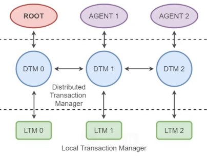
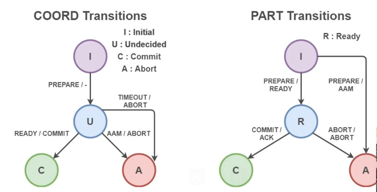
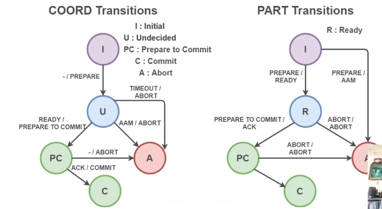
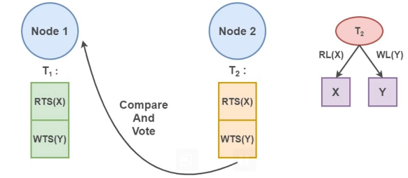
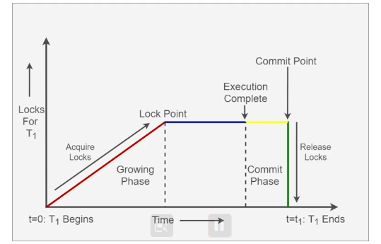
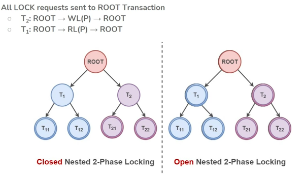

# Commit Protocols and Failure Recovery

## Outline
Distributed Commit Protocol is primarily an agreement protocol. If there are n nodes, all the n nodes should agree to do things together (commit or abort in this context). Even if one node does not agree to align, the entire process can stall. In general, it is a binary agreement protocol. However, there is no requirement to be in such protocol but is critical to have a mechanism of agreement. Especially when we hit failure, it becomes even more important if we can reach to a consensus in finite time. This also depends on the kind of problems that we face in our distributed system.

We also need to understand how this distributed commit protocol integrate with distributed concurrency protocols and how we can handle failures (byzantian failure or advertial failure)

## Distributed Commit Protocol

Distributed Transaction: Root Transaction (also representative of total transaction)
  * Local agents do transactions on several nodes
  * Distributed Transaction Manager to coordinate
  * Must agree to ACID

Root Distributed Transaction Manager along with other node distributed transaction managers have to run distributed commit protocol. If they agree to commit to the transaction, distributed and local transaction manager would work together to ensure that transaction is committed correctly.

* Multiple agents sit on several nodes. When the distributed commit protocol runs to commit data across nodes, there is a need for 
  * Concurrency Control Protocol
  * A Commit Protocol
  
We will learn two kinds of Distributed Commit Protocols
  * 2-Phase Commit (2PC) which integrates well with 2-Phase Locking. It can tolerate some kind of failures, which we will examine later.
  * When 2PC gets blocked on failure, we can convert it into a 3-Phase Commit (3PC) in certain cases.

### 2-Phase commit protocol

#### Process
It consists of two distinct phases (Phase 1 and 2). There are two kinds of nodes involved. One is the coordinator node (COORD) which initiates the protocol and participants (PART) where the part of transactions are taking place. 

Normally but not necessarily, one of the participants would act as a coordinator - the node on which the transaction got submitted becomes the coordinator. The nodes which executed out the parts of the transactions become participants.

**Phase 1**

* COORD: Initiates commit protocol (The initiation of the transaction itself can be taken can initiation of commit protocol, or we can have a specific event which marks the initiation of commit protocol)
  * Sends PREPARE Message to all PARTs
  * Enters a WAIT state
    * Until all READY messages received, or
    * Some/All PARTs cause TIMEOUT
  * If TIMEOUT occurs
    * Take safe decision to ABORT
* PART: Behavior
  * Wait for PREPARE Message
  * Reply with
    * READY: If willing to commit, write logs first
    * Abort Answer Message (AAM): If not willing to commit
> Note: Timeout is used to detect participant's failure for coordinator to take decision accordingly.

In this case, we are dealing with fail-stop failure. Here we are not considering byzantine failures.

**Phase 2: Commit Decision**
2-Phase commit protocol requires that all the PART MUST respond with READY for COORD to take commit decision else it must take abort decision. COORD has to communicate this decision to all the PART.

* COORD: If received READY from all PARTs:
  * Write a COMMIT Log - Stable Storage
  * Send COMMIT message to all PARTs
* PART: On receiving COMMIT from COORD
  * Commit Local transaction
  * Send ACK message to COORD
* COORD: On receiving ACK from all PARTs
  * Write COMPLETED log
  * Transaction successfully closed.

#### Resilience to Failure

* PART fails in Phase-1: COORD timeout and ABORT. The PARTs will get ABORT messages as well.
* PART fails in Phase-2
  * COORD already got READY, does COMMIT. Other PARTs are not blocked, they can continue with COMMIT
  * PART recovers, checks with COORD. 
  * Accordingly, closes transaction
* COORD fails in Phase-1 - After PREPARE sent (this would block all PARTs)
  * PARTs elect a new COORD
  * Restart 2PC protocol
    * IF new COORD fails, repeat election
* COORD fails in Phase-2
  * At least one live PART received COORD decision
    * Conveys decision to other PARTs, no waiting
  * No live knows COORD decision
    * All PARTs are live
      * Elect new COORD, RESTART 2PC
    * A few PARTs also failed
      * At one PART recorded COORD decision
      * Elect new COORD, restart 2PC
      * However, New COORD decision could contradict old COORD decision
      * And hence, Waiting for old COORD - only option!

> 2PC therefore, is not resilient to both COORD and one or more PARTs failed in Phase 2 and the COORD decision was known to the failed PART. All the PARTs will be blocked till the old COORD comes back.

### Leader (Coordinator) election

Leader election problem is an interesting topic in Distributed systems. There are many algorithms around the same.

One of the strategies can be a simple algorithm as shown below.

Each Node <- ID: Monotonically increasing or decreasing

If a PART discovers COORD failure
* Determine the next Node ID in order
* Elect that node and COORD(Leader)
* If PART discovers it has next ID, elects self as COORD

### 3-Phase commit protocol

We saw a problem in 2-Phase commit when COORD fails in Phase-2 and none of the live PART (with some failed PARTs) know of the COORD decision. In this case, all the PARTs get blocked until old COORD recovers.

To solve this, we introduce a new phase called **intention phase** - Prepare_To_Commit making this a 3-Phase commit protocol. The key really is to discover whether COORD intended to COMMIT or ABORT. This phase allows the COORD to get to this stage making its intention of COMMIT or ABORT clear without actually initiating the COMMIT/ABORT messages to PARTs.

Let's review the state transition diagram for 3-PC.

Now, 
* Phase 1: Prepare stage
* Phase 2: Prepare To Commit Stage
* Phase 3: Commit Stage

#### Resilience to Failure (what is sent as part of Prepare to commit)

In 3.5, professor just blabbered.

* PART fails in Phase-1: COORD timeout and ABORT. The PARTs will get ABORT messages as well. Same as 2-PC.
* PART fails in Phase-2
  * PART recovers, checks with COORD.
  * Accordingly, COMMIT or ABORT transaction based on response received from COORD
* COORD fails in Phase-1 - After PREPARE sent (this would block all PARTs)
  * PARTs elect a new COORD
  * Restart 2PC protocol
    * IF new COORD fails, repeat election
* COORD fails in Phase-2. COORD has sent Prepare To Commit message to PARTs and would have received acknowledgement from some PARTs, this is when the COORD failed.
  * Even if one or more participants have failed, all the live PARTs have got Prepare To Commit message. The remaining PARTs would not be able to ABORT until they check with the COORD.
  * It is also now possible to elect a new COORD who would now be aware of decision associated with Prepare To Commit 

> 2PC therefore, is not resilient to both COORD and one or more PARTs failed in Phase 2 and the COORD decision was known to the failed PART. All the PARTs will be blocked till the old COORD comes back.

## Basic Timestamping scheme

* Each Transaction T receives a logical Timestamp TS
  * The same Timestamp TS is used for both Read_Set and Write_Set
  * Serializability: Later transactions have higher TS
* Node decide on accessing data items, based on TS
* Data Item X:
  * Read Timestamp: RTS(X)
    * Highest transaction timestamp - TS - that read X
  * Write Timestamp: WTS(X)
    * The timestamp TS of transaction that last modified X
* Transaction T performs Read(X): If TS < WTS(X), ABORT
* T performs Write(X): If TS < RTS(X) or TS < WTS(X), ABORT

## Optimistic Timestamping scheme

* Each node sends Read_Set and Write_Set of local transactions, to all nodes
* All nodes can vote on sets: Vote on consistency

Consistency Criteria used in this case (with T1 and T2 transaction happening on n1 and n2 respectively) is:
* Use T2's Read_Set and Write_Set Timestamp. Apply Read(X) and Write(Y) on n1.
* If n1 has pending lists (n1 has voted to an earlier list but has not received the result of that vote), it would compare T2 with all the pending lists
* If no conflict, YES vote
* If conflict - (Please note that n1 has already voted YES on earlier transaction). Now n1 has to make choice to DEFER or say NO immediately to T2. In this case, two scenarios are possible.
  * It could receive T2 with a future timestamp. In this case, the decision can be "DEFER".
  * It could receive T2 with past timestamp. In this case, the decision should be "NO" (it can DEFER legally but makes no sense).
    * If a pending list receives a YES vote, publish it to all nodes
    * T2 has a chance of getting YES, only if T1 did not get enough votes

## Fault Tolerance

Fault Tolerance is the ability of a distributed system to provide normal services to clients even when one or more processes experience failure. It is an important part of distributed systems design.

Fault Tolerance Mechanisms
* Identifying Failed Nodes
* Electing a Coordinator (Leader) - It is a sub-problem of consensus problem. In a consensus problem, n nodes have to agree on a value (an input value). In case of leader election, all the nodes have to agree on one of the nodes to be the leader.
* Coordinator initiates recovery through Consensus - there are many consensus algorithms available for recovery

## Leader Election
Leader Election: A process in a distributed system to elect the main coordinator for a system-wide task

How things change:
* Before Election: No node has defined the Leader process
* After Algorithm runs: Every node knows the identity of the Leader process

For an algorithm to solve Leader Election:
* Processes are either elected or not elected
* Once elected, a process stays elected (until it fails or terminates abruptly)
* For every run, exactly one process is elected

Leader Election algorithm aim for efficiency in
* Transmitted bytes of information
* Time

### Conditions a Leader Election algorithm must meet:
* Termination: The algorithm should terminate in finite time (irrespective of failures of individual nodes) once the leader is selected.
* Uniqueness: Exactly one process assumes role of leader
* Agreement: All the other processes agree on leader identity

### Varying mechanisms of Leader Election:
* Communication mechanism: Nodes can communicate in Synchronous / Asynchronous fashion
* Process Names: Uniquely identifiable / Not distinguishable (??)
* Network topology: Ring / Acyclic Graph / Complete Graph (??)
* Network size: Number of system processes. Whether the node is closed or open - meaning if all the nodes to will be known at the time of election or whether nodes can join or leave as and when required.

A lot of interested possibilities can exist in a voting based system. You can have a node which can spoof itself (sybil attack) and create multiple identity for itself defeating the purpose of voting. One way to handle this can be that we can have an algorithm wherein the one which solves a crypto puzzle first and first its results which other nodes can verify can become the leader.

### Issues involved: Time
Many algorithms are timestamp based
* Different node have different physical clocks
* Clock drift and clock skew are major factors
* Using logical time is a better option
  * Counters: increment / reset
  * Algorithms
    * Lamport timestamp (linearizes the events - some information can be lost)
    * Vector timestamp (we get more information about the events)
    * Matrix timestamp (if we need even more information about events in the system)

## Naive Algorithm and Introduction to Consensus

Topology based Algorithms
* Ring-based leader election
  * Anonymous Rings - Probabilistic election
  * Synchronous Rings
  * Asynchronous Rings
* Bully Leader Election: The live node with the highest node_id. Hierarchy is well known. In absence of a leader, we know who is next in line.
* Mesh-based Leader Election
* Complete Networks

Universal Algorithm
* Shout
* Mega-Merger
* Yo-Yo

A lot of optimization is possible when messages are exchanged between the nodes. We can look a several kinds of gossip algorithms to help elect leader. Let's now focus on wider consensus problem in distributed systems.

[Consensus Protocol](consensus-protocols.md)

## Concurrency Control + Commit Protocol

2PC and 3PC: Reentrant Protocols

Scenario: If COORD0 runs commit protocol and fails, a new COORD1 is elected and restarts the protocol. If COORD1 fails as well, new COORD2 can be re-elected, and so on...

Here Reentrant Protocol can be invoked. Configurations for Reentrancy:
* Proactive: If COORD is in a state, enforce it on all PARTs
* Pessimistic
  * For COORD(i+1) state if any part in Prepare_To_Commit state, COORD(i+1) can restart 3PC
  * Even if COORD(i) had taken an ABORT decision, COORD(i+1) can take a COMMIT decision if it receives response from all the nodes.

Let's see a simple 2-Phase locking with 2-Phase commit protocol

In case of distributed transaction, the above simple 2PL-2PC protocol needs to be modified a bit because part of transactions can be executed on different nodes. It is possible that one part of transaction, T1 may require read lock on a data element P and T2 of the same transaction may put a "write" lock on P. In such cases, we have a slighted modified protocol called, **Nested 2PL + 2PC** protocol where all the lock requests are routed through root transaction.

Root holds all the LOCKs. All the Child inherits locks from Parent. Child then executes the transaction and returns the locks to parent.

> In Closed Nested 2-Phase Locking, transactions have only at the leaf node. In Open Nested 2-Phase Locking, any child node can execute transaction.

One of the major drawback of 2-PC or 3-PC is that that coordinator is a single point of failure. It also does not allow to scale sufficiently. Microservices introduced Saga pattern to scale. You can review Saga pattern of Microservices [here](microservices-as-distributed-system.md)

## Distributed Recovery (4 mins)

In a distributed system, nodes may fail, and we may not even have the correct information about failure whether the failure was caused by network or storage or something else. It is also very difficult to detect the nature of failure. 

For example, if we use heartbeat to detect node failure, it might really be an issue with network - wait long enough, and you may find node in a healthy condition.

In another example, 3 Phase commit may be susceptible for issue if coordinator and nodes have network partitions. A set of nodes can continue to communicate within their network partitions but not across it - in such cases, each set can elect its own leader and continue to operate independently which may be a problem.

To avoid total system failure, nodes should agree on a common strategy. However, nodes are inherently unreliable (byzantine fashion) - there could be nodes with software failure making them adversial node and may be working to subvert the protocol. Under Byzantine condition, distributed system can become very complex - node can be communicating different votes to different nodes, etc.

More on byzantine problem and consensus [here](byzantine-problem-consensus.md)

[Zookeeper Coordinator Process](https://druid.apache.org/docs/latest/design/coordinator.html)

