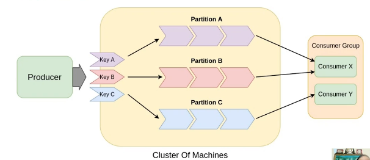
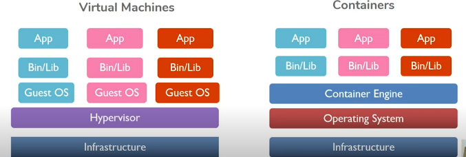

# Distributed Architecture Pattern

## Motivation
Distributed systems issues:
* Failure of Network or hardware
* Distributed system should look like a single system
* Distributed system should scale

There are patterns for common issues faced by people working with distributed system.

## Client-Server Systems
Client is proactive. It generates and sends request. Server is reactive. It processes request and sends response.

Single client, single server is a very simple model but does reflect the real world. Practical model involves multiple clients and servers for real world like eCommerce Portals and Online Banking.

The first pattern that we look at multiple clients and servers is **Conversational Continuity**. A client initiates the communication to a server which can then be directed to an available server, after which communication is set up between the two. If the communication is stateless, then there is no co-ordination required between the servers. It may have load balancer to balance the workload amongst the server. However, consistency becomes a challenge when the communication is stateful. Servers need to intercommunicate and remain updated with the latest state of the system. 
There are many ways to address this issue 
* Server Pool pattern
* Leader - Follower pattern
* Half Sync - Half Async pattern
* Notify Lock Pattern

### Server Pool
We create a set of servers in a pool to start with. Now a central server, working as dispatch server, routes the request to one of the available servers in the pool. Once the assigned server completes the processing, it gets back into the pool as being available. In this model, the overhead to create the server is eliminated and response time to client improves. There are various implementations of this strategy:
* Thread Pool: The process is passed on to one of the available threads in the pool. Example - Java Socket Pool
* Proxy Server: Transparently routes the request to one of the available server in server nodes. It can also do load balancing. Example - HTTP REST Servers
* Request Handoff

#### Advantage and Disadvantage of server pool
* Advantages:
  * Single Server is not blocked for a very long time.
  * Concurrent processing
* Disadvantages:
  * S0 (dispatch server) is a bottleneck especially if the number of requests increases.
  * Server pool is limited by the number of already created servers. Adding servers to handle spikes can be suboptimal in longer run.

### Leader - Follower
All the servers are chained together. The first server (S1) in the chain is called a leader and others are marked followers. 
* Leader (S1) takes the request
* The second server (S2) in queue becomes leader and ready to take the new request
* S1 handles request.
* Once S1 finishes, it joins the follower tail.

Example - TCP Crash Recover

#### Advantage and Disadvantage of Leader - Follower
* Advantages:
  * Low latency.
  * Minimal synchronization needed
  * All servers are equal - symmetric system as each server does the same thing.
* Disadvantages:
  * Complex implementation

### Half Sync - Half Async
This pattern is used to solve the blocking issue that a client faces while the server is processing its request. By doing this, we can increase the parallelism on the client side. This certainly makes most sense if the client can do "something" while waiting for result to be back. 
* Server receives request
* Server returns Future object to client immediately
* Server invokes Worker thread to handle the request
* Client polls future object and await for results to arrive
* Worker returns result as response on completion
* Client receives result

As you can see, tasks are split in High-level and Low-level
* High-level Layer: Synchronous, simple (Receiving )
* Low-level Layer: Asynchronous, efficient
* Queuing Layer: Buffering Point

Server can implement either callback based approach or future object based approach to return the result to client.

Example - UNIX, Windows NT Design

#### Advantage and Disadvantage of Half Sync - Half Async
* Advantages:
  * Simplified programming.
  * Enhanced efficiency
  * Decoupled execution layers.
* Disadvantages:
  * Additional synchronization, copying
  * Context-switch overhead

### Notify Lock
Let's understand this using Network file system (NFS). NFS is a client-server stateless system. Client sends both the file pointer and offset to server so that server does not need to maintain any state for client interaction. (Recovery becomes a challenge for stateful servers). Client utilizes remote procedure call (rpc). The way NFS works is - when client calls the server, the server sends few kb of data back (which is then maintained as cache at server and client). Client reads this data and if it needs more, requests more. Client polls every 30ms for data and every 3 sec for meta-data file. If there is any change to data, the cache is invalidated, and new set of data is received. This makes the architecture very network intensive. Hence, NFS cannot scale beyond few hundred nodes.

To solve this problem, Notify Lock can be implemented where-in if there is any change to the file, the client will be notified. This helps reduce network load and allows system to scale up over ten thousand nodes. This is what is called AFS (Andrew File System)

## Multi-tier Architecture

Presentation Tier (Mobile App) <--> Logic Tier (Application Server) <--> Data Tier (Database)

A lot of web applications are built using this pattern. Example - LAMP Stack (Linux - Apache Webserver - Mysql - Php)

Client-server architecture with separate layers, which can be managed/scaled independently of one other:
* Presentation
* Processing
* Data Management

### Motivation
* Flexible and Reusable applications
* Cache of Database connections
  * Reusable for future requests
  * No connection creation overhead
  * Cuts down turnaround time
* Allows for both mechanism
  * Push-based (Server pushes the data to data store using the connection pool)
    * Server receives the client request
    * Server starts transaction to data layer
    * Data layer responds
    * Server dispatches response
    * Advantage: Easy to match response to request and simple routing on client
    * Disadvantage: Application Server needs to be proactive and gets tricky balancing heavy loads
  * Pull-based (Up call because a downstream database is making call to upstream application server)
    * Server receives the client request
    * Requests are put in request queue
    * Database server will pull the request for the database server
    * Database server will put the response back for application server to consume
    * Application server dispatches the response
    * Advantage: Database server can optimize process based on its scheduling selection to optimize disc access time, as an example.

## Publish - Subscribe Model (PubSub)
A messaging pattern:
* Publishers: Create and categorize messages
* Subscribes: Receive messages of interest
* No direct interaction

### Mechanism
* Topic Based: Publish messages to logical channels. Subscriber subscribes to topic and are notified for new message arrival.
* Content Based: Match messages attribute to Subscriber

### Advantages and Disadvantages of PubSub
* Advantages
  * Loose coupling
  * Better scalability through caching
* Disadvantages
  * No timely delivery guarantees
  * Lack of co-ordination
  * Message Ordering - Processing failures and retries
  
There are many broking systems (like Kafka) which would help remove some challenges like delivery guarantees (exactly once, or at least once)

### Distributed PubSub Broker
Broker plays a crucial role in keeping the communication as good as possible between Sender (Publisher) and Receiver (Subscriber)
It's main role are:
* Translates message from Sender to Receiver
* Manages message queues
* Provides message routing
* Offers transaction management

[Apache Kafka](../Apache-Kafka/wrapper.md) and RabbitMQ are good example of distributed PubSub Broker.

* Advantages
  * Guaranteed message delivery
  * Broker manages discovery
* Disadvantages
  * Slower, high latency
  * Deployment and maintenance overhead

A typical distributed PubSub system

## Microservices Architecture

Functional cohesion is the best way of cohesion.
* Decompose monolith (single, large application) to microservices architecture (Collection of loosely-couple services)
* Mapping microservices to containers - docker
* Kubernetes as Orchestrator (CI-CD for DevOps)

Microservices Architecture:
* Small size, bound by context
* Message enabled
* Independently developed and deployed

### When to apply
* Rapidly evolving business model - Application structure changes frequently
* Frequent application scaling - apply functional decomposition
* Tangled dependencies in monolith - difficult to evolve independently and to separate concerns

We can have nano microservices which can further compose other microservices. This enhances re-usability tremendously.

### How to decompose microservices
* Business capabilities
* Domain-driven subsystems
* By verb or use-case responsible for specific action
* By noun or resource action on all operations on any given entities
* Classes of service should hold SRP (Single Responsibility Principle)

### Implementation
Microservice Instances:
* Service instance per Host
* Service instance per Container (More popular these days) - you should be able to scale independently.

### Benefits
* No single point of failure
* Better fault isolation
* Easier and more flexible deployment - continuous deployment using kubernetes and containers.
* Improved testability
* Maintainability
* Multiple tech stacks can co-exist and evolve

### Drawbacks
* Inherent complexity in a distributed architecture
* Handling requests spanning multiple services
* Testing interactions between services becomes difficult
* Addressing partial failure is difficult
* Increased memory consumption
* Deployment complexity (can be simplified using Kubernetes and other frameworks). This is where cloud native architecture comes to rescue.

## Cloud Native Architecture

* Designed for Automation - we can have declarative way to define the state of our service.
  * Scale up, Scale down
  * Monitoring and Recovery
* Load Balancing
  * Distribute workloads across compute resources
    * Scheduling algorithms
    * Load balancing policies
  * Service-based Load Balancing (especially important for stateful services)
    * Routes client requests to capable servers
    * Flexible to add/subtract servers
  * Depends on nature of tasks
  * Advantages
    * Scalability (Scale up when number of request hits beyond a threshold) - Lets deal with Auto-scale separately
    * High availabilities of services
    * Reliability
  * Disadvantage
    * Latency increase during spikes
    * Inflexibility in pre-processing
* Managed services - all the above can be handled using cloud native framework and solutions.

### Auto Scaling
* Compute resources vary, depending on the load - and hence the need
* The make-up of Auto Scaling
  * Auto Scaling Group
  * Server Instances
  * Desired Capacity
  * Metric
    * CPU utilization
    * Memory utilization
    * Network bandwidth
  * Scaling Policy
    * Updates the Group's desired capacity
    * Based on changes to the metric

In most of the cases, you can specify minimum capacity, desired capacity and maximum capacity within an auto-scaling group and policies (trigger points based on metric) around the scaling up and down the group.

**Advantages**
  * Responsive to actual usage patterns
  * Reduces operational costs
  * Better availability

**Disadvantages**
  * Hides application inefficiencies
  * Capacity thrashing possible if configured suboptimally

### Containers

Containers work very differently than virtual machines.

Docker started the container technology (as believed). Docker provides:
* Abstract app layer - Packages application and dependencies together
* Containers provide isolated workspace using linux namespaces
* pid, net, ipc, mnt, uns
* cgroups is the part of container which limits the system resources
* Containers also have union FS - thin file system layers including btfrs, AUFS, vfs and device mapper
* docker engine wraps namespaces, cgroups and union-fs in a container format, default is libcontainer. This libcontainer is more or less a standard image format for running docker images.

Once a container becomes an image, we can now use this image to run your microservices.

* Task isolation - one container per microservice
* Supports multiple tech stacks
* Database separate - data volumes mounted as containers
* Automated monitoring - tools like prometheus, sysgid chisel and inspect

### Container orchestration in Cloud using Kubernetes

Kubernetes provides a managed framework for managing containers.

* Deployed as a cluster
* Includes worker nodes running containerized applications
* Control plane
  * kube-apiserver
  * etcd
  * kube-scheduler
  * kube-controller manager
  * cloud-controller-manager
* Compute components
  * kubelet
  * kube-proxy
  * kubernetes CRI

We can specify rollout strategy in kubernetes so newer versions can replace slowly when proved to be stable.

## More References: 
### Books
1. Pattern-Oriented Software Architecture, Volume 4, A Pattern Language for Distributed Computing
2. Using Docker: Developing and Deploying Software with Containers
3. Distributed Systems, Principles & Paradigms, 2nd Edition: Andrew S Tanenbaum & Maarten van Steen.
4. Designing Data-Intensive Applications: The Big Ideas Behind Reliable, Scalable, and Maintainable Systems: Martin Kleppmann

### Links
[EMR](https://aws.amazon.com/emr/)
[Clock](https://www.mdpi.com/1424-8220/20/20/5928/htm)
[Logical Clock](https://wintermade.it/blog/posts/logical-clocks-lamport-timestamps.html)
[Brief Intro to Distributed Systems](https://link.springer.com/article/10.1007/s00607-016-0508-7)
[Apache Kafka](https://kafka.apache.org/intro)
[Docker](https://www.docker.com/)
[Microservices](https://martinfowler.com/articles/microservices.html)

