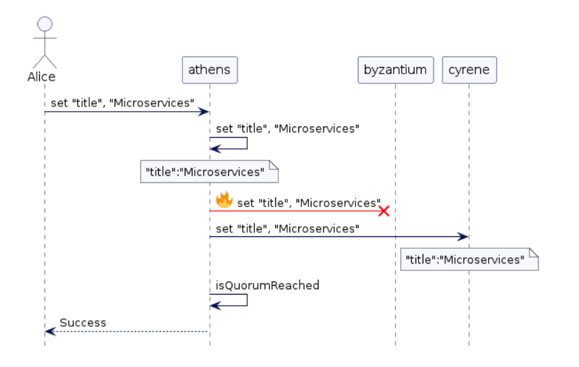
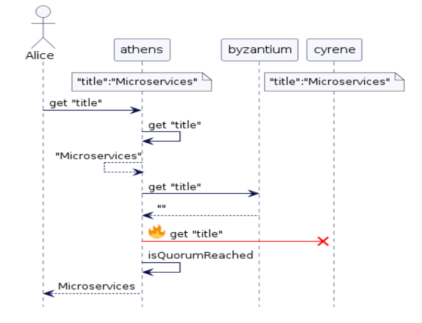
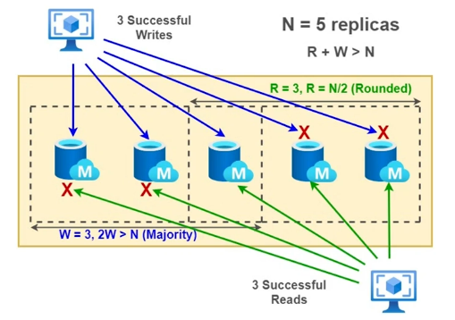

# Quorums and its role in Distributed System

## Quorum

It is majority vote (Yes/No)

More details can be found on [wiki](https://en.wikipedia.org/wiki/Quorum_(distributed_computing))

## What problem does it solve?

* If the original server waits for too many replications, then it would respond slowly.
* If it doesn't not have sufficient replications, then the updates could be lost.
* It is critical to balance between the overall system performance and system continuity

## Quorum Protocol

When applied while writing or reading, it guarantees carrying out each operation (Read/Write) so that a Quorum is ensured. Based on this, there can be "write" Quorum and "read" Quorum.

### Write Quorum

It denotes the number of replicas that need to acknowledge a "write" to complete the write operation.



### Read Quorum

It denotes the number of replicas approached when a read accesses a data item.



## Quorum System

A collection S = {S1, S2, ... , Sn} of Quorum Sets such that each pair overlaps on at least one common item. This ensures that the system is reading at least from one replicas where the latest values have been written.

For replication models, Quorum sets (Write Quorum, W and Read Quorum, R where N is the total number of replicas / nodes) must follow the below rules:

* Any Read Quorum must overlap with some Write Quorum. This means, ```R + W > N```
* Every two Quorums must overlap. This means, ```2W > N```



Seeing above, we can see the formulae below satisfies this above replication model.

```text
min write quorum = RoundDown(sum_of_replication_factors/2) + 1, where
sum_of_replication_factors = data-center_1_RF + data-center_2_RF + ... + data-center_n_RF

min read quorum = RoundDown(sum_of_replication_factors/2)
```

In words, Write Quorums need a majority while Read Quorums need at least half the node sets.

> Quorum can help manage tolerance of replica down up to (Total number of node - quorum). So, using replication factor of 6, a quorum is 4 - the cluster can tolerate 2 replicas down.

It is therefore, easy to understand that -  

* Even number replicas does not add any value.
* as you add more replica, the throughput begins to lose. Sweet spot is 3 replicas.

## Examples

### Amazon Dynamo

N = 3, R = 2, W = 2

A set of principles to construct distributed data store:

* Highly available
* Improved Scalability

Addressed scalability issues faced at Amazon.com - Holiday Season 2004

#### Principles

* Incremental Scalability
  * Able to scale in solitary units
  * Minimal impact on system
* Symmetry
  * All peer nodes have same responsibilities
  * No selective assignment

### Apache Cassandra

N = 3, R=1, W = 1 default

## Further studies

* [Applying the universal scalability law to distributed systems](https://speakerdeck.com/drqz/applying-the-universal-scalability-law-to-distributed-systems)
  