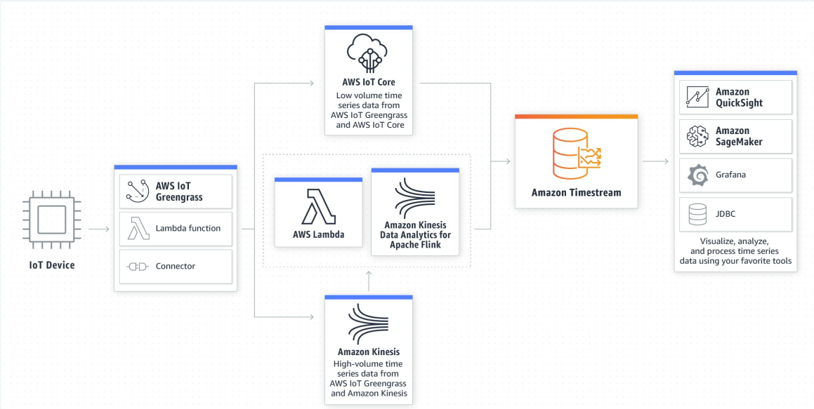

# IOT Analytics

## Use cases
Look for patterns

### Environment
* Disaster Detection & Response
* Smart Energy - Balance of supply and demand
* Resource Management - Water, fuel 

### Industry
OEE
* Supply Chain Management
* Machine Monitoring
* Predictive Maintenance
* Inventory Management

### Lifestyle
* Public Safety
* Smart Buildings
* Lifestyle Monitoring
* Security & Safety

### Health
* Health Monitoring
* Patient Care
* Fitness enhancement
* Sports (and performance enhancement)

### Transport
* Autonomous Vehicle Performance
* Driver-less car
* Traffic Control and Routing
* Smart Parking

## IoT Analytics - What is different?

### Availability of data
* Connected devices enable data collection
* Heterogeneous sensors and input data formats
* Numerous possibilities of correlation of data
* High volume, velocity and variety of data

### Types of data
* Continuous time-series data (some of them may be "well-known" data like heart rate or activity data)
* Irregular data created by anomaly detection
* Low frequency but complex data generated by diagnostics
* Formats - Time Series, Image/Video streams, Tabular, Textual, Location Data, etc.

### Processing variation
* These are typically by choice.
* Periodic output with feedback to optimize operations
* Predictive maintenance based on diagnostic data (time-series data) comparison with baseline
* Long term model building and enhancements, for ML use cases
* Deriving correlations for business understanding and improvements
* Aggregate visualization for business process and operational monitoring

### Storage and Enrichment
* Storage of relevant data (raw and processed)
* Data enrichment merging multiple streams and adding additional relevant data outside of sensors
* Unique data modeling requirements for aggregate, time series, and correlated data

### The "additional" need syndrome
This is something we must be able to avoid
* Since we have the data, we have to process it and store it
* Compute to check rather than compute with a purpose
* Overwhelming the infrastructure by computing and storage needs
* Large overheads for assumed future needs. We should predict future needs.
* Unstructured decoupled systems leading to duplicate processing and storage

## Architecture and Design Considerations for IoT Analytics
* Processing topology - Various steps can be split between device, edge and cloud
* Ingestion
  * Ingest data from multiple sources - Streams and Databases 
  * Transformations to homogenize data formats
  * Preprocessing - Clear outliers and errors
  * Merge multiple streams with enrichment
* Availability - High availability for stream ingestion
* Storage
  * Store raw and processed data in specialized data models - Time series, Flexible schemas
  * Deep querying capabilities to supply data for various analytic use cases
* Data security - Encryption at rest, access control, personal data scrubbing
* Compute
  * On-demand high scaling capabilities for ML model generation and processing
  * Ongoing highly available compute demand for near real-time analytics requirements
* Visualization - Trend visualization, slice-and-dice capabilities for business intelligence
* Structured support for deep-tech machine learning and statistical techniques

## IoT Analytics - Stages
* Data Generation and Communication
* Data Collection and Pre-processing (Cleaning, format normalization included) - Edge/Fog/Cloud Compute
* Data Processing - Batch / Streaming / Hybrid
* Data Analytics - Trend Analysis, Real time Analytics, Predictive Analytics, Data Mining

## IoT Analytics - Types
* **Descriptive Analytics** - Describe incoming IoT data and visualize patterns. Find statistical parameters, understand data distribution and spread, pattern recognition
* **Prescriptive Analytics** - Taking decision on future actions and optimizations. Image/Video processing, ML model data feed, diagnostics. Leading to parameter and workflow optimizations
* **Predictive Analytics** - Predict future data points using historical data. Regression, Time Series forecasting, and other complex ML algorithms

## Time Series Data 
By and large, IoT data is timely collection of data (and therefore time series data).
Time Series Data is a collection of immutable data points obtained by periodic (or irregular) measurements over time. Example -
- Air quality related values captured every hour
- GPS location data collected every ten seconds
- Vehicle throughput at a busy traffic signal captured every five minutes
- Anomalies detected in real-time heart rate measurements - Irregular

### Sub-Types
* Trend Analysis: Spectral analysis - Cyclic/Seasonal Behaviour, Auto-correlation, Change Visualization
* Predictive Analysis: Extrapolation by curve fitting, Forecasting 
* Anomaly Detection:Segment comparison against baseline models - Rule-based or ML

### Example: Environmental Monitoring System Solution

### Amazon Time Stream (ATS)
As appreciated, time series data are really huge, coming from heterogeneous systems. We need a very capability system to allow querying for historical data. Amazon Time Stream is fast, scalable and serverless time series database for IoT systems. It can handle trillions of data per day, up to 1000 times faster, at fractional cost. It manages cost by managing the lifecycle of this time series data. Typically, recent data is placed in memory and others can be moved to some cost optimized storage. While querying, both recent and historical data can be unioned within ATS while returning the result. It has built-in analytics functions, helping identify trends and patterns in realtime. See the overall generic flow -

## IoT Analytics - Tools and Frameworks

### Popular Tools
* AWS IoT Analytics
* Azure Stream Analytics
* IBM Watson IoT Platform
* Thingspeak
* Thingsboard
* Apache StreamPipes

### Libraries and Frameworks:
* Scikit-Learn - Extensive library with implementations of various ML techniques including classification, regression and clustering
* Tensorflow - Build neural networks and deep learning models on image and textual data
* Pandas - Data exploration and pre-processing for machine learning modeling

#### AWS IoT Analytics and its components

##### General Flow

##### Components
* **Channel**
  * Ingest data from MQTT topics and publish to pipelines, can buffer data temporarily
* **Pipeline**
  * Transform and homogenize input data in various formats
  * Clean up data outliers and data created due to errors
  * Enrich data by adding relevant information - weather data based on time and location, addresses based on lat/long, etc.
* **Data Store and DataSet**
  * Processed data storage after pipeline processing
  * Flexible time-series storage, provides SQL based querying capabilities
  * Defined dynamic datasets based on queries and periodic ‘refresh’ updates
* **Analysis**
  * SQL queries based results
  * Time-series analysis
  * AWS Quicksight Visualization
  * Hosted Jupyter notebooks for deeper analytics and machine learning

## Analytics Scenarios and Use case

### Some common scenarios
* **Continuous Data Analytics**: Time series data, aggregate monitoring and predictive actions
* **On-Demand Data Analytics**: ML model enhancements, Operational state updates, Predictive financial planning requirements
* **ETL - Extract, Transform and Load**: Enrich and transform data from various sources, aggregate in common data models for further processing
* **Data Visualization**: Visualization and BI tools for default and custom visualizations. Drive by business requirements, and operational and planning use cases

### Use Case: Predictive Maintenance

Towards the edge (AWS Greengrass)

Let's focus on the Cloud section where analytics can happen.

## Further studies
* [AWS IoT Analytics](https://docs.aws.amazon.com/iotanalytics/latest/userguide/welcome.html)