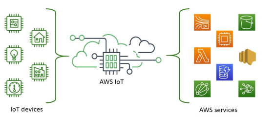
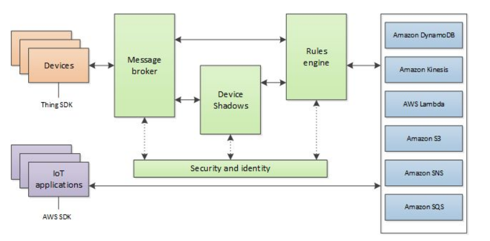

# AWS Services
A very reliable cloud provider.

## Availability
Auto-scalable IoT Core Services

## Device Monitoring
* Device Shadow Service, provided by AWS for bidirectional communication on MQTT
* Useful for building separate service layer for uptime check, status updates, push updates.

## Data security
* ‘Thing’ registration - X.509 certificate and keys for authentication and authorization

## Stakeholder Updates
Extensive SNS based scalable notification pipeline

## Data Correlation & Pattern Analytics
* Multiple data models supported - 
  * Data lakes, Stream processing, Semi-structured storage (S3/Lake Formation, Kinesis/SQS/Kafka-MSK, DynamoDB/RDS)
* Big data processing and statistical/ML services - 
  * IoT Analytics, EMR, SageMaker, Deep Learning AMIs, Quicksight

## AWS IoT - Components

### Device & Edge Services
* Greengrass - SDK for Edge Servers
* FreeRTOS - Real-time OS for Devices
* FreeRTOS BLE Mobile SDK - Low power communication via mobiles

### Cloud services
* IoT Core - Scalable and secure device connection and communication, Device shadows, On-the-fly data transformation, post-collection seamless connection to various AWS services
* IoT Device Management - Registration, Organization, Monitoring, Update Management

### Analytics Services
* AWS IoT Analytics - Workflows, Time-series data storage, Queries, Transformations, ML
* IoT Events - Rule-based event processing and actions
* IoT Things Graph - Visual organization and workflows

## AWS IoT Core
* Virtual device configuration and mapping to real devices
* Shadow device service to maintain status, monitoring, updates, and upstream connections 
* Device organization in various hierarchical categories 
* Secure device communication - X.509 certificate and keys for authentication and authorization
* Communication protocols - MQTTS, MQTT over secure websockets, HTTPS, LoRaWAN (becoming popular, though MQTTS and MQTT over secure websockets are de facto)
* On-the-fly data transformation 
* Data streaming to various services - DynamoDB, S3, SNS, Lambda, Elasticsearch, Cloudwatch, IoT Analytics, IoT Events, Kinesis, SQS, Custom services 
* Scalable to billions of devices 
* Read more at [AWS-IoT](https://aws.amazon.com/iot-core/)

## AWS IoT Core - Concepts

### IoT Device Registry
* Virtual device registration ()
* Bulk provisioning with hierarchies 
* Various mechanisms for secure communication 
* Automated API-driven provisioning & management

### IoT Device Gateway & Message broker
* Communication with multiple protocols - MQTTS, MQTT over secure websockets, HTTPS, LoRaWAN
* Low latency scaling to billions of devices
* Bidirectional communication with devices - data ingress, heartbeat monitoring, control messages, updates

### IoT Device Shadow Service
* State management with continuous updates
* Bidirectional communication for downstream configuration and software updates
* Status available to upstream services even on device disconnections (or addition or deletion of devices)
* Support for device state restoration on reconnection
* Supports generic Get, Update and Delete REST api calls 

### Jobs Management and API
* Defined jobs for devices - OS updates, software installs, reboot, cache reset, troubleshooting information, security certificate updates
* Extensive control over device targeting and job ordering
* Support for supplying assets including new updated files and configuration information

### IoT Rule Engine
* Enables automatic upstream data and event communication to various services - DynamoDB, S3, SNS, Lambda, Elasticsearch, Cloudwatch, IoT Analytics, IoT Events, Kinesis, SQS, Custom services
* SQL based selection syntax
  * Partial payload pickup possible - _select value, device_id, timestamp_ 
  * Topic selection control - _from devices/#_ to build the right context
  * Possible data pickup or alerts, based on rules - where value >= 50
* Use cases - Storage, Stream Processing, Direct alerts/notifications, Processing triggers based on conditions, etc.

### DynamoDB action rule
* Automatically send all (or some) device data to DynamoDB 
* Complete payload in one column or map payload keys to different columns 
* Map different set of topics to different tables for automatic segregation
* Provides low latency reads - topic oriented or time oriented, etc.
* More details are present at [Dynamo](../../Database/NoSQL/key-value-database/dynamoDB.md) page

## Putting everything together

