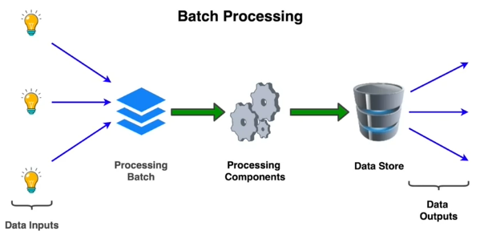
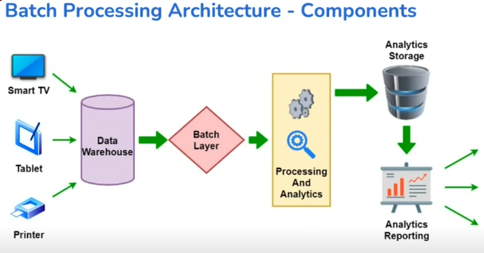

# Batch processing

## What is batch processing?

### Executing a set of tasks, that:
* Are not interactive
* Can be scheduled according to resource availability

### How Batch Processing works:
* Collect and store data in an intermediate storage (and pre-proceesing)
* Process this data during a “Batch Window” in finite period of time
* Store/send the resulting output

### Batch v/s Stream Processing:
* Stream: Feed data piecewise to Analytics, in real time
* Batch: Collect data over time, send batches to Analytics (Quantum of data required for usecases)

### High level

## Use cases: Health Care

### Elderly Care And Assistance
* Digital pacemaker’s operation is only possible if the data is batch-analysed for characterisation. For example,
  * Pacemaker’s software update and configuration possible to change the sequences and pulses
* Regular recording heart murmurs, batch-analyzed by Physician

### Patient Bedside Monitoring
* Episodic versus Periodic analysis - both a requirement
* Periodic ECG data collection and heart-rhythm analysis
  * Relate episodic with the periodic
* Periodic recording of Blood Pressure levels, and determining the average level
  * Relate with heart function

### Fitness Management Devices
* Periodic analysis to build fitness regime efficacy factor - Bi-weekly/Monthly
* Collecting fitness band data, publishing monthly reports on the average walking distance
* Activity - long distance runs - various batches compare and contrast

## Use cases: General IoT

### Municipal Corporation: Water Supply Billing
* Water consumption is measured daily, and stored
* Consumption bills are computed monthly, and provided to consumers
* Trends in consumption provide insight - example, when demand is not met with supply, say seasonal demands.

### Industrial Bottling Plant
* Each “batch” - size, quantity, packaging - of bottling has its unique characteristics
* Build efficacy across such “batches” - ensure high productivity - Overall Equipment Effectiveness
* Monitor data per batch on specified periods
* Post facto analysis for improvements in the next batch

### Traffic Load Balancing System
* “Vehicle Packets” movements through routes intra-city
* “Batch” based on time-of-day, day-of-week, special events
* Analyse data in batches, periodically, to take decisions of routing or enhancing the road network improvement

## Use cases: Generic

### Billing Process Automation
* A consulting company may bill customers monthly, pay employees fortnightly
* Credit card payments happen regularly, but are billed monthly

### Distribution - eCommerce
* Parcels processed for routing and distribution
* Processing driven by - destination, package types (small, large, heavy)
* Predictable time to reach destination

### Financial Analysis
* Investment model creation and updates, HFT (High frequency transactions) algorithm updates
* Periodic risk analysis based on market data and transactions

### Telecommunications
Evaluate network performance and optimize cell tower locations and signal strength

### Text Processing
Large scale web text processing for inverted indexes, NLP, social media sentiment analysis.

## Architecture - Components

## Cloud - Big Data
* Storage - Distributed storage with high read throughput
* Compute - Worker node topology with parallel processing and horizontal scaling
* Data Warehouse - Big data storage with complex querying capabilities for Analytics
* Processing Framework - Structured framework for orchestration, partitioning, processing, workflow management, and result aggregation.

In IoT, some batch processing can also be done at the edge
* Edge will use local storage and compute power for mini-batch processing
* Use cases - Local actions, Local display, Aggregation for reduced data transfer upstream
* Processed data sent to cloud for further processing and analytics across data from multiple edges (For example, you can send the modelled data on cloud)

## Architecture - Considerations
* Partitioning: Effective data partitioning for parallel processing and result aggregation for large data. Also, ensuring that interdependent data is within the same partition.
* Compute requirement: High compute resource (CPU, RAM and Storage) requirement but for limited time periodically
* Scalability: Large amount of data forces scaling across multiple servers, requires efficient parallel processing
* Fault tolerance: Failure at some nodes expected; recognize, recover, and redo those data chunks
* No shared state: Processes must be truly parallel, no interaction while processing
* Orchestration: A multi-steps parallel pipeline requires orchestration by special nodes (which should be queried for status)

## Advantages

### Improves efficiency
* System can set processing priorities
* Process data when required/feasible/convenient

### Simpler than Stream Processing
* Data input does not require system support or custom hardware
* Running system requires less maintenance

### Data Quality improvement
* Fewer errors due to reduced user interaction
* Improved accuracy and precision of results

## Challenges

### Troubleshooting Complexity
* Errors are often difficult to debug, require specialized tools and dedicated teams
* Handling node failures in edge scenarios

### High Initialization Costs
* Requires initial cost to set up resources (utilization)
* Requires time and effort in setup, and skill-based training
  * Batch scheduling skills
  * Event detection and notification experience

## Batch processing - Edge Computing

### Using Edge Computing effectively
* Raw data collected from device
* Compute on the edge - collect raw data, only if required
* Deviations flagged as alarm - data processed in batches and metadata can be added to enrichment and flagging alarms
* Processed data in batches transmitted to the cloud - aggregate analysis, compare and contrast

Take an example of **Fleet Management**. This involves -
* Driving raw data collected frequently - per second
* Computing determines type of operation and behaviour - abnormalities detected
* Movement data sent periodically - Location, Aggregate data on driving characteristics 
* Data - over a period of time - analysed for compare and contrast, and aggregate analysis on a monthly on quarterly basis

## Tools and Frameworks
* Storage - HDFS, HBase, DynamoDB, S3, Azure Blob
* Processing - Hadoop, Spark, AWS EMR
* Analytics Storage - Data Warehouse (AWS Redshift), DynamoDB, Hive, MongoDB, Hbase
* Analytics and Reporting - Tableau, PowerBI, QuickSight

## Further studies
* [Batch Processing Wiki](https://en.wikipedia.org/wiki/Batch_processing)
* [Apache Spark](../../Apache-Spark/README.md)
* [Spark on Databricks](https://docs.databricks.com/getting-started/spark/index.html)
* [PySpark](https://databricks.com/glossary/pyspark)