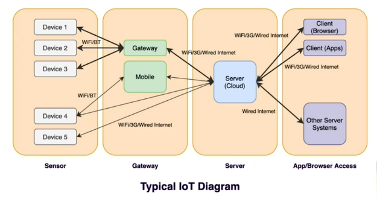

# IoT Architecture

There is no single classification - there are many variants of IoT architectures. Some of the most popular computing system are:
* Edge Computing
* Fog Computing
* Mist Computing
* Cloud Computing
* Mobile Computing

As new technology come up, architecture would continue to evolve. Consider advent of mobile phone, internet, etc.

Major concerns - 
* Interoperability - standards (protocol and data)
* Security - Each connection point is vulnerable to attack.
* Scalability - in terms of nodes that can be connected.

## Typical IoT

Device1, 2 and 3 can send the data to gateway periodically or gateway can poll data from these devices over bluetooth or WiFi. Gateway then interacts with server, which may be a cloud based server over wired / wireless / WiFi communication.

Device 4 can be sending to mobile and then to server and can be sending it directly to server. GPS classic example.

Device 5 is typical connect directly to server.

All the combinations can be used in a single IoT application deployment depending on considerations like cost, latency, accuracy, etc.

## IoT Architecture

### Cloud Computing

### Edge Computing

### Fog Computing

### Mist Computing

### Mobile Computing