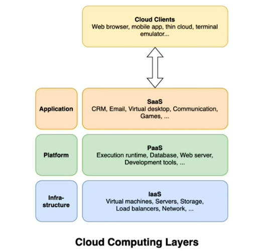
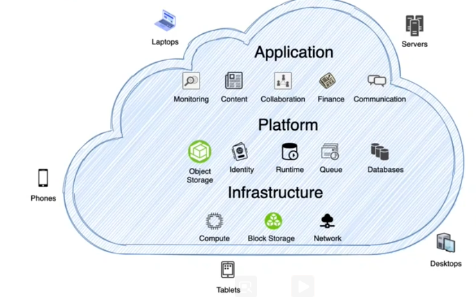
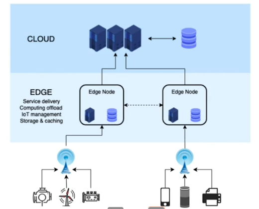
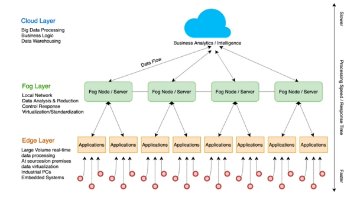
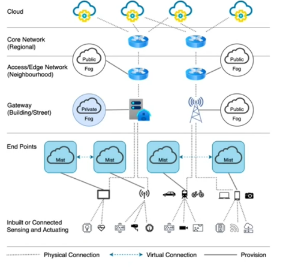

# IoT Architecture

There is no single classification - there are many variants of IoT architectures. Some of the most popular computing system are:
* Edge Computing
* Fog Computing
* Mist Computing
* Cloud Computing
* Mobile Computing

As new technology come up, architecture would continue to evolve. Consider advent of mobile phone, internet, etc.

Major concerns - 
* Interoperability - standards (protocol and data)
* Security - Each connection point is vulnerable to attack.
* Scalability - in terms of nodes that can be connected.

## Typical IoT

Device1, 2 and 3 can send the data to gateway periodically or gateway can poll data from these devices over bluetooth or WiFi. Gateway then interacts with server, which may be a cloud based server over wired / wireless / WiFi communication.

Device 4 can be sending to mobile and then to server and can be sending it directly to server. GPS classic example.

Device 5 is typical connect directly to server.

All the combinations can be used in a single IoT application deployment depending on considerations like cost, latency, accuracy, etc.

## IoT Architecture

### Cloud Computing
#### History
* Started with time-sharing RJE(1960s)
* 1990 to date - advent of telecom, computing
* "Central" resources, Pay per use

#### Today's Cloud
* Computing, Storage, network, and more
* Scalable and distributed
* Service Oriented models (SAAS, PAAS, IAAS)

#### Cloud Computing Layers

Let's take a look at another view of cloud infrastructure.

The key to note here is that there is peripheral or edge of cloud infra on which external devices like phones, laptops, servers, desktops and tablets can attach for any business processing. This view opens up gate for other kind of computing architecture like edge, fog and mist architecture.

#### Deployment
Private, Public and Hybrid

#### Characteristics
* User manages applications
* Vendor manages infrastructure
* Lower cost if done the "cloud" way

 
### Edge Computing

#### Edge Computing Paradigm
* Distributed computing at the edge of cloud
* Proximity - closure to the user/need

#### Today's Edge
* IoT friendly - Massive amount of data
* Processed at the "Edge"
* Broad definition and implementation - see the typical architecture section for more detail.

#### Typical architecture

Fundamentally, we are looking at not bringing all the data to central server and doing all the computing outside the cloud. It also allows scaling horizontally - we can add more nodes to handle increased sensor.

This becomes a very useful architecture when our sensor may lose internet connectivity to cloud (say our sensor is on a moving vehicle). You would still need minimum process and data retention to happen. Let's see more details in the why section.

#### Why?
* Real-time control decisions - Low latency
* Intermittent Internet access - Remote locations or moving devices
* Low bandwidth connection - Pre-process and send fewer data
* Cost-effective - Reduces bandwidth and central processing costs

**Constraints**

* No complex or long-running operations
* No aggregate analytics - because required data can be other nodes
* Redundancy and recovery - harder to achieve as compared to cloud

#### Characteristics
* Increased efficiency
* Data and Security - Edge vs Cloud
* Fault tolerant

### Fog Computing

#### Fog Computing Paradigm
* Coined by Cisco
* Local networks or "local cloud"
* Some data available offline

#### Fog computing of today
* IoT friendly - Heterogeneous devices connecting to fog and allowing processing on local networks
* Processed data sent to the cloud
* A thin line between Fog and Edge

#### Typical architecture

It is purpose driven.

#### Characteristics
* Process large volumes with little delay
* Data under users' control
* Flexible storage system

### Mist Computing
It can be another area of computing - embedded devices which have microcomputers and microcontroller whose processing power have been increasing.

#### Mist computing paradigm
* Extreme edge computing
* Computing, monitoring and control closest to the sensor

#### Mist computing of today
* IoT friendly - Microcomputers and microcontrollers
* Only essential data sent to fog, cloud

#### Typical Architecture

#### Characteristics
* Efficient use of communication
* Local - Analytics and decision-making
* Local - Monitoring and control
* Great fit for low power battery operated devices

### Mobile Computing

#### Mobile computing paradigm
* Computer is "mobile"
* Connected over a wireless network across very large geographical areas - specific protocols, data formats
* Interoperating technologies over standard protocols and data formats

#### Mobile Computing of today
* IoT friendly - wearables, mobile phones
* Mobility is key - portable computing
* Interface with peripherals

#### Characteristics
* User and usage focused - adapt to local technologies (example, knowing whether you are walking or running or swimming)
* Superior connectivity expected - application focused
* Serving the individual