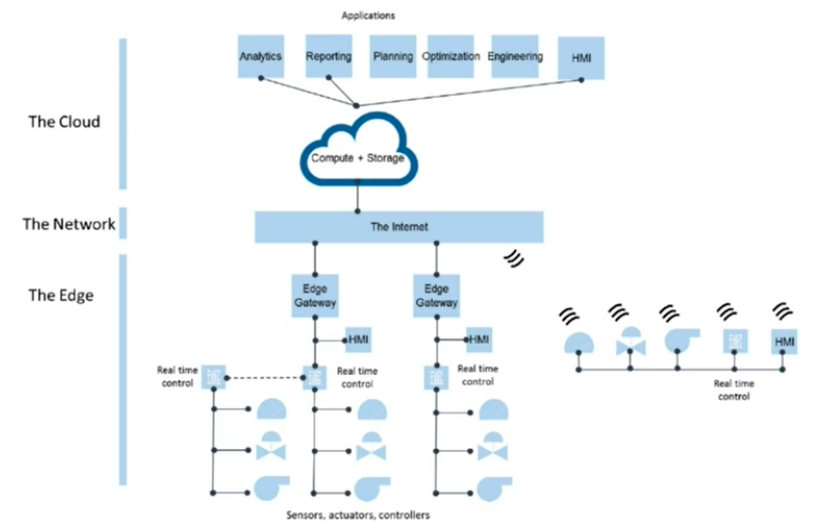
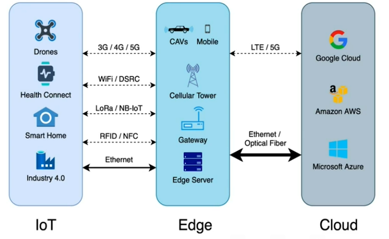
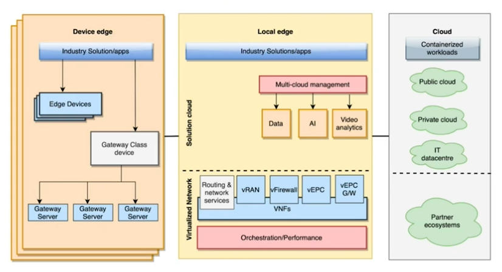

# Edge Computing - IIoT Architecture

## Typical architecture

> Global mobile edge computing market size growth through 2017 to 2024 rose from $138.81mill tp $1556.08 (projected) with a staggering CAGR of 35.27%

## Examples
* Attendance System (Biometric or RFID)
  * Temperature detection, facial recognition, fingerprint recognition, etc
  * Local data - faster processing
* Security Systems
  * Fencing, video detection, etc.
  * Local computing - reliable intrusion detection and alarms
* Fleet Management
  * Driver alerts - in cabin
  * Vehicle alerts for driver to act
* Agriculture (with help of cloud)
  * Local decisions based on weather inputs
  * Crop type based actions at the edge
* Healthcare (Bedside monitoring)
  * Local monitoring, processing and alerts

Let's review a use case of [Facility/building management](../use-cases/building-mangagement.md) which we looked at earlier and enrich it with edge or "local" computing

## Architecture 11m

The three-tier architecture is connected with network interfaces.

Let's take one step towards understanding what is included in "edge" with edge computing (also note what can remain on-prem)

Now let's see the architecture topology now. Please see the diagram below.

First box is the device edge. This is particular industry solution using the edge devices. Each of these devices edges would also have gateways. Some processing can happen on the device edges.

Then, is the intermediate local edge between the device edge and cloud edge. This local edge really becomes the solution cloud (a mini cloud) available at the edge. It would have its own management for its resources locally. Because it has processing power in terms of compute, storage and RAM - some data analytics, AI, web analytics is possible here. Alerts and aggregations can then be sent on cloud.
 
Cloud itself can be public or private cloud or an IT datacenter with its entire infrastructure ecosystem.

## Challenges

With edge computing, we can solve for latency, intermittent communication issues, bandwidth challenges, etc. Edge computing requires lots of devices of various kinds, numerous locations, etc. However, it has a lot of challenges.

* Deployment, Configuration, Upgrades (hardware or software) and Maintenance - these must be really thought through during the design.
* Handling heterogeneous devices
* Troubleshooting - due to variety requiring specific way to troubleshoot and distributed nature
* Reliability (the entire system) and Redundancy
* Competing proprietary protocols
* Deployment Costs
  * Capital Expenses
  * Operational expenses
  * Power usage
  * Temperature and environment control
  * Occupied real estate
* Durability in large, long-term projects (generally 5 to 7 years plan)

## Edge Vs Cloud Computing

| Edge                                            | Cloud                      |
|-------------------------------------------------|----------------------------|
| Low Latency                                     | High Latency               |
| Real time Response                              | Slower Response            |
| Reduced storage, network traffic, bandwidth cost | Big Data Processing        |
| Operationally challenging to maintain           | Unlimited Storage capacity |
| Utilizes proprietary networks                   | Scalable                   |
| High cost of data storage and transmission      | No offline mode             |
| High device power consumption                   ||
