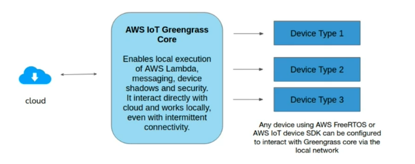

# Edge Computing Software Frameworks

There are some very popular edge computing software frameworks from various manufactures.

* [AWS Greengrass](https://aws.amazon.com/greengrass/)
* [Azure IoT Edge](https://azure.microsoft.com/en-in/services/iot-edge/)
* [GCP Edge TPU](https://cloud.google.com/edge-tpu)
* [Waggle - An Open Platform for AI@Edge Computing and Intelligent Sensors](http://wa8.gl/)
* [EdgeX Foundry](https://www.edgexfoundry.org/)

## AWS Greengrass

### What is it?

* Open source runtime and software services for edge servers
* Extend AWS to edge
* Process generated data locally
* Aggregate and send less data to cloud
* Trigger Machine Learning predictions
* Deep integration with the cloud layer (AWS IoT Core)
* [Preinstalled on partner devices](https://devices.amazonaws.com/)
* [More information](https://aws.amazon.com/greengrass/features/)

### Capabilities

* Core software and SDK
* Lambda runtime
* Local container (Docker) support
* Device Shadows - help manage states of the device
* Networking with Devices
* ML inferencing
* Stream processing and management
* OTA updates for device upgrades
* Credential Management
* AWS IoT Greengrass API
* Message manager

### Core

