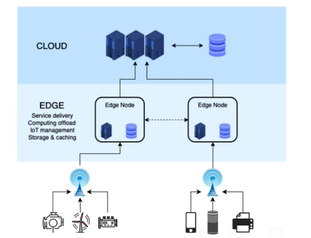
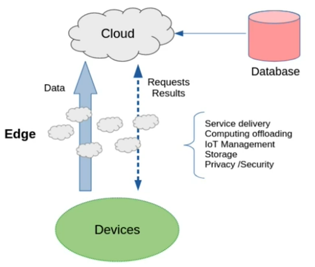

# Introduction

Compute, Storage and RAM required for IoT has always existed on the Cloud infrastructure. In fact, it has now increased - we have more of these in small space requirement. Network, communication, quantum of data can be transported has also increased. While this is at the large capacity scale, the small capacity side things like microprocessors, devices have become more intelligent. Devices themselves have significant processing power and are now packaged with fair amount of storage and RAM. Some devices have multiple cores available as well.

If you see these three components - devices, network and Cloud, edge computing seems like a good alternative to sending things on cloud each time. This allows the processing locally within gateway, which forms one of the basis of edge of the cloud.

## What is edge computing?

By the edge of the cloud, we mean two things: 
* Fundamentally away from the cloud computing/infrastructure
* The point from which the communication to the cloud begin.

* Edge Computing Paradigm
  * Distributed computing at the edge  of cloud 
  * Proximity - closer to the user/need
* Today’s Edge
  * IoT Friendly - Massive amount of data
  * Processed at the “Edge”
  * Broad definition and implementation
* Characteristics
  * Increased efficiency
  * Data and Security - Edge vs. Cloud
  * Fault-tolerant (on the basis that a lot of computing happens towards the edge)

Pictorially, edge can be made up of edge nodes. Each edge node will have its own computing framework - virtualization of these nodes on the frameworks, available on the edge itself is useful in building numerous use cases. A lot of management of devices can be done by edge computing. Below is way to present the basic architecture in a three-layered way.

Or, if we visualize the same in a data view. Ensuring not all the data need to be sent to cloud. Processed data can be sent to cloud in most scenarios. Cloud can do more strategic processing, trend analysis, etc. See below.

## Why do we need edge computing?

* Real-time control decisions since the processing is near the devices where the data is collected and where the decision is made, it results in Low latency (since round trip to cloud is avoided)
* Intermittent Internet access - Remote locations
* Low bandwidth connection - Pre-process and send less data
* Cost-effective - Reduces bandwidth and lower central processing costs

**Constraints**

* No complex or long-running operations (compared to cloud)
* No aggregate analytics
* Redundancy and recovery - harder to achieve both in terms of cost and maintenance (configurations)

## Gateways to ML
We have seen gateways as intermediate computing hardware. Typical gateways are headless. These gateways have transformed IoT evolution. It all began with simple gateways.
* Simple Gateways - Transfer data as-it-is from devices to upstream server
* Later, it had increased storage - Store-and-forward on intermittent connections
* Then came in gateways with higher machine capacity leading to generalized processing capability (including mobile acting as gateways)
  * Immediate (local) alerts - Smart buildings, Factory Floor
  * Aggregate and forward - Reduce bandwidth by only sending macro data upstream for analytics 
  * Security - Encryption and Obfuscation 
* With increased processing capacity, the next step came in as Machine Learning inferencing, which further propelled
  * Anomaly detection (batch process)
  * Image and video entity detection and alerts
  * Healthcare device orchestration
  * Autonomous driving (split second decisioning)
* We now have mobile as Edge is becoming popular with visual interaction

