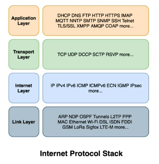
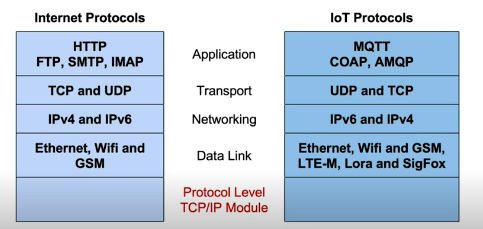

# IoT Networking Protocol and Applications

The aim is get familiar with IoT Networking and Protocols
* Understand main components of IoT Networking 
* Get familiar with protocols used in IoT networks 
* Understand how MQTT works and why it is required 
* Able to summarise all what you learnt using a Facility or Building Management use case

## Outline - IoT - Networking, Protocols and Applications
As we have seen, an ecosystem of sensors, actuators and devices interact with each other either P-2-P or via gateway or via servers (fog, edge or cloud). This communication is enabled by networking. There are several protocol available, trying to solve specific problem domain. Let's understand this in greater detail.

## Typical IoT Architecture

The connecting link is what is network, which can be wired or wireless and uses standard protocol to make things happen. Before we look into network protocols, lets do a quick comparison with typical web services and understand what would the IoT Network require.

## Comparison with web services and IoT Network Requirements

**Standard Web services**

* Homogeneous network stack - Default http / tcp / ip / ethernet stack 
* Substantial power available - Most devices are not on battery, have continuous power supply 
* Persistent connections - Web services can maintain continuous connections and are almost always available. In fact, before wireless system, the connections were always persistent (unless there was a wire cut or something).
* Many-to-one connections - Multiple clients connecting to one server side endpoint 
* Permanent physical layer - Cost consideration not as high, as load is shared with multiple communication use cases.
* No real-time requirements - Large scale web application, which even work on eventual consistency. We look at faster response time, lower latency but internet as a whole worked on the concept of the best effort.

When we start comparing this standard web service requirements against IoT requirement, the world starts shifting. **Networking in IoT** must recognize the environment within IoT system operates which really drive most of the requirements and thereby, need of multiple protocols. Some key considerations below:

* Heterogeneous elements with different networking protocols (MQTT, HTTP, Raw TCP, Raw UDP, etc.)
  * Gateways/Servers: Need to support multiple ingress/egress protocols
* Power constraints (IoT systems should be planned to use minimum power to support the use case)
  * Battery operated devices - Require low power consuming protocols, not always on.
  * Peak power usage - Maximum drawable power at any point limits bandwidth levels
* Intermittent connections
  * Network available for limited time or with varying bandwidth (specially if devices are mobile) - store and bulk send 
  * Unreliable network - Data transit reliability
* Hierarchical architecture
  * Multiple entities - Devices, Gateways, Edge servers, Cloud, Mobile, other layers 
  * Different protocols possible in each connection pair, based on different considerations 
* Wireless is now a necessity
  * Wired connections may be impossible in certain situations- environment, distance, mobility 
  * Different wireless protocols available due to power and cost considerations
  * Sometimes, even WiFi is not an option and satellite connections are the only option, say for example for weather stations.
* Real-time data transmission (say we are dealing with healthcare)
  * Safety and Security requirements - Minimal delays
* High reliability 
  * No data loss in transit
  * Data store and retry in intermittent connections
* Data security
  * Large attack surface area - devices, communication layers, edge servers
  * Unguarded devices in various use cases
* Device level monitoring and traffic management
  * Periodic payloads
  * Continuous chatter for monitoring, control, and updates 
* Last but not least, Cost-effective
  * Device initial cost - Require network protocols fulfilling exact requirements 
  * Device ongoing energy cost (operating cost) - Limits bandwidth, range, metadata per transport 
  * Cost of networking medium usage (operating cost) - 4G, WiFi, etc.
  * Important, but will cover for now is maintenance of these devices.

## Need for Multiple Protocols
Network protocols are driven by certain constraints. Let's see few of the constraints and their impact.
* Cost
  * Processing cost for each network stack  
  * Transceiver cost based on distance 
* Bandwidth 
  * Optimal bandwidth based on network topology, distance. Sometimes, very high reliable but lower bandwidth would work, so we do not lose even a single packet. Or, sometimes, a slightly less reliable but higher bandwidth is required, so we can transfer a lot of data packets. 
  * Peak bandwidth required in burst mode
* Power Usage 
  * Processing based power consumption 
  * Power consumption in data transfer - wired or wireless
* Infrastructural attributes 
  * Security, Latency, Simultaneous connections, Dynamic increase and decrease of devices, etc.
* Balance cost and capability for various current and future use cases
      
## Elements
Let's divide the elements involved in IoT network into 4 large categories:
* Network Interfaces
  * Wired (RS232, USB, Ethernet)
  * Wireless (BT, WiFi, GSM)
* Network Topologies
  * Peer to Peer (RS232, BT)
  * Mesh (BT, WiFi)
  * Wireless LAN (WiFi, ZigBee, LoRaWAN)
* Data Communication 
  * Protocols (HTTP, FTP, SMTP, XMPP, MQTT, COAP)
  * Layer - Protocols Stack (Internet Protocol Stack)
* The Internet - Interconnected Things (IOT)

Let's see the internet protocol stack and examples of elements that exist in networking.

As technology evolves, one layer can be exposed directly to another and a new layer can be introduced.

## Protocols and Protocol Landscape

## Wireless 4m
## Protocol Design Considerations 18m
## Protocol Design and Popular protocols 11m
## MQTT - Introduction and Pub-Sub vs. Request-Response 7m
## MQTT - Authentication 1m
## MQTT - Publish - Subscribe 3m
## MQTT - Why? 5m
## HTTP 4m
## IoT Layers 4m
## Summary 19m

## Further learning
* [MQTT](https://mqtt.org/)
* [IoT Standards and Protocols](https://www.postscapes.com/internet-of-things-protocols/)
* 