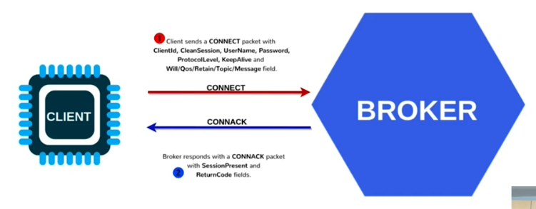
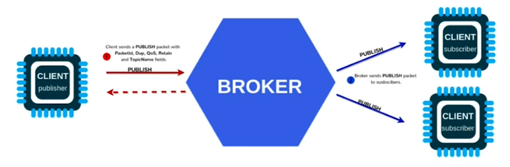

# MQTT

**Message Queuing Telemetry Transport**
* First version by Andy Stanford-Clark and Arlen Nipper (1999)
* Publish-Subscribe - No Queue as in the name!
* Very effective and light-weight

It is an application Layer Protocol of the Internet Protocol Suite, normally used over TCP for communication.

It is an Open Oasis and ISO/IEC 20922.

MQTT is really a Server-Broker (a publisher-subscriber model), where Clients “publish” or “subscribe” to/from a topic and a broker manages “topics”. Broker distributes messages to clients who have subscribed to relevant topics.

Its simplicity is also in its Messages types. There are only three types:
* Connect
* Disconnect
* Publish

A **Publisher-Subscriber** model is really a “Push”. A publisher or client device would push a message to broker on a topic. Broker would push the message to a subscriber. Topic is where the data or payload resides. MQTT is an example of it.

This is strikingly different from **Request-Response** model which is really a "Pull and Push". Typically, a Client will pull the data from the server and server will push the data to the client. This allows Bi-Directional conversation of data or payload. There is an URI or URL (Universal Resource Locator). HTTP is an example of it.

## Authentication

If a CONNACK is not received, the client would know that the broker is not available. Credentials can be used to authenticate the client.

## Publish - Subscribe

## Advantages of using MQTT in IoT

* The Message Queuing Telemetry Transport can transmit messages between many devices. Devices can join or leave the system.
* It is a lightweight protocol, typically runs over TCP/IP but can run on any network protocol that provides ordered, Loss-less and Bi-Directional communication.
* It is very easy to implement - it is a simple publisher and subscriber model.
* Publish-Subscribe Model - Unique model to connect devices in Bi-Directional mode.
* It is really scalable - Can scale to thousands of devices. Devices just need to have credentials/secured certificates to get into the network.
* QoS can be chosen out the three modes:
  * At most once (Fire and Forget)
  * At least once (Acknowledged Delivery)
  * Exactly once (Assured delivery)
* Concept of Topics makes the system really scalable.
  * Hierarchy of topics
  * Message distribution by topics
    * Publish on topic and Subscribe on topic
  * Message (2 bytes to 256 Megabytes)