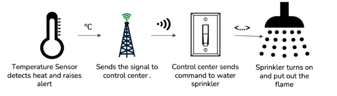

# Actuators

Actuator is actually a “mover”. Once a sensor detects something and send the digital signal, we will need something to take an action. The action in response of a signal happens by an actuator. An actuator can be a valve which can close itself as result of response. It is responsible for effecting a change.

## General Types
* Hydraulic
* Pneumatic
* Mechanical
* Electrical
* Magnetic
* Thermal

## IoT: Change triggered by electrical signal
In IoT, we would want a change triggered by electrical signal. This change can be in form of
* Sound, as done by Electroacoustic Transducer, Solenoid movement
* Switching, as done by Relays, Electromechanical
* Movement, as done by Stepper motor, Servomotor, Solenoid

We can also have digit to analog converted.

## Sensor to Actuator Flow

Let's take an example -

Here, water sprinkler would have a selenoid actuator which would turn the sprinkler on. You can have the cloud center local or in the cloud - remember there can be internet issues, and you do not want critical systems like fire alarm or sprinkler to fail to do intended job.