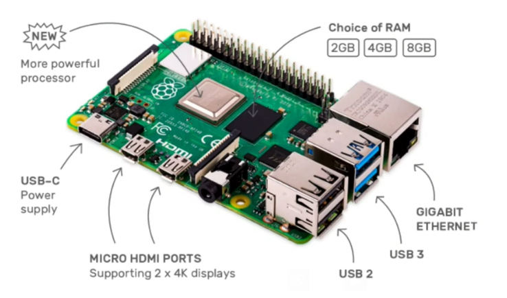
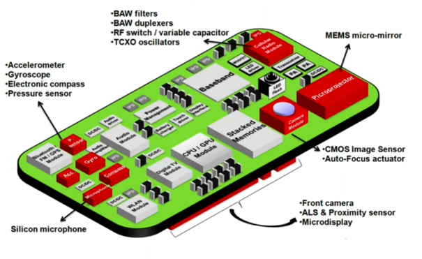

# Devices

Sometimes sensor and devices are used interchangeably. Device provides processing power to convert incoming sensor data into appropriate format, signal amplification, etc. Let's see it in detail.

## Purpose
What does a device provide:
* It converts sensor data to appropriate formats - ADC, Processor 
* It sends the data upstream for processing/storage - Network interface and controller 
* It receives control commands and triggers the actuators - Processor, Local Transmission 
* It supports for Local Display and Audio - Processor, Display Port 
* It optionally stores the latest historical data and current data for aggregation - RAM, SSD 
* It provides Power to - Active Sensors, Actuators, Processor, Network subsystem, Display, Data converters, Memory. It can also have battery operated.

All of these would need to fit into a form / size and enclosure. There would be LED indicators, test point for resetting, various interfaces, etc. 

Generic devices would need to support varied interfaces and wider set of application, performance tuning becomes a user resolved. Hence, devices are manufactured on a very purpose driven basis - it is typically optimized for performance, cost, functionality and hence not everything that we mentioned above would be present in a particular device. Manufacturers specify and sometimes guarantee performance parameter of a device.

## Structure

### General Purpose Devices
These are available for learning and testing. They have many things available which we may or may not require.
* Provide basic display and processing power (generally more than you require) 
* Ability to connect various sensors and actuators
* Provide network capabilities to transfer information to cloud, edge devices or local computers

**Examples** 
* ESP32 series 
* u-blox 
* NXP Rapid IoT 
* Raspberry Pi 4 (a very popular) 
* Arduino Uno/Leonardo

Each of these have microprocessors and an integrated development environment. The manufacturer would also recommend their toolchain and libraries to use - they would have an operating system. They would also suggest certain drivers and an entire mechanism to develop your custom software. These boards would typically connect with your computer where you can write your code, compile it using their compiler, use their bootloader to run and test your code.

These cannot typically be used in production (in target environment) and would need to be customized further using the actual purpose-built devices and environment.

#### Example - Raspberry Pi 4 anatomy

### Purpose-built Devices - Production Use
* Embedded sensors and actuators for a specific purpose 
* Targeted processing and power requirements 
* A specific network protocol support based on topology, bandwidth and power 
* Secure data storage and transmission, physical tamper-proofing 
* Safety against the environment (dust/water/hazards) - Ingress Protection (e.g. IP68)

**Examples**
* InnoSent - Smart Home and Smart Building Devices 
* DSEGenset - Sensor/Devices for Power Generator control 
* Google Nest Audio, Amazon Alexa 
* Your Smartphone!

#### Example - Typical Smartphone Anatomy

## Processing and Network capabilities

As an engineer, we need to build a system which provides end-to-end guarantee of timely delivery of solution. One slow link in the entire chain can bring down overall performance and capability - it is therefore important to review hardware, software and network capabilities to ensure well-architected and built system. Let's review them one by one.

### Processing Capability - Hardware

#### How to estimate?
* Processing has to keep up with the data sensing speed, at minimum 
* Sensed data: Clear the outliers (pre-processing - data curation), Transform, Store, Transfer - all these need to be completed before the next data packet from sensor arrives.
* Example:
  * Sensor can sense at a frequency of 50ms 
  * Requirement to be as accurate as possible 
  * Processor takes 100ms to read, transform, and store 
  * Constrained by the processor - sensor capability unutilized
* Power consumption limits the maximum processing power

#### Typical Processor Types
* 8 bit, 2 to 40 MHz 
* 16 bit, 2 to 250 MHz 
* 32 bit, 2 to 1000 MH on a single core
* 32 bit, multicore

Also, think about roadmap and architecture before choosing a processor. Should a more processor be preferred or a more power gateway - this is an architectural question, really. 

Also, Choose for end of life for these processors. Manufactures typically provide this information while supplying the processor.

### Processing Capability - Software

#### What do you run?

* Smaller devices 
  * Only basic system management support 
  * All logic written in monolithic assembly or C
  * On a 8 bit or 16 bit processor, typically.

* Larger Devices (using Realtime OS)
  * FreeRTOS - Popular realtime open-source kernel/OS ported on numerous platforms 
  * MbedOS - OS/Platform by ARM with support for C/C++
  * RTLinux - Realtime Linux variant

### Networking Capabilities
Networking interface and protocol is a key decision. There are numerous protocols available - which raises an interesting question - Why are there so many protocols at different levels?

#### Core considerations
* Power available - Peak limit, and long term range 
* Underlying protocols available: TCP/UDP, IP assignment 
* Wired/Wireless 
* Distance to the receiver 
* Bandwidth available at the source 
* Data size per transfer 
* Security and compliance requirements 
* Overall topology of the device/sensor system

We’ll dig deeper into [Networking](../networking/README.md) as separate topic.