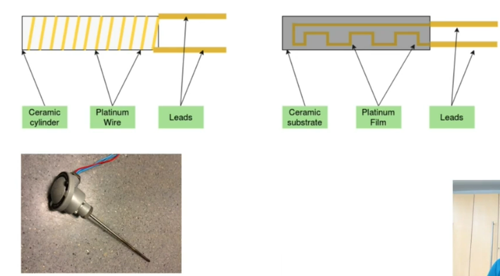

# Sensors

## What?

### Data exists in the physical world
* Environmental - Temperature, Humidity, Pressure
* Entities - Speed, Location, Acceleration
* Particle density - Air quality, Sound Level, Machine vibration
* Waves - Light intensity, Sound level, Machine vibration
* Organisms - Body temperature, Heart beats, Perspiration, Touch
* Composite - motion, proximity, image
* And a lot more!

### Human work by sensing data
* Sight, Touch, Smell, Taste, Hearing
* Machine need to sense too!

_Controlled environment_ Sensors help us to get these data.

Sensors transform physical data into electrical signals.
* Sensitive to the physical property
* Measurable change in signal
* Only dependent on one property

### Practical problems
* Sensitivity - Minimum change (in the physical data) that triggers signal change. This limits the least count of measurement and hence, control.
* Dependency on other properties, for example, temperature affects most sensors. This limits environment range of operation.
* Non-linear behaviour - At specific levels. These limits range of accurate operation. Sometimes we may even have to look into a lookup to understand what a signal value correspond to a physical attribute. It sometimes may not be very accurate as well.
* Response times - Time required to sense a change. This might limit frequency of measurements or miss quick variations.

These limitations may sometime be most crucial to select the right kind of sensor for our use case requirement and environment. There are variety of sensors for measuring a particular physical attribute, suited with various ranges of environment, sensitivity and response time.

> Wrong device in wrong environment would not give us right result.

## Why?

We need sensors to get us the data in digitized format to solve the problem, enhance the system and finally, make things possible which wouldn't otherwise be possible.

### Improve our lives directly
* Health: Elder Healthcare or healthcare in general, Fitness signals, Remote monitoring and Help
* Smart Home: Security, Safety (Fire, Gas detection, etc.), Convenience, Energy Savings, etc.
* Smart Building: Cost savings, Environmental Benefits, Safety and security, Predictable Transport facility, etc.

### Improve our lives indirectly
* Smart City: Time Savings, Safety & Security, Efficiency, Energy Savings
* Agriculture & Livestock: Healthcare, Cost Savings, Efficiency, Yield 
* Industry: Productivity, Proactive Maintenance, Monitoring & Control
* Transportation and Logistics: Safety, Management, Efficiency, Wastage Prevention
* Environment: Monitoring & Prediction, Climate & Habitat Preservation, Early Warnings for adverse conditions, etc.

So much more - Real-world applications in all domains (Info-entertainment, etc.)

> They all begin with sensing a parameter, processing them to solve the problem and hence sensor is critical in the entire IoT ecosystem.

## Digitizing Data
As we saw, sensor senses the real-world data but can be used only when digitized. Sensed data (or change of data) is signaled by (change of) voltage, current, resistance or charge. In Resistive temperature detector, RTD (like PD100), there is a change in resistance with change of temperature. In thermocouple, change of temperature is converted to change of current.

These changes in voltage, current, resistance or charge is analog and are used to digitized by some mechanism. While analog signals are continuous, digital signals are discreet values (which forms its resolution) - there is sacrifice which we make to get the signals in digital format.

### Analog to Digital Conversion
* Sampling Rate. The important thing is that we should be able to reconstruct the analog signal from its digital signal. Sampling rate is hence important - if my change is faster than our sample rate, we will not be able to reconstruct its analog pattern. Here we use something called **Nyquist Criterion** which states that a repetitive waveform can be correctly reconstructed provided that the sampling frequency is greater than double the highest frequency to be sampled.
* Resolution - Set of digital values. This defines how many discreet values to required for higher accuracy.
* Multiple approaches - Complex Algorithms.

> Delta change of the physical data is sensed by sensor as quickly as possible, translated into analog data which is then digital at sample rate and resolution. This is critical input to designing an IoT system  

### Digitized Data
We can then
* Display locally (Digital read-out DRO), ex. weighing machine
* Store and process locally, ex. Last ten body temperature readings
* Transmit upstream (and stored remotely), ex. Smoke alarm info to the fire-station

## Types and Examples

### Types

#### Environmental
* Temperature
  * Thermistor - Change of temperature -> Change of resistance
  * Thermocouple - Change of temperature -> Change in Voltage
* Humidity
  * Psychrometer
  * Chilled Mirror Hygrometers - Refraction based
* Pressure
  * Piezoresistive Strain Gauge - Change of pressure -> Change in resistance
  * MEMS Barometric Sensor

#### Entities
* Location - GPS (4 satellites), RFID
* Movement
  * Accelerometer
  * Gyroscope
  * Tachometer - Speed of Rotation

#### Particle Density
* Air quality (CO, NO, SO2, O3, Particulates, CO2, etc.) - Infrared, Electrochemical 
* Smoke, Gas - Ionization, Photoelectric, Infrared

#### Waves
* Light - PhotoResistor (LDR) (Change of resistance), PhotoDiode (Change of conductivity)
* Sound - Diaphragm vibration captured by Capacitance Sensing
* Vibration - Piezoelectric (Change of charge)

##### Organisms
* Body temperature - Thermistor, Infrared
* Heart rate - Optical, Electrical impulses (ECG)

#### Composite
* Motion detection - Passive Infrared, Ultrasonic
* Proximity & Touch - Capacitive, Doppler Radar

In general, Capacitive sensors are used for Non-Metal while Inductive types for Metals.

### Examples

#### Light Dependent Resister (LDR)

#### Pressure Sensor
Diagram change is captured.

#### Optical Proximity Sensor
Transmitter and Receiver can be used to see if something obstructs when placed facing each other or can detect reflection for proximity (when placed adjacent)

#### Gas Sensor (Pellistor)
Heats the gas and detects the change of resistance which is unique for each gas, which can then capture the presence and concentration of particular gas. 

> Sensors are connected to PCB (printed circuit board) via a wire.

## PT100 Anatomy

This sensor varies its resistance on sensing temperature change. It uses Platinum, hence Pt in the name. Platinum has unique characteristic which makes it a best fit for temperature sensing.

### Characteristics of Pt - Platinum
* Resistant to corrosion and chemicals 
* Stable at high temperatures 
* Linear resistance change based on temperature 
* Less material used, so cost-effective 

PT100 is calibrated at 100 → 100 ohms resistance at 0⁰C and then there is a steady change in resistance with change in temperature.

### Construction

* Platinum wire wrapped around an insulated core 
* OR Platinum thin-film embedded in a ceramic substrate 
* Two leads connected at two ends which forms part of the sensing circuit