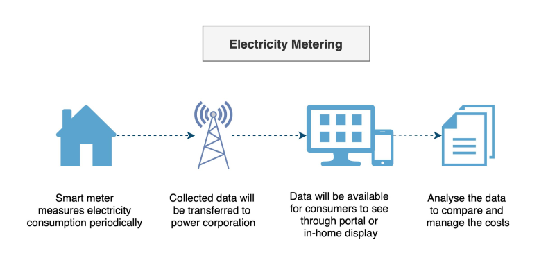
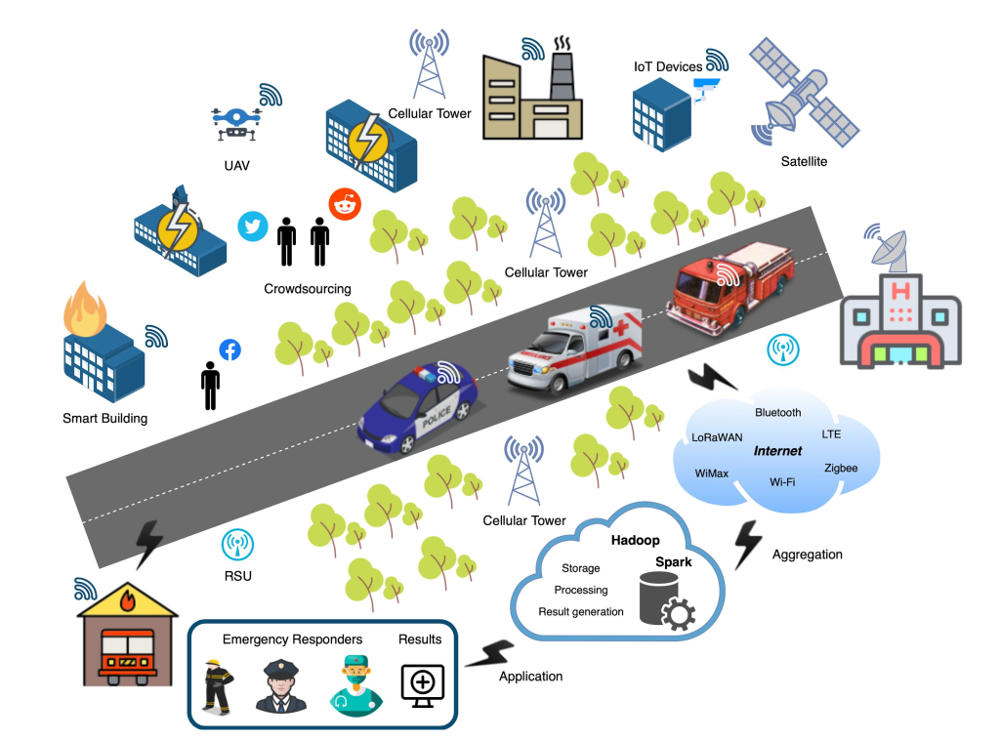

# Use Case - Smart City 22m0

## Goals of Smart City
* Manage urban assets, services and flows
* Respond to various challenges in real-time or optimal time
* Build a balanced city ecosystem 
* Long Lasting, Upgradable and Maintainable Systems

## What makes a city smart?
* Manage assets, resources and services efficiently
  * Examples: Buildings, Transportation, Fire & Safety
* Optimise and improve city’s operations
  * Examples: Traffic control, efficient rescue/response to disaster
* Connect entities and services to improving quality of life
  * Examples: Healthcare, Water, Electricity, Waste Treatment
* Management by data
  * Analyse data to get insights and trends
  * Make informed and consistent decisions

## How is a city made smart?
* Use of electronic methods and sensors/instrumentation to collect data
  * Measurements & metering
    * Water, electricity metering and monitoring
  * Monitor the services
    * Street and Community Lighting, Traffic
  * Manage the flow of services
    * Public transport synchronization (Buses, Trains, Metro)
  * Safety & Security
    * CCTV Cameras, Anomaly alerts (Water levels, Pollution levels)
  * Public Places
      * Sports Complexes, Malls, and Gardens
* Analyse the data to gain insights
* Connect entities - Buildings, Services (Fire & Safety, Transportation)
* Enable interactions with systems and community 

> It’s all about an ecosystem which thrives, sustains and grows

### Interconnected Systems - Water & Electricity metering

Smart Metering (IOT Architectures)
* Installed smart meters
  * Residential, Commercial and Industry
* Collect data periodically
  * Meter readings and consumption
* Transmit data to central servers
  * Gain insights with the data

IoT facilitates the system to
* Match demand and supply
* Manage, Monitor and advise during scarcity (alert to reduce usage)
* Enable prepaid metering
* Better control on the “flow”

### Interconnected Systems - Fire & Safety

Fire Detection & Monitoring
* Installed smart fire equipment
  * Residential, Commercial and Industry
* Monitor system
  * Heartbeat, alerts
* Alert notifications
  * Fire Department and first responders
  * Hospitals
  * Transportation

IoT provides
* Cityscape for “normal operation” - heatmaps
* Detection of anomalies and multiple system notifications
* Interconnected systems and collaboration mechanisms

