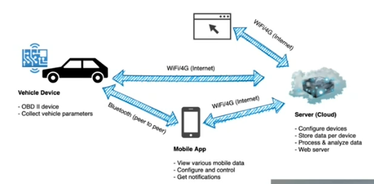

# Telematics

## Why?
* Vehicle monitoring
* Driver behavior

## Architecture

### Elements of IoT
* Sensor
  * OBDII - Data Collection like RPM, Engine temperature, speed, coolant, fuel level, etc
  * GPS - If available, can be integrated with location as well.
* Gateway
  * Mobile phone
  * Vehicle Device - transmit data to directly server
* Cloud Server
  * Data Collection framework
  * Data Processing and Analysis
* Browser/App
  * View - Analysis/Trends, Vehicle Location, Driver behavior
  * Reports - Analytics (Daily, Weekly & Monthly)