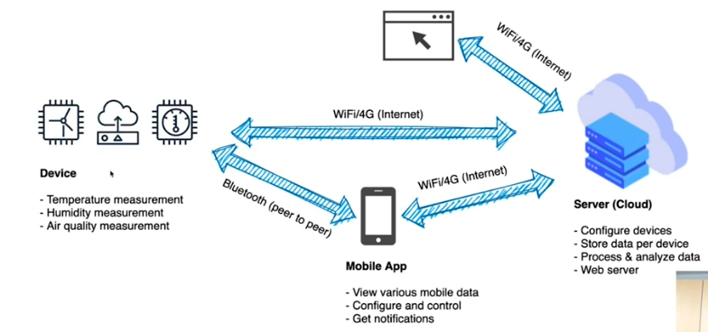

# Telemetry

It is a very broad topic where we monitor something by collecting information over the internet. Here we look at a specific use case.

## Use - case Climate control of enclosed spaces

## Architecture

### IoT Elements
* Sensor
  * Temperature, Humidity, Air Quality
  * App-based configuration
* Gateway
  * Device-transmit data to server
* Cloud server
  * Data Collection framework
  * Saves data in database
  * Data process and analyse the data
* Browser/App
  * View data - Analysis/Trends
  * Report Analytics
