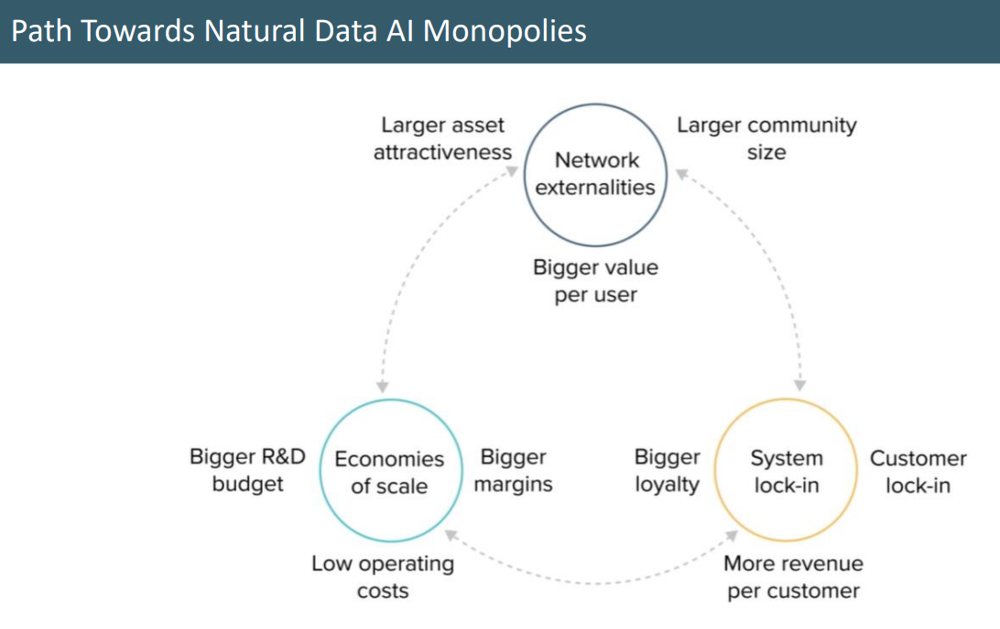

# Introduction to the AI Design Process

Design process is very important, because of

1. Rapid evolution of AI possibilities - finding practical applications requires some form of innovation. The AI application is almost always unique. In AI, copying what others are doing, without design work, is likely to lead to sub-optimal results.
2. Importance of AI complentary assets - It is AI along with changes in business processes that leads to value creation. It is important therefore, to design a deployment process where the organization will continue to improve technology, by providing the right training data to machine learning algorithms. Organizations adapting their business processes and products to benefit from these gradual improvements.

> Planning ahead
>
> 1. Identify some AI products you would like to design
> 2. Keep a log/journal throughout the course of each of these design ambitions to identify how what you are learning relates to each of them

## Stages of AI Design Process

There are 4 stages of AI Design Process:

1. Intelligence
2. Business Process
3. AI Technology
4. Tinkering

It can be done in any order, or in parallel.

### Stage I

The goal is to identify the desired intelligence or behavior of the AI and focus on two key choices —

1. AI Performance metrics - What are the target intelligence performance metrics that we want to implement with AI? If the AI can provide a performance benchmark to beat a human for example, maybe we can explore that option for superhuman behavior.
2. scope - what is the scope of this superior that we are expecting to implement?

To identify a behavior that an AI system could enact, first determine a broad taxonomy with what is possible. Next, come up with examples. To come up with examples, consider the following questions:

- What can humans do? (e.g., Write a novel.)
- What are some similar AI examples? (e.g., AI can generate text through GPT-3)

> Please note: You may want to go through all the four stages, and come back to this again to revalidate or refine performance metrics and scope as per identified challenges.
>
> Performance Metrics Challenge - Understand how the performance frontier is evolving in our chosen domain so we can send targets for the AI designs.
> Scope Challenge - Understand the scope of what we are asking AI to achieve

### Stage II

Now that you have a behavior, you need to define a business process that incorporates this behavior. Defining a business process includes 90% of your value.

To define a business process, consider the following question:

- What is a business process that can employ AI technologies?

For example, in healthcare, AI technologies have the ability to discriminate sickness, recommend treatment, and understand diagnostics. These abilities can be applied to a business process that tracks the behaviors of users and tells them if they are taking the correct drugs.

In essence, you will identify a business process for the AI, focusing on two choices —

- The strategic role that AI along with other complementary assets would play to compete in the marketplace
- The operational targets you'd set for the business activity

For strategic role, Delta model developed by Prof Hacks at MIT Sloan, postulates three ways to look at the competetive strategy. They are -

1. Best Product Player - this is where we use AI with the best technology possible. For example, best fingerprint product
2. Full Customer solutions player - this is where we build AI product that incorporates all features to make it a use product or service. For example, self-serve Data Platform.
3. Network externalities - this is where we focus on building a large user base for users to get more benefits. For example, Python community, or nation-wide fingerprint database, where the value continues to increase if more municipality participates and adds fingerprints into your database.

We can probably use 2 for building AI product. This is where we should go back stage 1 to look into the scope. Getting to specifics is the key to delivering value for the basis to avoid loss of accuracy. If you are not able to get to 2, you may choose 1 or 3. For example, Open AI model creates a toolkit for companies to adopt the model for various task (Delta postulate 3). It warns about the possibility of being abused for malicious goals because it produces realistic text which makes it hard for humans to distinguish between Human text and GPT text.

For operational targets, we focus on -

- Fully describing (mostly operational description) Business Process impacted by AI, which can give adequate information to engineers on what is expected in AI implementation.
- Establishing sensible improvement targets - process performance metric For example, operational targets by the use of NLP can be
  - Lower the number of incomplete calls by 80% in a call centre at the same cost
  - Lower legal translation costs by 80%
  - Add voice commands to a web page
  - Create a shopping list assistance skill for Alexa or Google device
  - Create a sentiment analysis toolkit
  - Improve Alexa's existing skills
  - Improve GPT-3

This is the stage where you need to decide if we need to get user's consent, or new terms of usage of tool, etc.

In this stage, you begin to develop the AI approach. In developing an AI approach, you need:

1. A set of data
2. An architecture
3. An objective

### Stage III

In stage three, there are two key decisions that we need to make -

1. Selecting the right Intellectual Property (IP) approach/technology that you can incorporate in your product. You do not want to pick something that may become obselete in few months. You can also patent your solution, which should your IP approach, especially if it is novel, useful, and non-abuse.
2. Picking the right Data Approach or Data Strategy

These technologies combine to create an architecture to accomplish the AI’s objective of implementation. However, for this implementation to occur, the AI must undergo training. There are three types of AI training:

1. Supervised learning
2. Unsupervised learning
3. Reinforcement learning

Key thing in Data Strategy is metadata - date, time, collection mechanism, and content description. If metadata is not appropriate, you can at best do is Unsupervised learning.

FAANGs have a data strategy which gives them network externalities allowing them to test any of the machine learning approaches. Below is a framework that establishes a path toward natural AI data monopolies. Companies that align their AI strategies to accommodate these forces can gain a natural long-term sustainable advantage.

> Network externalities is not a concept restricted to AI.
>
> Sytem lock-in applies to advertisers and third party application developers as well.
>
> Economy of scale works alongside network externalities and system lock-in.

The FAANGs (Facebook, Apple, Amazon, Netflix, and Google) spend a substantial amount of money building and maintaining their data strategy. A big part of that strategy is effectively capturing and utilizing metadata. Metadata is data that describes data.

### Stage IV

The final stage is tinkering (Software Development). Tinkering comprises 90% of your time. This is where most AI engineers do their work. Tinkering denotes the day-to-day actions of working with AI technologies. Stage 4 completes the development cycle.

Here also we make two key decisions -

- Deciding the software development approach. It should be such that it allow for flexibility and adaptability, for example -
   1. New source of data increases accuracy or lowers the computational costs
   2. Users dislike the tone of the voice responses generated
   3. A new channel offering the same service; AI needs to be readapted
   4. A new version TensorFlow or PyTorch requires revisiting the code

> You code should be in data repository. Establish the location of different code versions. Tools to be used to store the code, like GitHub. CI/CD. Documentation to improve readability.
>
> Testing and experimental plan. This means, testing the software and managing different issues arising from the testing plan, especially methods of tracking them and addressing critical issues. Testing does not only meaning software, it includes business profitability, user acceptance, and integration with company product strategy.
>
> Experimentally set up GPU - rationalize the use of resources, crunch numbers for machine learning applications. The set up should be such to maximize and optimize the usage of available machines. It may use a cloud provider - in essence, it is make computational and financial sense.
>
> A plan with a budget to justify the investment. Rule of thumb is software development projects may cost 2.5 times more that estimated cost.

- Dealing with AI cancers
  1. Adversial Attacks: You can fool AI with simple change to input signal. Example, if you add slight adversial noise to dermatoscopic image of a benign melanocytic nevus can lead to system stating it to be malignant. Or, if you add a toaster image near banana, system can state it to be toaster instead of banana as classifier output.
  2. Lack of generalization. For example, In NLP, translation accuracy from Language A to Language B may not not help when going from Language A to Language C but, if Language A to Language B and Language A to Language C happens, it may help Language B to Language C. Balancing of datasets makes generalization very difficult.
  3. Bias, due to the training dataset it used.
  4. Lack of explainability. Deep learning models does not really provide any insight regarding how they concluded to an answer. If the goal is to explain how we are reaching to a conclusion, deep learning is not our best choice.
  5. Unintended behavior.

We need to plan on how to minimize the impact of these five cancers.

## Fields of AI

- Computer Vision
- Natural Language Processing
- Agentic AI
