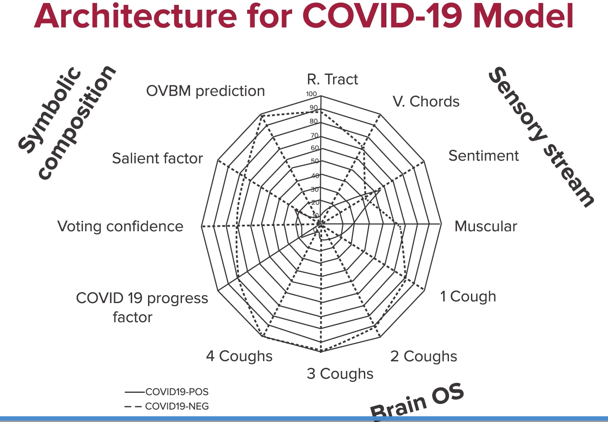

# AI Product for Business Problem Solution

## Use cases

AI is a generic technology that can do much more than providing a metric.

### Using Sound

AI can be taught to listen to the differences between sound with the incorrect air filter and the one with new filter. We can train them with more careful data gathering techniques so that the AI algorithms don't have to deal with figure-ground issues.

Stethoscope, Regurgitation (Diastole, Systole), Echo 2D, etc. are some other examples where sound is used in medical fields.

Detecting Tracheobronchitis, Vocal fold polyps, Broncopulmonary dysplasia can be detected through change in voice. AI can help here eliminating the need of a very qualified personal to detect these conditions.

### Car Manufacture

Phone can detect if there is an imbalance between the car wheels.

## Using Natural Language Processing

AI can use NLP techniques to:

* Identify the possible indicators of cognition decay
* Establish a dementia scale
  * Identify the onset and progression of the disease
  * Identify finer metrics associated with each type of dementia (not yet achieved)

## Stages

## Stage 1: Identification of problem statement

Metrics: 90% biomarker accuracy on disease discrimination
Scope: Current medical best practices

### Alzheimer and Covid

AI can be used to diagnose the early onset of COVID. The design of an AI intelligence would record (i.e., listen to) human coughing behavior into a device and categorize it as one belonging to a person with bronchitis, COVID-19, asthma, and so on.

## Stage 2: Strategy and Operations

Next is to define of **strategy** where we want to be in -

1. Best product where you want to produce an AI pipeline that is best at the AI diagnosis or want to have the best audio diagnostic pipeline available for Azheimer's or Covid.
2. Network externalities if you want to have the largest database of Alzheimer's voice samples or make Covid patients' info available quickly
3. Full customer solution where you want to target AI discrimination efforts or access the effectiveness of a specific drug in a given cohert.

In terms of **operation**, we must also come up with one business process where this tool can be used. For example, the objective is to develop biomarkers that can track progress between doctor assessments in the early phases of the illness. The advantage of doing this is to be able to help demonstrate whether a given drug helps stop disease progression.
> The cost of putting AI to work may be many times more than cost of developing it.

These business operations form collateral assets, the investment in which is critical to the success of IT projects.

Covid is a special case where AI can be relevant only for a brief period of time (say 1 or 2 years) - it is possible to have its advantage in such future pandemics. Advantages of Covid AI detectors -

1. Run the test on a mobile device - no one at risk
2. Reduce implementation cost and deployment time
3. Get immediate response
4. Repetitive - take the test as many times as you wish
5. Has negligible variable cost
6. Instant - can be done from anywhere by downloading from the internet or by running it on a web page
7. Network externalities - cough data can be collected simultaneously, thereby allowing algorithms to be more useful.

Operational possibilities for COVID-19 AI Discriminator

1. Pre-screening the general population
2. Pre-screening entryways
3. Pool testing

For the pre-screenings, accuracy rate is very important. We should be hitting a 99% accuracy in a binary classification task. The two important parameters used to tune AI — specificity and sensitivity.

Sensitivity targets lowering false negatives. It means if out of 100 positive cases, 10 are marked negative - meaning 10% false negatives, we call sensitivity is 90%.

Specificity targets lowering false positives. It means if out of 100 negative cases, 10 are marked positive - meaning 10% false positives, we call the specificity is 90%.

The table given below is called a table of confusion (sometimes also called a confusion matrix). A confusion matrix is a table that is often used to describe the performance of a classification model (or "classifier") on a set of test data for which the true values are known. It has two rows and two columns that report the number of false positives, false negatives, true positives, and true negatives in an experiment.

$S_n = \frac{TP}{(TP+FN)}$ - Sensitivity measure the proportion of positives that are correctly identified.

$S_p = \frac{TN}{(TN+FP)}$ - Specificity measures the proportion of negatives that are correctly identified.

Onset is the earliest any method can detect the presence of the disease.
Biomarkers are metrics or markers that can track the progression of a disease in a biological system. Temperature measures by a thermometer is one such biomarkers. Longitudinal biomarkers are biomarkers that evolve and give you an idea of disease progression.

For pool testing, we can achieve much better results when we even apply a lower individual AI accuracy. For example, we can achieve 99% accuracy within a pool with a 90% individual AI accurracy if we take a pool of say, 9 or 10 cases.

Before moving to stage 3, please pause a reflect -

1. To take a decision on the use cases to make sure the right objectives are in place for stage 3. You may require higher or lower accuracy which inturn means higher or lower training data.
2. To highlight the role of AI designer in the whole process
3. To keep a few operational options open until one that can really deliver is found

## Stage 3: IP approach

Let's understand the fundamental Deep learning model often used in diagnostic applications -> ResNet.

We will most likely be using AI programming package like Pytorch or TensorFlow. We can also change the model from ResNet to DenseNet or VGG.

The block of a ResNet address a particular problem of a convolutional networks called the vanishing gradient problem. Vanish gradient problem signifies that adding layers to a simple convolutional network produces a phenomenon whereby adding layers decreases the system performance. ResNet solves this issue through a signal that's pushed forward, thereby training the network on residual differences.

In general, for development of new learning models,

1. First, do a version with standalone solutions
2. Second, use them as a "**base case**" to compare with the improved models.

### Part 1: IP - Choice of Architecture

To improve the accuracy of our model, we can try these architectural improvements -

* Graph with multiple ResNets
* Data Augmentation techniques
* Transfer Leanrnig

#### Graph with multiple ResNets

The choice of model we make is perhaps the most critical step. When dealing with Alzheimer, we could postulate that a brain model would be a good starting point since this disease is brain-related. We can use **MIT Open-voice brain model (OVBM) architecture**. Lets review this in more detail.

* Identify and combine biomarkers
* Find malfunctioning components of the brain
// TODO: change the name from OBVM to OVBM

It consists of four units.

* Sensory stream is devoted to first 200 ms of perception in human brain, uses eyes, is responsible for taking input from sensors like eyes and ears, and pre-processing the receiving information. Please note that Alzhemier dementia may impact voice, vision and hearing.
* Brain OS takes all inputs from sensory streams and tries to make sense of them with cognition and stories it is building.
* Cognitive Core is responsible to organizing areas of knowlege such as physical interactions (plans or skill required for driving, for example). Alzheimer's memory loss may be related to this.
* Symbolic / semantic compositional model is responsible for organizing stories. They might be able to performance inferences that are required to explain a picture for example. They are also essential for conversations or in writing a novel.

The overall architecture

> For audio and video (continuous signals), we can chunk the data to keep it manageable for a neural network (5-10 sec is good enough). There might be other strategies to LSTM (Long Short-Term Memory). To know more about LSTM, please refer to [this](LSTM.md).

For COVID19, the architecture was a similar one.

> Resnet is not very good with **explainability**. We can build some logic which can offer some details.

#### Data Augmentation techniques

### Part 2: Data Strategy - Privacy and IRB approval

Managing confidentiality constraints and data protection is extremely crucial in today's data-driven world. Europe's GDPR and California's CCPA are two very well known regulations for data privacy protection.

Data Sanitization is one such way to protect.

Another is PII anonymization.

> If you do not need PII, do not ask for it.

In general, we need to go through Institutional Review Board (IRB), a specialized bodies within Organization (hospitals or universities, in this case) before you can start collecting data about humans. Sometimes, it goes through ethics committees or COUHES (committee on use of humans as experimental subjects) especially for gathering any sort of health data about the persons. We need to explain to IRBs on what and why the data is being collected, how would it be used or shared, etc. We can use one IRB approval to go to another.

We sometimes, also need a consent document from participants, or subjects. There are two key sections here:

* Purpose
* Study procedures: How the data is processed.

More on this in Appendix.

For data collection, we can collect data sample from phone, smart speakers, websites, etc. We can also buy data from other appropriate sources.

We can achieve system lock-in by using -

* Approved IRB protocols that everyone uses
* Getting more downloads of the apps
* Capturing longitudinal data
* Setting up pool testing

The difficulty is to get enough data to get the ball rolling. For example, average media exposure value per cough recording was about $100 and only 1-3 per 1000 people did contribute their cough.

#### Transfer Leanrnig

### Stage 4: Tinkering

#### Software Methodology

1. Code and Data Repository Methodology. Example -
   1. TensorFlow
   2. GitHub
2. Graphic Processing units. Example -
   1. Azure cloud with NVIDIA Tesla machines
3. Testing and experimental plan
   1. Academic papers
   2. Testing OVBM architecture with 16 biomarker
      1. Base case
      2. Full model over base with increasing trasfer learning

#### AI Cancers

AI can be used to streamline many different processes. However, it comes with its limitations. The biggest concerns of all are -

* **Explainability**. Diseases have multiple causes and symptoms, so without an explanation, the prediction sounds "concidental".
* **Bias**: Biomarkers have gender and cultural bias.

## Appendix

The following web pages will help in this activity:

* [Guidelines for Selected Procedures and Populations](https://couhes.mit.edu/guidelines-selected-procedures-and-populations)
* [Forms and Templates](https://couhes.mit.edu/forms-templates)
* [Artificial intelligence model detects asymptomatic COVID-19 infections through cellphone-recorded coughs](https://news.mit.edu/2020/covid-19-cough-cellphone-detection-1029)
* [MIT Open Access Articles](https://dspace.mit.edu/bitstream/handle/1721.1/128954/09208795.pdf?sequence=1&isAllowed=y)
