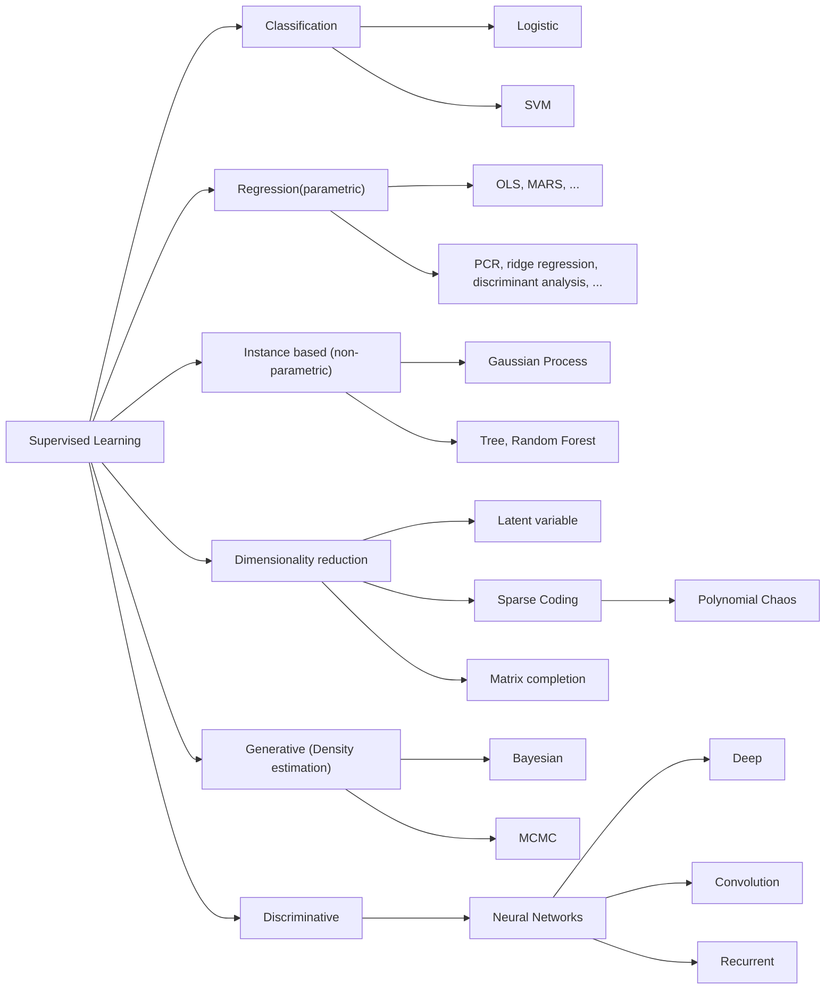
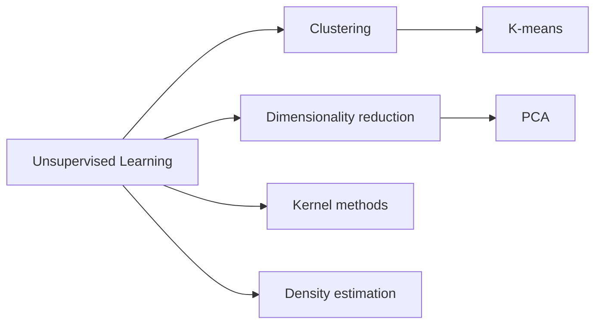
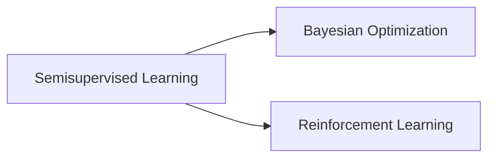

# Machine Learning

## Classification Regressions

**Random forest** is a typical decision tree algorithm approach. Random Forests are an ensemble learning method for classification. Additionally, the process of collecting common recommendations and then using this “data” to make a decision is a typical random forest algorithm approach to solving a problem.

In statistics, **Naïve Bayes classifiers** are a family of simple "probabilistic classifiers" based on applying Bayes' theorem with strong independence assumptions between the features. Using these frequencies we generate our apriori or initial probabilities (for example, the probability of overcast is 0.29 while the general probability of playing is 0.64). Next, we generate the posterior probabilities, where we try to answer questions like “what would be the probability of whether a person would want to play golf if it is sunny outside?”

### Logistic Regression

Built on linear regression

$z = \theta^Tx + \theta_0$

Intepret $g = \sigma(z)$ for any input $x$

$g=\sigma(z)=\frac{1}{1+e^-z}$

### Support Vector Machines or SVMs

Support vector machines (SVMs) are formulated to solve a classical two-class pattern recognition problem.

SVM helps in diagnosis and prognosis by running numerous models. Example, there is a lot of data in the form of an image that is analyzed. We have thousands of cancer datasets. We train hundreds of models using SVM to classify cancer as malignant or benign.

## Unsupervised Clustering Algorithms

Large only input. Statistical foundation. PCA (Principle Components Analysis).

Clustering. Goal is to identify "natural" grouping of the data. Inference: Decide which cluster a new data point $x$ belongs to. Used as part of larger machine learning solutions and often used with other machine learning methods. It helps determine representative data points to directly label, and then impute a label for the rest of the data points in the cluster.

* k-mean Algorithm: Challenges - Assume k beforehand. Additional approaches might needed to sweep across different values of k to get the best clusters - to achieve good separation of cluster.
* Hierarchical Clustering:

## Semi-Supervised algorithms and Reinforcement learning

The algorithm may provide guidance of what new data should be gathered.

Bayesaian optimization builds on the probability model view of the world. Probability density functions. Where the new datapoints can reduce the uncertainty.

Reinforcement learning: The learner is not told directly which outputs accompany which inputs. The learner must try different actions by interacting with the environment. The learner needs to explore this state-action space, build models of rewards, and improve its knowledge and models. Goal of the algorithm is to learn what actions works the best. The algorithm needs to be optimized for a long term goal.

## Summary

### Supervised Learning

### Unsupervised Learning

### Semisupervised Learning

### Regression vs Classification

Linear Classification, Logistic Regression, Decision Tree, Bayesian Methods, etc

Neural Networks, Deep Learning, Multi-Layer perceptrons (MLPs), Convolutional neural networks (CNNs), or Recurrent Neural networks (RNNs),etc. Let's learn more [here](deep_learning.md).