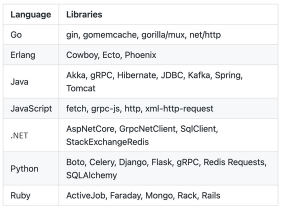

# Auto-Instrumentation
One of the very first OTEPs to be produced by the project (https://github.com/open-telemetry/oteps/blob/main/text/0001-telemetry-without-manual-instrumentation.md) described the need to support users that wanted to produce telemetry without having to modify the code to do so:
> Cross-language requirements for automated approaches to extracting portable telemetry data with zero source code modification. – OpenTelemetry Enhancement Proposal #0001

Being able to get started with OpenTelemetry with very little effort for new users was very much a goal from the start of the project. The hope was to address one of the pain points of producing telemetry: **the cost of manual instrumentation**.

## Challenges of manual instrumentation

* The libraries and APIs that are provided by telemetry frameworks can be hard to learn how to use. With auto-instrumentation, users do not have to learn how to use the libraries and APIs directly; instead, they rely on a simplified user experience that can be tuned via configuration.
* Instrumenting applications can be tricky. This can be especially true for legacy applications where the original author of the code is no longer around. By reducing the amount of code that needs to be modified, auto-instrumentation reduces the surface of the changes that need to be made and minimizes the risks involved.
* Knowing what to instrument and how it should be done takes practice. The authors of auto-instrumentation tooling and libraries ensure that the telemetry that's produced by auto-instrumentation follows the semantic conventions defined by OpenTelemetry.

Additionally, it's not uncommon for systems to contain applications written in different languages. This adds to the complexity of manually instrumenting code as it requires developers to learn how to instrument in multiple languages. Auto-instrumentation provides the necessary tooling to minimize the effort here, as the goal of the OpenTelemetry project is to support the same configuration across languages. This means that, in theory, the auto-instrumentation experience will be fairly consistent.

## Components of auto-instrumentation
The first part is composed of instrumentation libraries.



The second component is a mechanism that's provided by OpenTelemetry to allow users to automatically invoke the instrumentation libraries without additional work on the part of the user. This mechanism is sometimes called an agent or a runner. In practice, the purpose of this tool is to configure OpenTelemetry and load the instrumentation libraries that can be used to then generate telemetry.

> Auto-instrumentation is still being actively developed and the OpenTelemetry specification around auto-instrumentation, its implementation, and how configuration should be specified is still in development. The adoption in different languages is, at the time of writing, in various stages. Python and Java use full auto-instrumentation with both instrumentation libraries and an agent. The JavaScript and Go code only leverage instrumentation libraries. 

## Limits of auto-instrumentation
* Auto-instrumentation cannot instrument application-specific code.
* It may instrument things you're not interested in. An effort is being made in OpenTelemetry to support configuration to give users fine-grained control over how telemetry is generated via instrumentation libraries.

With this in mind, let's learn how auto-instrumentation is implemented in **Java**.

## Bytecode manipulation
The Java implementation of auto-instrumentation for OpenTelemetry leverages the Java Instrumentation API to instrument code (https://docs.oracle.com/javase/8/docs/api/java/lang/instrument/Instrumentation.html). This API is defined as part of the Java language and can be used by anyone interested in collecting information about an application.

### OpenTelemetry Java agent
The OpenTelemetry Java agent is distributed to users via a single Java archive (JAR) file, which can be downloaded from the opentelemetry-java-instrumentation repository (https://github.com/open-telemetry/opentelemetry-java-instrumentation/releases). The JAR contains the following components:
* The **javaagent** module. This is called by the Java Instrumentation API.
* Instrumenting libraries for various frameworks and third-party libraries.
* The tooling to initialize and configure the OpenTelemetry components. These will be used to produce telemetry and deliver it to its destination.

The JAR is invoked by passing it to the Java runtime via the -javaagent command-line option. The Java OpenTelemetry agent supports configuration via command-line arguments, also known in Java as system properties.
```shell
java -javaagent:/app/opentelemetry-javaagent.jar \
     -Dotel.resource.attributes=service.name=broken-telephone-java\
     -Dotel.traces.exporter=otlp \
     -jar broken-telephone.jar
```

AgentInstaller also loads all the third-party instrumentation libraries that are available in the OpenTelemetry agent.

> The mechanics of bytecode injection are outside the scope of this book. For the sake of this chapter, it's enough to know that the Java agent injects the instrumentation code at runtime. If you're interested in learning more, I recommend spending some time browsing the Byte Buddy site: https://bytebuddy.net/#/.

As you can see, there is no mention of OpenTelemetry anywhere in the code. The real magic happens when the agent is called at runtime and instruments the application via bytecode injection, as we'll see shortly. With this, we now have an idea of how auto-instrumentation works in Java. Now, let's compare this to the Python implementation.

## Runtime hooks and monkey patching
In Python, unlike in Java, where a single archive contains everything that's needed to support auto-instrumentation, the implementation relies on several separate components that must be discussed to help us fully understand how auto-instrumentation works.

### Instrumenting libraries
Instrumentation libraries in Python rely on one of two mechanisms to instrument third-party libraries:
* Event hooks are exposed by the libraries being instrumented, allowing the instrumenting libraries to register and produce telemetry as events occur.
* Any intercepting calls to libraries are instrumented and are replaced at runtime via a technique known as monkey patching (https://en.wikipedia.org/wiki/Monkey_patch). The instrumenting library receives the original call, produces telemetry data, and then calls the underlying library.
  Monkey patching is like bytecode injection in that the applications make calls to libraries without suspecting that those calls have been replaced along the way.

Each instrumentation library adheres to an interface to register and deregister itself. At the time of writing, in Python, unlike in Java, the different instrumentation libraries are packaged independently. This has the advantage of reducing the number of dependencies that are required to install the instrumentation libraries. However, it does have the disadvantage of requiring users to know what packages they will need to install. We'll explore in [Instrumentation Libraries](instrumentation-libraries.md).

### The Instrumentor interface
To ensure a consistent experience for the users of instrumentation libraries, as well as ensuring the developers of those libraries know what needs to be implemented, the OpenTelemetry Python community has defined the Instrumentor (https://opentelemetry-python-contrib.readthedocs.io/en/latest/instrumentation/base/instrumentor.html) interface. This interface requires library authors to provide implementations for the following methods:

* _instrument: This method contains any initialization logic for the instrumenting library. This is where monkey patching or registering for event hooks takes place.
* _uninstrument: This method provides the logic to deregister the library from event hooks or remove any monkey patching. This may also contain any additional cleanup operations.
* instrumentation_dependencies: This method returns a list of the library and the versions that the instrumentation library supports.

In addition to fulfilling the Instrumentor interface, if an instrumentation library wishes to be available for auto-instrumentation, it must register itself via an entry point. An entry point is a Python mechanism that allows modules to make themselves discoverable by registering a class or method via a string at installation time.

> Additional information on entry points is available in the official Python documentation: https://packaging.python.org/specifications/entry-points/.

Other Python code can then load this code by doing a lookup for an entry point by name and executing it. 

### Wrapper script
For those mechanisms to be triggered, the Python implementation ships a script that can be called to wrap any Python application. The opentelemetry-instrument script finds all the instrumentations that have been installed in an environment by loading the entry points registered under the opentelemetry_instrumentor name.

The following command shows an example of how auto-instrumentation is invoked in Python:
```shell
opentelemetry-instrument ./broken_telephone.py
```

## Summary
Although the data that's generated via auto-instrumentation is likely not enough to get to the bottom of issues in complex systems, it's a solid starting point. Auto-instrumentation can also be quite useful when you're instrumenting an unfamiliar system.

The use of instrumentation libraries allows users to gain insight into what the libraries they're using are doing, without having to learn the ins and outs of them. The OpenTelemetry libraries that are available at the time of writing can be used to instrument existing code by following the online documentation that's been made available by each language.