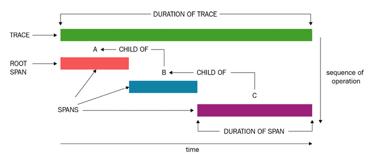
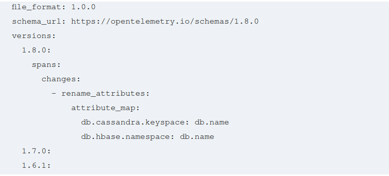

# OpenTelemetry Signals - Traces, Metrics, and Logs

Let's dive into the specifics of the following:

* Distributed tracing
* Metrics
* Logs
* Producing consistent quality data with semantic conventions

The following open source projects support the storage and visualization of OpenTelemetry data:
* Jaeger (https://www.jaegertracing.io)
* Prometheus (https://prometheus.io)
* Loki (https://github.com/grafana/loki)
* Grafana (https://grafana.com/oss/grafana/)

An actual worked out example -

```shell
$ git clone https://github.com/PacktPublishing/Cloud-Native-Observability
$ cd Cloud-Native-Observability/chapter02
$ docker-compose up

# Jaeger UI - http://localhost:16686
# Prometheus UI - http://localhost:9090
# Grafana UI - http://localhost:3000/explore

$ curl localhost:13133
$ curl localhost:5000/healthcheck
$ curl localhost:5001/healthcheck
$ docker logs -n 2 shopper

# Finally
$ docker-compose stop
$ docker-compose rm
```

## Traces
Distributed tracing is the foundation behind the tracing signal of OpenTelemetry. A distributed trace is a series of event data generated at various points throughout a system tied together via a unique identifier. This identifier is propagated across all components responsible for any operation required to complete the request, allowing each operation to associate the event data to the originating request.

Each trace represents a unique request through a system that can be either synchronous or asynchronous. Synchronous requests occur in sequence with each unit of work completed before continuing.

Each operation recorded in a trace is represented by a span, a single unit of work done in the system.

### Anatomy of a trace
The World Wide Web Consortium (W3C), an international group that collaborates to move the web forward, assembled a working group in 2017 to produce a definition for tracing. In February 2020, the first version of the Trace Context specification was completed, with its details available on the W3C's website (https://www.w3.org/TR/trace-context-1/). OpenTelemetry follows the recommendation from the W3C in its definition of the SpanContext, which contains information about the trace and must be propagated throughout the system. The elements of a trace available within a span context include the following:

* A unique identifier, referred to as a **trace ID**, identifies the request through the system.
* A second identifier, the **span ID**, is associated with the span that last interacted with the context. This may also be referred to as the **parent identifier**.
* **Trace flags** include additional information about the trace, such as the sampling decision and trace level.
* Vendor-specific information is carried forward using a **Trace state** field. This allows individual vendors to propagate information necessary for their systems to interpret the tracing data.

A span can represent a method call or a subset of the code being called within a method. Multiple spans within a trace are linked together in a parent-child relationship, with each child span containing information about its parent. The first span in a trace is called the root span and is identified because it does not have a parent span identifier. The following shows a typical visualization of a trace and the spans associated with it. The horizontal axis indicates the duration of the entire trace operation. The vertical axis shows the order in which the operations captured by spans took place, starting with the first operation at the top:



### Details of a span
The work captured in a trace is broken into separate units or operations, each represented by a span. The span is a data structure containing the following information:
* A unique identifier
* A parent span identifier
* A name describing the work being recorded
* A start and end time

In OpenTelemetry, a span identifier is represented by a 64-bit integer. The start and end times are used to calculate the operation's duration. Additionally, spans can contain metadata in the form of key-value pairs. In the case of Jaeger and Zipkin, these pairs are referred to as **tags**, whereas OpenTelemetry calls them **attributes**. The goal is to enrich the data provided with the additional context in both cases.

### Additional Considerations
When producing distributed traces in a system, it's worth considering the additional visibility's tradeoffs. Generating tracing information can potentially incur performance overhead at the application level. It can result in added latency if tracing information is gathered and transmitted inline. There is also memory overhead to consider, as collecting information inevitably allocates resources. These concerns can be largely mitigated using configuration available in OpenTelemetry. We will discuss this later in [Distributed Tracing - Tracing code execution](distributed-tracing.md)

Depending on where the data is sent, additional costs, such as bandwidth or storage, can also become a factor. One of the ways to mitigate these costs is to reduce the amount of data produced by [sampling](sampling.md) only a certain amount of the data.

> Distributed tracing data presumes that **all the services correctly propagate the context** else this may be difficult to use or not helpful at all.

> Please consider the effort required to instrument an application correctly. OpenTelemetry provides instrumentation libraries to make this easier.

## Metrics
Just as distributed traces do, metrics provide information about the state of a running system to developers and operators. The data collected via metrics can be aggregated over time to identify trends and patterns in applications graphed through various tools and visualizations. The term metrics has a broad range of applications as they can capture low-level system metrics such as CPU cycles, or higher-level details such as the number of blue sweaters sold today. These examples would be helpful to different groups in an organization.

Additionally, metrics are critical to monitoring the health of an application and deciding when an on-call engineer should be alerted. They form the basis of service level indicators (SLIs) (https://en.wikipedia.org/wiki/Service_level_indicator) that measure the performance of an application. These indicators are then used to set service level objectives (SLOs) (https://en.wikipedia.org/wiki/Service-level_objective) that organizations use to calculate error budgets.

> SLIs, SLOs, and service level agreements (SLAs) are essential topics in production environments where third-party dependencies can impact the availability of your service. There are entire books dedicated to the issue that we will not cover here. The Google site reliability engineering (SRE) book is a great resource for this: https://sre.google/sre-book/service-level-objectives/.

The metrics signal of OpenTelemetry combines various existing open source formats into a unified data model. Primarily, it looks to OpenMetrics, StatsD, and Prometheus for existing definitions, requirements, and usage, wanting to ensure the use-cases of each of those communities are understood and addressed by the new standard.

### Anatomy of a metric
The common fields a metric contains include the following:
* A **name** identifies the metric being recorded.
* A **data point value** may be an integer or a floating-point value. Note that in the case of a histogram or a summary, there is more than one value associated with the metric.
* Additional **dimension** information about the metric. The representation of these dimensions varies depending on the metrics backend. In Prometheus, these dimensions are represented by labels, whereas in StatsD, it is common to add a prefix in the metric's name. In OpenTelemetry, dimensions are added to metrics via attributes.

### Data points types
A metric is a more generic term that encapsulates different measurements that can be used to represent a wide array of information. As such, the data is captured using various data point types. These can be
* Histograms - min, max, count, interval, etc.
* Distribution - 0-10, 10-20, etc.
* Summary - Count, min, max, sum, etc.
* Quantiles - p50, p75, p99, etc.
* Gauge - Last value
* Counter - Last increment

Each data point type can be used in different scenarios and has slightly different meanings. It's worth noting that even though competing standards provide support for types using the same name, their definition may vary. For example, a counter in StatsD (https://github.com/statsd/statsd/blob/master/docs/metric_types.md#counting) resets every time the value has been flushed, whereas, in Prometheus (https://prometheus.io/docs/concepts/metric_types/#counter), it keeps its cumulative value until the process recording the counter is restarted.  The following definitions describe how data point types are represented in the OpenTelemetry specification:

* A **sum** measures incremental changes to a recorded value. This incremental change is either monotonic or non-monotonic and must be associated with an aggregation temporality. The temporality can be either of the following:
  * Delta aggregation: The reported values contain the change in value from its previous recording.
  * Cumulative aggregation: The value reported includes the previously reported sum in addition to the delta being reported.
> A cumulative sum will reset when an application restarts. This is useful to identify an event in the application but may be surprising if it's not accounted for.

* A **gauge** represents non-monotonic values that only measure the last or current known value at observation. This likely means some information is missing, but it may not be relevant. Unlike gauge definitions in other specifications, a gauge in OpenTelemetry is never incremented or decremented; it is only ever set to the value being recorded. A timestamp of the observation time must be included with the data point.
* A **histogram** data point provides a compressed view into a more significant number of data points by grouping the data into a distribution and summarizing the data, rather than reporting individual measurements for every detail represented. Like sums, histograms also support a delta or a cumulative aggregation and must contain a time window for the recorded observation. Note that in the case of cumulative aggregation, the data points captured in the distribution will continue to accumulate with each recording.
* The **summary** data type provides a similar capability to histograms, but it's specifically tailored around providing quantiles of a distribution. A **quantile**, sometimes also referred to as percentile, is a fraction between zero and one, representing a percentage of the total number of values recorded that falls under a certain threshold. A summary is somewhat similar to a histogram, where the histogram contains a maximum and a minimum value; the summary includes a 1.0-quantile and 0.0-quantile to represent the same information. The 0.5-quantile, also known as **median**, is often expressed in the summary. For a summary data point, the quantile calculations happen in the producer of the telemetry, which can become expensive for applications. OpenTelemetry supports summaries to provide interoperability with OpenMetrics (https://openmetrics.io) and Prometheus and prefers the usage of a histogram, which moves the calculation of quantiles to the receiver of the telemetry.

### Exemplars
Metrics are often helpful on their own, but when correlated with tracing information, they provide much more context and depth on the events occurring in a system. Exemplars offer a tool to accomplish this in OpenTelemetry by enabling a metric to contain information about an active span. Data points defined in OpenTelemetry include an exemplar field as part of their definition. This field contains the following:
* A trace ID of the current span in progress
* The span ID of the current span in progress
* A timestamp of the event measured
* A set of attributes associated with the exemplar
* The value being recorded

The direct correlation that exemplars provide replaces the guesswork that involves cobbling metrics and traces with timestamps today.

> Although exemplars are already defined in the stable metrics section of the OpenTelemetry protocol, the implementation of exemplars is still under active development at the time of writing.

### Additional considerations

A concern that often arises with any telemetry is the importance of managing cardinality. **Cardinality** refers to the uniqueness of a value in a set. One of the challenges with high-cardinality data is the increased storage cost. Specifically, in the case of metrics, it's possible to significantly increase the number of metrics being produced and stored by adding a single attribute or label. Suppose an application creating a counter for each request processed uses a unique identifier as the metric's name. In that case, the producer or receiver may translate this into a unique time series for each request. This results in a sudden and unexpected increase in load in the system. This is sometimes referred to as **cardinality explosion**.
Hence, consider - 
* Will scaling components of the system increase the number of metrics in a way that is understood? When a system scales, the last thing anyone wants is for an unexpected spike in metrics to cause outages.
* Are any attributes specific to instances of an application? This could cause problems in the case of a crashing application.

Using labels with finite and knowable values (for example, countries rather than street names) may be preferable depending on how the data is stored. When choosing a solution, understanding the storage model and limits of the telemetry backend must also be considered.

## Logs
Although logs have evolved, what constitutes a log is quite broad. Also known as log files, a log is a record of events written to output. Traditionally, logs would be written to a file on disk, searching through as needed. A more recent practice is to emit logs to remote services using the network. This provides long-term storage for the data in a location and improves searchability and aggregation. 

### Anatomy of a log
Many applications define their formats for what constitutes a log. There are several existing standard formats. An example includes the Common Log Format often used by web servers. It's challenging to identify commonalities across formats, but at the very least, a log should consist of the following:
* A timestamp recording the time of the event 
* The message or payload representing the event

This message can take many forms and include various application-specific information. In the case of structured logging, the log is formatted as a series of key-value pairs to simplify identifying the different fields contained within the log. Other formats record logs in a specific order with a separating character instead.

### Correlating logs
In the same way that information provided by metrics can be augmented by combining them with other signals, logs too can provide more context by embedding tracing information. One of the goals of the [logging](logging.md) signal in OpenTelemetry is to provide correlation capability to already existing logging libraries. Logs recorded via OpenTelemetry contain the **trace ID** and **span ID** for any span active at the time of the event.

### Additional considerations
While the free form of traditional logs makes them incredibly convenient to use without considering their structure, this can pose some challenges. One of these challenges is the opportunity for **leaking potentially private information** into the logs and transmitting it to a centralized logging platform. This problem applies to all telemetry, but it's particularly easy to do with logs. This is especially true when logs contain debugging information, which may include data structures with passwords fields or private keys. It's good to review any logging calls in the code to ensure the logged data does not contain information that should not be logged.

Logs can also be **overly verbose**, which can cause unexpected volumes to be generated. This may make sifting through the logs for useful information difficult, if not impossible, depending on the size of the environment. However, it's hard to predict just how much data will be needed upfront. On more than one occasion, I've responded to alerts in the middle of the night, wishing for a more verbose log level to be configured.

## Semantic conventions
High-quality telemetry allows the data consumer to find answers to questions when needed. Sometimes critical operations can lack instrumentation causing blind spots in the observability of a system. Other times, the processes are instrumented, but the data is not rich enough to be helpful. The OpenTelemetry project attempts to solve this through semantic conventions defined in the specification. These conventions cover the following:

* Attributes that should be present for traces, metrics, and logs.
* Resource attribute definitions for various types of workloads, including hosts, containers, and functions. The resource attributes described by the specification also include characteristics specific to multiple popular cloud platforms.
* Recommendations for what telemetry should be emitted by components participating in various scenarios such as messaging systems, client-server applications, and database interactions.

These semantic conventions help ensure that the data generated when following the OpenTelemetry specification is consistent. This simplifies the work of folks instrumenting applications or libraries by providing guidelines for what should be instrumented and how. It also means that anyone analyzing telemetry produced by standard-compliant code can understand the meaning of the data by referencing the specification for additional information.

### Adopting semantic conventions

Semantic conventions are great, but it makes sense to turn the recommendations into code to make it practical for developers to use them. The OpenTelemetry specification repository provides a folder that contains the semantic conventions described as YAML for this specific reason (https://github.com/open-telemetry/opentelemetry-specification/tree/main/semantic_conventions). These are combined with the semantic conventions generator (https://github.com/open-telemetry/build-tools/blob/v0.7.0/semantic-conventions/) to produce code in various languages. This code is shipped as independent libraries in some languages, helping guide developers.

### Schema URL

A challenge of semantic conventions is that as telemetry and observability evolve, so will the terminology used to describe events that we want to observe. An example of this happened when the db.hbase.namespace and db.cassandra.keyspace keys were renamed to use db.name instead. Such a change would cause problems for anyone already using this field as part of their analysis, or even alerting. To ensure the semantic conventions can evolve as needed while remaining backward-compatible with existing instrumentation, the OpenTelemetry community introduced the schema URL.

> The OpenTelemetry community understands the importance of backward compatibility in instrumentation code. Going back and re-instrumenting an application because of a new version of a telemetry library is a pain. As such, a significant amount of effort has gone into ensuring that components defined in OpenTelemetry remain interoperable with previous versions. The project defines its versioning and stability guarantees as part of the specification (https://github.com/open-telemetry/opentelemetry-specification/blob/main/specification/versioning-and-stability.md).

The schema URL is a field added to the telemetry generated for logs, metrics, resources, and traces tying the emitted telemetry to a version of the semantic conventions. This field allows the producers and consumers of telemetry to understand how to interpret the data. The schema also provides instructions for converting data from one version to another, as per the following example:



Continuing with the previous example, imagine a producer of Cassandra telemetry is emitting db.cassandra.keyspace as the name for a Cassandra database and specifying the schema as 1.7.0. It sends the data to a backend that implements schema 1.8.0. By reading the schema URL and implementing the appropriate translation, the backend can produce telemetry in its expected version, which is powerful! Schemas decouple systems involved in telemetry, providing them with the flexibility to evolve independently.
