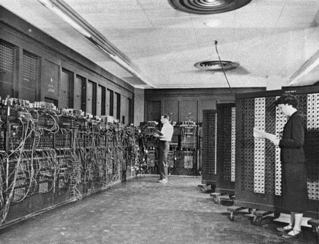
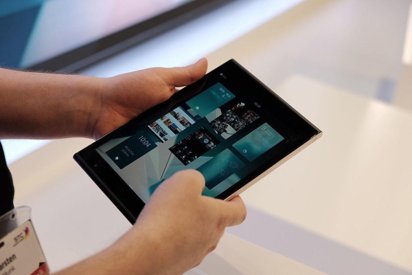
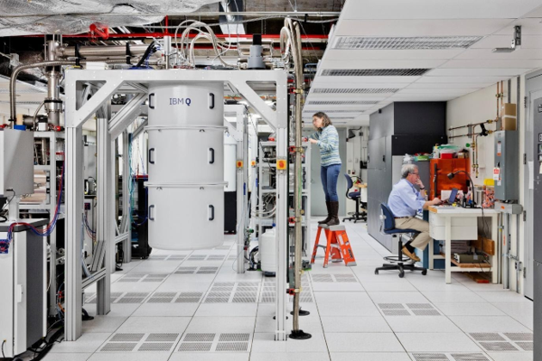
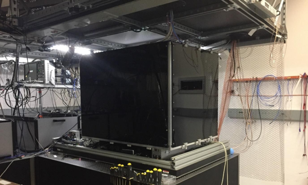
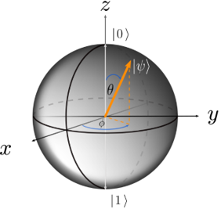

# Introduction to Quantum Computing

## Pre-Read

- [Financial Times](https://www.ft.com/content/b2f1c0ea-e4ff-11e7-a685-5634466a6915)

The Financial Times article discusses how early investors in quantum computing are beginning to see benefits from their investments. Quantum computing, which leverages the principles of quantum mechanics to perform computations at unprecedented speeds, is still in its early stages but shows promise for applications like cracking online encryption and modeling new molecules. The article highlights that while full-scale, general-purpose quantum computers are years away, initial systems with tens of quantum bits (qubits) are already available for researchers. Organizations like Los Alamos National Laboratory are using these early quantum machines for real-world problems, such as analyzing the electronic structure of materials. The article also mentions that companies like Microsoft and Google are making strides in quantum computing development, with potential near-term benefits like improving classical computing algorithms and developing hybrid quantum-classical algorithms.

- [Science.org](https://www.science.org/content/article/after-years-avoidance-department-energy-joins-quest-develop-quantum-computers)

The article from Science discusses how the U.S. Department of Energy (DOE) has decided to join the race to develop quantum computers after years of hesitation. While companies like Google are working towards achieving "quantum supremacy," the DOE is focusing on practical applications of quantum computing in fields such as chemistry, materials science, nuclear physics, and particle physics. The DOE has launched a $40 million initiative to develop useful quantum computing algorithms and has established testbeds at national laboratories to facilitate this research.

## Brief Introduction

Quantum computers are not simply smaller and faster versions of today's computers. Rather, they represent a fundamentally new paradigm for processing information. They have the potential to exceed the performance of conventional computers in relation to problems of importance to humankind and organizations alike, in areas such as:

- Cybersecurity
- Materials science
- Chemistry
- Pharmaceuticals
- Machine learning
- Optimization

In this program, you will learn about this promising new technology, exploring questions such as:

- What is a quantum computer?
- How are quantum computers different from conventional computers?
- What types of problems are hard for classical computers but can be efficiently solved with a quantum computer?
- When can we expect a quantum computer to become available, and what might it look like?

Throughout the program, you will be introduced to new concepts and vocabulary. Please make use of the online forum to discuss these concepts with your peers and enhance your learning experience.

## Origins of Quantum Computing

The development of classical computers didn't jump directly from the vacuum tube to laptops and smartphones. Commercial demand for intermediate products throughout the 1900s incentivized organizations to develop and advance the technologies that led to the ubiquitous classical computers we have today. Early examples of some “off-ramp" products include:

- **Three terminal triode vacuum tube**: Invented by Lee de Forest in 1906. It was used as amplifiers for radio receivers. It could also be used as on/off switch for logic gates.
- **Electronic Numerical Integrators and Computers (ENIAC)**: Discovered in 1940s
- **Radar**:  Before being replaced by transistors, vacuum tubes were used to modulate radar signals.
- **Frequency mixers**:  Some of the first research on transistors developed out of an attempt to build frequency mixers for radio receivers during World War II. This was the starting point for Bell Labs’ work on transistors.
- **Transistor radios**:  The development of the bipolar junction transistor led to the creation of transistor radios sold by organizations like Texas Instruments, I.D.E.A., and Sony. Unlike vacuum-tube radios that could not output sound while the tubes were warming up, transistor radios could turn on an output sound immediately.
- **Amplifiers**:  Transistors were used (and are still used today) in all manner of products requiring electrical amplification, including sound speakers, hearing aids, radios, and telephones.

> While the first three-electrode (triode) vacuum tube was invented by Lee de Forest in 1906, the first electronic computer, ENIAC, was constructed around the year 1943.
>
> The transistor was invented in 1947. The first transistor-based computer, TX-0, was developed in the early 1950s; however, it used discrete transistors and a magnetic core memory. The first commercial integrated circuits of the type you know today, such as the Intel 4004 and the Intel 8008, arrived in the 1970s.

Considering these technologies, it will be challenging to sustain intense commercial interest and funding for quantum computing technology development if the first useful quantum computer is a million-qubit fault-tolerant machine that is still 20-30 years in the future. There is a need for nearer-term commercial applications of quantum information technologies to seed and maintain the virtuous cycle of technology development needed to realize large-scale quantum computers. Some of these quantum information technology “off-ramp" applications could be, for example:

- **Noisy, intermediate-scale quantum simulation**:  Small, error-prone quantum computers may be useful in simulating small-scale quantum systems — perhaps as coprocessors to classical computers. You will learn more about quantum simulation later in the program.
- **Noisy, intermediate-scale optimization**:  Noisy, error-prone quantum computers may also be applied to optimization or classification problems. You will learn more about such problems later in the program.

For more examples of noisy, intermediate-scale quantum applications of quantum computing, please see [this paper](https://arxiv.org/pdf/1801.00862.pdf) by Caltech physicist John Preskill.

In addition, the various components needed to build these quantum systems will likely generate new business opportunities and expand existing ones. For example, the optics, electronics, refrigeration, software, and other services are likely to be dual-use; these products will benefit from the enhancements required for quantum computing and support customers with applications beyond quantum computing.

## Historical perspective

Classical computers have changed dramatically over the past 80 years, from the room-filling vacuum tube-based computers like ENIAC, to the tablets and phones people use today.

Let’s see what a quantum computer looks like.

Currently, quantum computers are at the research and prototyping stage, looking more like an ENIAC than like a laptop or tablet. They often occupy an entire laboratory space that contains a variety of machines and tools to house and operate the core of the computer. A portion of this infrastructure is necessary to shield the computer from sources of electromagnetic noise, mechanical vibration, heat, and other types of noise that tend to degrade performance. Another portion of the infrastructure, comprising conventional classical computers, electronics, and optical systems, is used to control the quantum computer, implement algorithms, and read out the results.

In the picture above, you see a large research-grade dilution refrigerator used to house and cool a prototype superconducting quantum processor. Refrigeration is required to cool the quantum chip to its operating temperature of less than 20 millikelvins, a temperature more than 100 times colder than outer space. The refrigerator also serves to reduce the thermal load and noise that would otherwise degrade performance, arising in large part from the room-temperature electronics connected to the chip through various types of electrical cabling (keyword: Johnson noise). To the left of the refrigerator are racks of such electronics, including arbitrary waveform generators, microwave signal generators, and current sources used to control the processor.

In the picture below, you see an optical table supporting a large, black box that houses the optical system used to control and measure a trapped ion quantum computer. The trapped ion computer core itself resides in an ultrahigh vacuum chamber to isolate the atomic qubits from outside disturbances at pressures around 10-9Pa — 15 orders of magnitude below atmospheric pressure. The ion trap itself can be operated at room temperature or even above, while the ions confined in it will be cooled with lasers to a temperature of around 0.5 millikelvin. Most breakthrough results have been achieved in similar settings, but more often, ion traps are now getting coupled to standard cryogenic systems at a temperature of around 3-4 kelvins — similar to that of outer space — that are used to further enhance the ultrahigh vacuum environment and reduce voltage noise in the electrodes. Especially when scaling up the size of trapped ion systems, cryogenics become a requirement.

There are many different technology implementations used to build quantum computers. Let's in detail the two most promising approaches in use today: superconducting quantum computers and trapped ion quantum computers.

## Physical and Conceptual Models of Classical Computation

To understand quantum computing, you first need to understand how information is processed today and, more generally, what constitutes a computer and computation.

The most common approach to classical information processing today uses a conventional electronic computer comprising a memory and a transistor-based computational processing unit. However, this is not the only physical manifestation of a classical computer. For example, human beings and our brains process information with different physical methods and architectures. In fact, as these two examples suggest, there are many physical models of classical computation. Let's review a few of them.

### Physical Models of Classical Computation

#### Mechanical

A computational system built from primarily mechanical components is a mechanical computer. Adding machines used for bookkeeping during the first part of the last century are an example of such computers. Their input system is composed of numbered key buttons. After entering the required numbers, a user pulls a crank, gearwheels start turning, and the sum is mechanically computed and displayed. As in the case of an adding machine, mechanical computers are generally designed to implement application-specific tasks.

#### Electrical

Electrical computers use electrical elements that switch electrical currents or voltages on or off. Today's personal computers are in this class, and they use transistors as their fundamental switching elements. Transistors enable the construction of universal classical computers that can tackle any computable problem, although they may not be able to do so efficiently (in a reasonable amount of time and/or using a reasonable amount of physical hardware).

#### Optical

Systems that use photons — the fundamental particles of light — to perform computation are optical computers. Gates used to perform logic with photons can be engineered using nonlinear optical materials. As of today, existing optical computers tend to be application-specific. Here are some examples:

- Optical Correlators: These devices are used for pattern recognition and image processing. They can detect and track objects by comparing input patterns with stored templates1.
- Synthetic-Aperture Radar (SAR): Optical computing principles are applied in SAR systems for high-resolution imaging, often used in satellite and aerial imaging.
- Optical Transistors: These are the optical equivalents of electronic transistors and are used to create optical logic gates. They manipulate light beams to perform logical operations1.
- Optical Data Storage: Devices like CDs, DVDs, and Blu-ray discs use optical technology to read and write data using laser light.
- Optical Neural Networks: These networks use light to perform computations similar to the way neurons in the brain process information, potentially leading to faster and more efficient AI systems.

#### Biological

Biological molecules, for example proteins or DNA, can also be used to process information. The individual necessary elements of a fully operational biological computer, such as biological transistors, have been demonstrated in the past. However, the present biological computational systems are hybrids that require the addition of electrical or mechanical components to operate.

There are also several conceptual models and architectures of classical computation that, in principle, can use any of the above physical systems to process information. Let's review some of these as well.

### Conceptual Models and Architectures of Classical Computation

#### Turing Machines

A Turing machine comprises a memory tape and a read/write head. The memory tape is divided into discrete cells that store data. The cells are successively manipulated by the head. A cell's data may be altered, depending on the cell's prior information, according to a set of rules that is also accessible by the head. This scheme provides an architecture to construct universal computational systems.

#### Cellular Automations

A cellular automaton comprises an array of cells, each connected to several of its neighboring cells. After the cells are set to initial values, the cellular automaton evolves over time, according to a set of rules that governs how the state of each cell changes in response to the states of its neighboring cells. Depending on the rules and connectivity of the cells, the result may be a uniform, oscillating, chaotic, or other complex pattern. This computational concept is used to simulate or mimic the behavior of biological or chemical systems; for example, where a global function emerges from a large number of seemingly independent agents that interact with one another in a specified way.

#### Von Neumann Architecture

Architectures comprising a central processing unit and a memory unit are called von Neumann architectures. The central processing unit contains a controller, an arithmetic logic unit, and a set of registers. The controller manages the computational processes; it requests data from the memory, stores it in a register, directs the arithmetic logic unit to process it, and then sends the result back to the memory. This model is used for most present-day computational devices.

## How is Quantum Computer different?

In transistor-based classical computers, a transistor represents a binary classical bit that can store one bit of information. Classical bits are found in one of two distinct logical states: logic state $0$ or logic state $1$. State $0$ corresponds to the transistor switch being off (e.g. ,  no voltage is applied to the transistor gate, so no current flows in the transistor channel), and state $1$ corresponds to the transistor switch being on (e.g., a voltage is applied to the gate, so a current flows through the transistor channel). These discrete states are robust and can be measured with near certainty.

The fundamental elements of quantum computers are qubits. Qubits are two-level quantum mechanical systems. They are binary in the sense that they can be initialized in classical states $0$ or $1$. However, as quantum mechanical objects, qubits can also be prepared in a quantum superposition state, a  single quantum state  that embodies aspects of both state $0$ and state $1$.

Quantum superposition states are succinctly represented using Dirac notation. In this notation, quantum states are expressed as “kets," where  $|0⟩$  and  $|1⟩$  represent the quantum states $0$ and $1$, respectively. **A qubit that is in a superposition of these two states** is then written as  $|ψ⟩ = a|0⟩ + b|1⟩$. The coefficients $a$ and $b$ are called probability amplitudes, and they are related to the relative weighting of the two states in the superposition. An obvious special case occurs when either is zero, in which case the state  $|ψ⟩$  is no longer in a superposition. For example, if  $a = 0$ , then  $|ψ⟩ = |1⟩$ . More generally, both  a  and  b  can be complex numbers and, therefore, must satisfy  $|a| 2 + |b| 2 = 1$ , a normalization to unity that ensures that the weights being compared are of a standard, consistent size. This is analogous to the convention that probabilities are set to sum to $1$.

Both classical and quantum bits can be visualized on a Bloch sphere, a tool that can be thought of as the planet Earth, as pictured below. By convention, the north pole of the sphere represents state zero, and the south pole represents state 1. A classical bit is either at the north pole or the south pole but nowhere else. In contrast, a qubit may exist anywhere on the surface of the sphere. When the qubit state is anywhere  except  for the north or south poles, it is in a superposition state.

To better illustrate the connection between the state of a qubit and the Bloch sphere, the coefficients of the state $|ψ⟩$ can be expressed as $|ψ⟩ = cos(θ/2)|0⟩ + eiϕsin(θ/2)|1⟩$. It is a straightforward exercise to confirm that these coefficients satisfy the normalization condition mentioned above. The two angles $θ$ and $ϕ$ determine the point on the surface of the Bloch sphere corresponding to the state $|ψ⟩$, as pictured below. These angles relate back to the globe above because $θ$  moves the state  $|ψ⟩$  in the north-south direction and corresponds to the qubit’s latitude, while $ϕ$  moves the state along the east-west direction and corresponds to its longitude.

The ideal projective measurement of a qubit occurs along a  single  axis of the Bloch sphere; for example, the z-axis (which would be the line connecting the north and south poles of the globe). This is called the measurement basis, and such a measurement will yield a classical result — either state 0 or state 1 along the axis. The measurement process itself is probabilistic, and the probability of obtaining either  $|0⟩$  or $|1⟩$ is related to the projection of the qubit onto the measurement basis. As an example, consider when the qubit is an equal superposition of states $|0⟩$ and $|1⟩$. This occurs whenever $θ = π/2$ and corresponds to the states along the equator of the globe. In these cases, the state, when measured along the z-axis, is equally likely to result in the outcome $|0⟩$ or $|1⟩$ because their probability amplitudes are the same. Logically, any point on the equator, when projected onto the z-axis, is at the center of the globe, equally far from the north and south poles.

> On the Bloch sphere, the z-axis runs from the south to the north pole of the sphere. Axes x and y are perpendicular to one another in the plane of the equator of the sphere. The north pole corresponds to state $0$, and the south pole corresponds to state $1$. The equator corresponds to equal superposition states. $\frac{(|0> + |1>)}{sqrt(2)}$ is at the surface of the sphere in the +x direction. $\frac{(|0> - |1>)}{sqrt(2)}$ is at the surface of the sphere in the -x direction.

As a result, quantum computers rely on encoding information in fundamentally different ways than classical computers. For $N$ bits, there are $2^N$ possible classical states. However, a classical computer can represent only one of these $N$-bit states at a time. Processing multiple $N$-bit states can either be performed sequentially or in parallel, using additional copies of the hardware. This is called classical parallelism. In contrast, the qubits in a quantum computer can be set into a single superposition state that may simultaneously carry aspects of all $2^N$ components. So, in quantum computing, 3-qubit can represent aspects of all of 8 different states components simulataneously in a single quantum superposition state (a quantum version of parallelism) with in 8 possible quantum interferences between them. This enables two uniquely quantum mechanical effects: [quantum parallelism and quantum interference](quantum_parallelism_interference.md), which makes quantum computing different.

## Superconducting Quantum Computers

## Trapped Ion Quantum Computers
