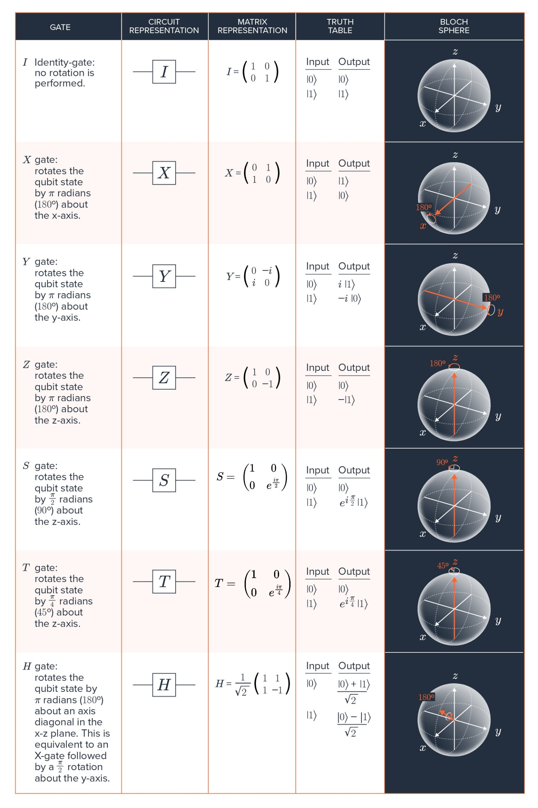
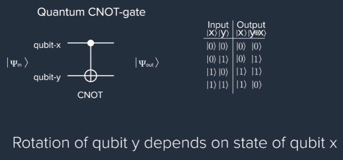

# Quantum Gates

## Classical Gates

Classical computers perform arbitrary Boolean logic with a small set of single-bit and two-bit logic gates. This [document](GATE.pdf) introduces several examples of single-bit and two-bit gates. The subsets of these gates form a universal gate set. The NOT gate (a single-bit gate) in conjunction with the AND gate (a two-bit gate) is one example of a universal gate set. Such a universal gate set can, in principle, implement any arbitrary classical algorithm based on Boolean logic.

The table in the document introduces a set of single-bit and two-bit Boolean logic gates. Logic gates perform Boolean functions on the inputs to yield an output. The second column shows the graphical symbols used to represent the gates introduced in column one. The third column shows the truth tables for these gates. The truth tables comprise all possible combinations of the input states, $2^1$ for single-bit gates and $2^2 = 4$ for two-bit gates, and the corresponding output states.

The most basic Boolean logic gate is the NOT gate, a single-bit gate that inverts the input bit, $logic\ \bold{0} \rightarrow logic\ \bold{1}$, and vice versa. Single-bit gates alone are insufficient to form a universal gate set; universal computation requires some form of logical operation on multiple bits, such as a two-bit gate.

The table presents six two-bit Boolean logic gates. The AND gate outputs a $logic\ \bold{1}$ only if the two inputs are both in the $logic\  \bold{1}$ state. A NAND gate is an inverted AND gate, that is, an AND gate followed by a NOT gate. The OR gate outputs a $logic\ \bold{1}$ if at least one input bit is $1$. The NOR gate is an OR gate followed by a NOT gate. The XOR gate outputs a $logic\ \bold{1}$ only if the two input bits differ. An inverted XOR gate, an XOR gate followed by a NOT gate, is called an XNOR gate and outputs a $logic\ \bold{1}$ if the two input bits are the same.

As these six two-bit gates foretell, gates are not unique and can be generated using combinations of other single-bit and two-bit gates.

## Quantum Gate

Universal quantum computing is performed using a small set of single-qubit and two-qubit gates. The table below introduces several single-qubit gates used in the circuit model of quantum computation.

### Single Quibit



The first column of the table introduces the gates and a short definition of their actions. The second column shows their graphical representation, and the third column shows their corresponding matrix representation. The fourth column provides the truth table for the input states |0⟩ and |1⟩. The last column indicates the rotation the gates perform on the Bloch sphere. Let’s examine the I, X, Z, and Y gates to gain a sense of how single-qubit gates work in general.

* The first gate is an identity gate, an operation that does not alter the input state and is used to represent a lossless quantum channel. It is represented by the identity matrix:
  * $I|0⟩=(1001)(10)=(10)=|0⟩$
  * $I|1⟩=(1001)(01)=(01)=|1⟩$
  * There are two facts to note here. First, we use operator notation to mathematically represent the application of a gate operation on a qubit state. For example, the identity operation applied to qubit state |0⟩ is written as I|0⟩. You may sometimes see a “hat" added to an operator (e.g., I^) to make its role clear. The operator and state can then be replaced by the corresponding matrix and vector, respectively, to calculate the action of the gate. Second, note that the identity operator leaves the state of the qubit unchanged.

* The X gate can be visualized as performing a rotation around the x-axis on the Bloch sphere. As discussed previously, the X gate is the quantum analog of the classical NOT gate. See below how the X gate acts on states |0⟩ and |1⟩:
  * $X|0⟩=(0110)(10)=(01)=|1⟩$
  * $X|1⟩=(0110)(01)=(10)=|0⟩$
  * The X gate is said to perform a bit flip because the qubit states |0⟩ and |1⟩ are flipped to |1⟩ and |0⟩, respectively. As you saw in Video 15.6, more generally, the X gate swaps the probability amplitudes in a quantum state as $X(α|0⟩ + β|1⟩)→β|0⟩ + α|1⟩$.

* The Z gate adds a phase of -1 to the |1⟩ state and leaves |0⟩ unchanged.
  * $Z|0⟩=(100−1)(10)=(10)=|0⟩$
  * $Z|1⟩=(100−1)(01)=−(01)=−|1⟩$
  * Although the net result is to multiply state |1⟩ by -1, the language “adds a phase" is often used. The terminology arises from the fact that the Z gate will rotate a state around the z-axis by π radians (180 degrees). Phases are additive, so applying a π phase shift to a starting phase ϕ0 results in $ei(ϕ0+π) = eiϕeiπ = -eiϕ$. Thus, adding a phase in the exponent leads to a factor $eiπ = -1$.

* The Y gate is a rotation around the y-axis by π radians (180 degrees). This operation may also be written in terms of the X gate, the Z gate, and a global phase. That is, the Y gate may be viewed as performing both a bit flip and a phase flip as well as introducing a global phase factor of i:
  * $Y=iXZ=i(0110)(100−1)=(0i−i0)$
  * Applying the Y gate to qubit states |0⟩ and |1⟩ yields
    * $Y|0⟩=(0i−i0)(10)=(0i)=i|1⟩$
    * $Y|1⟩=(0i−i0)(01)=−(i0)=−i|0⟩$

* Rotations around the z-axis by an arbitrary angle $\phi$ cause state $|1⟩$ to acquire a phase $ei\phi$ and leave state $|0\rangle$ unaffected. Rotations around the z-axis by the specific angles $π/2$ and $π/4$ are referred to as the $S$ gate and $T$ gate, respectively.

* Finally, the Hadamard gate (H gate) induces a $π$ rotation around an axis exactly in between the x-axis and z-axis of the Bloch sphere. For example, it takes states located on the z-axis and rotates them onto the x-axis, creating equal superposition states $H|0⟩ = \frac{(|0\rangle + |1\rangle)}{\sqrt{2}}$ and $H|1⟩ = \frac{(|0\rangle - |1\rangle)}{\sqrt{2}}$.

Lets look at X Gate in more detail

#### X Gate

The quantum analog of a NOT gate is the X gate. A NOT gate inverts its input ($NOT\ 0→1$, and $NOT\ 1→0$ ). Similarly, the X gate would swap states $|0⟩$ and $|1⟩$. The swap can be visualized on the Bloch sphere as a 180-degree rotation around the x-axis (this is why it is called an X gate) since we are applying the pulse across it. Because the rotation is 180 degrees, the signal you send to the qubit to perform an X gate is referred to as a $π$-pulse. In general, the X gate can be applied to any arbitrary quantum superposition state, and it acts to swap the probability amplitudes on the states $|0⟩$ and $|1⟩$: It is can be denoted as $(α|0⟩+β|1⟩) \ -> X gate \ -> (β|0⟩+α|1⟩)$

In addition to the X gate, one may rotate the qubit state around the y-axis or the z-axis. A  $π$-rotation around the y-axis is called a Y gate, and a  $π$-rotation around the z-axis is called a Z gate.

Not all classical gates have a direct quantum analog. This is because quantum circuits must be  reversible. In a reversible circuit, one can exactly reconstruct the input state(s) given the output state(s). For example, a NOT gate is reversible because, given the output 0/1, you know the input was  1/0. However, the AND gate is not reversible because, for example, given the output 00, you can't tell if the input had been  00,  01, or 10. The reason quantum circuits have to be reversible has to do with the fact that coherent quantum states ideally always undergo unitary evolution, so a quantum gate can be undone by applying the inverse of that unitary evolution.

### Two-Quibit Gate

https://classroom.emeritus.org/courses/10190/pages/two-qubit-gates?module_item_id=1863521

Two-qubit gates are unitary quantum operations on two qubits. When these gates cannot be written as the product of two single-qubit gates, they are called entangling gates. They may also be controlled or conditional gates. The word controlled arises from the conditional implementation of these gates, in which a unitary operation U is conditionally applied to a target qubit, depending on the state of the control qubit. A two-qubit controlled gate, denoted here as UcA,B, with the first qubit as control (A) and the second qubit as target (B), can be written in Dirac notation as

UcA,B=|0⟩⟨0|A ⊗IB+|1⟩⟨1|A⊗UB,

where IB and UB are single-qubit operations applied to qubit B, depending on the state of qubit A. If qubit A is in state |0⟩, then the identity operation is applied to qubit B, and its state remains unchanged. However, when qubit A is in state |1⟩, the unitary single-qubit operation UB is applied to qubit B:

|0⟩A⊗|0⟩B→|0⟩A⊗IB|0⟩B
 
|0⟩A⊗|1⟩B→|0⟩A⊗IB|1⟩B
 

|1⟩A⊗|0⟩B→|1⟩A⊗UB|0⟩B
 
|1⟩A⊗|1⟩B→|1⟩A⊗UB|1⟩B

 

The specific operation UB depends on the type of the two-qubit gate.

In quantum circuits, a controlled gate is indicated by a vertical line that connects two qubits; the control qubit is indicated by a solid black circle, and the target qubit is indicated by a symbol representing single-qubit unitary operation U that is conditionally applied, as shown in the circuit below.

Two-Qubit Gates.png

Note that the roles of the target and control qubits may be swapped. A controlled unitary gate, UcB,A, with B as the control qubit and A as the target qubit, is denoted as

UcB,A=IA⊗|0⟩⟨0|B +UA⊗|1⟩⟨1|B,

where IA represents the identity gate operating on qubit A, and UA is the single-qubit gate that operates conditionally on qubit A. The quantum circuit of this controlled gate is shown in the following figure.

Two-Qubit Gates.2.png 

Two common examples of conditional gates are the controlled-phase gate (CZ gate) and the CNOT gate (also called the CX gate). Both gates take their name from the single-qubit operation U that is conditionally applied to the target qubit.

In the case of the CZ gate, the conditional single-qubit operation is the Z gate. The word phase refers to the phase factor (expiπ = -1) that results from the application of the Z gate on state |1⟩:

Z|0⟩=|0⟩

Z|1⟩=−|1⟩

If qubit A is the control and qubit B is the target, the CZ gate can be written in Dirac notation as

ZcA,B=|0⟩⟨0|A ⊗IB+|1⟩⟨1|A⊗ZB,

and its quantum circuit looks like this:

Two-Qubit Gates.3.png 

In the case of the CNOT gate, the single-qubit operation is the X gate. The word NOT comes from the effect of the X gate on the states |0⟩ and |1⟩:

X|0⟩=|1⟩

X|1⟩=|0⟩

If qubit A is the control and qubit B is the target, the CNOT operator and its corresponding quantum circuit are

CNOTA,B=|0⟩⟨0|A ⊗IB+|1⟩⟨1|A⊗XB.

Two-Qubit Gates.5.png 

Similarly, if the role of the control and target qubits are interchanged, the CNOT operator and its quantum circuit are

CNOTB,A=IA⊗|0⟩⟨0|B +XA⊗|1⟩⟨1|B,

Two-Qubit Gates.6.png 

A CNOT gate can be implemented using a Z gate by applying a Hadamard gate (H) before and after a Z gate, since X = HZH. The figures below represent this identity.

Two-Qubit Gates.7.png 

The table below shows a summary of the two controlled gates, CZ and CNOT. Note that the subindexes A and B in cZA,B are usually omitted. In their absence, it is generally assumed that the first qubit is the control qubit, and the second qubit is the target qubit. This is not only true for the cZ gate but also for the controlled unitary gate (cU) and the CNOT gate.

TwoQubit.png  

It is worth emphasizing that during the implementation of these two qubit gates, at no point a measurement is made. Any superposition state in the control persists and gets transferred to the target in the form of having the X or Z gate enacted and not enacted. This is the key that allows for the creation of entanglement.

### CNOT

There is a quantum analog to the classical exclusive OR gate (XOR gate) called the controlled NOT gate (CNOT). The CNOT gate is a conditional gate comprising two qubits: a control qubit and a target qubit. **When the control qubit is in state $|0⟩$, the target qubit remains unchanged. However, when the control qubit is in state $|1⟩$, an X gate is applied to the target qubit, and it undergoes a $π$-rotation around the x-axis of the Bloch sphere**.



Consider an interesting example where the control qubit (x) is in an equal superposition of $|0⟩$ and $|1⟩$, and the target qubit (y) is in state $|0⟩$:

$|\Psi_{in}⟩ \propto (|0\rangle + |1\rangle)_x |0\rangle_y$

$|\Psi_{out}⟩ \propto |0\rangle_x |0\rangle_y + |1\rangle_x |1\rangle_y$

```FIX
12−√(|0⟩+|1⟩)⊗|0⟩−→−−−CNOT12−√(|0⟩⊗|0⟩+|1⟩⊗|1⟩)

(Note: We are introducing tensor notation, where  |x⟩⊗|y⟩  indicates a two-qubit state with the first qubit in state  |x⟩ and the second qubit in state  |y⟩ . Occasionally, we may drop the ⊗ and write a two-qubit state as simply  |x⟩|y⟩ .)
```

The resulting output state is remarkable because it is no longer separable into two single-qubit components, such as (…) x ⊗(…) y (x and y components are separated). This is known as an **entangled state**, and it is a manifestly quantum mechanical state.

[Universal quantum computation](Universal_Algorithms.md) can be built from a small subset of these types of single- and two-qubit gates. A universal gate set enables us to perform any type of algorithm — quantum or classical — on a gate model quantum computer. However, universality does not imply quantum advantage. There are many algorithms that can be implemented on a quantum computer but feature no quantum advantage.
