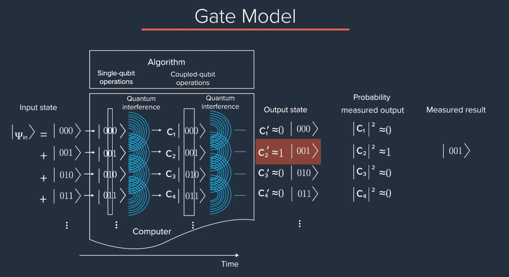

# Universal Quantum Algorithms

The power of a universal computer is that it can implement any algorithm that can be expressed in terms of a circuit comprised of logical gates. A universal, **fault-tolerant quantum computer** (explained [here](#how-a-universal-algorithm-works) is such example) will enable people to program, implement, and reliably run arbitrarily complex quantum algorithms. In fact, a universal quantum computer can run any type of algorithm — quantum or classical. Determining when it is advantageous to implement an algorithm on a quantum computer (as opposed to a classical computer) is one of the principal aims of quantum information science.

The study of how efficiently a computer, whether a classical or a quantum one, can solve a given problem results in the formal segregation of algorithms into what are called computational complexity classes. This efficiency is determined based on how the computational resources needed to solve a problem grow or scale with the size of the problem instance; for example, how the size of the memory or the number of computational steps scales in accordance with the problem size.

Two important computational complexity classes are $P$  and $NP$. An example of a problem in $P$ is the multiplication of two numbers of length `n` that requires  $n^2$  time steps to complete. For example, this means that multiplying the binary numbers `01`  and  `10` requires four time steps, since each number has `n = 2`  digits, but multiplying `100` and `110` requires  nine time steps, since `n = 3`  for these numbers. This time scaling, and any time scaling of `a×n b`  where both `a` and `b` are constants, is referred to as polynomial scaling and is considered efficient.

These problems should be compared with those in the complexity class $NP$, where the time required to solve a problem is exponential in the number of problem inputs and is, therefore, not considered to be efficiently solvable. An example of such a scaling would be $2^n$.

One common point of confusion is that time steps required to solve both $P$ and $NP$  problems can be comparable for small `n`. For example, when  n = 1, 2, 3 , the given polynomial scaling requires time steps of $n^2 = 1, 4, 9$, as compared to the exponential scaling that requires  $2^n = 2, 4, 8$ time steps. However, as `n` increases, these two scalings rapidly diverge, and this is why they are categorized into different complexity classes. Considering `n = 10`, these two scalings are already an order of magnitude apart, with  $10^2 = 100$ and $2^10 = 1024$. Go to `n = 100` and  $100^2 = 10,000$, whereas $2^{100} > 1×10^{30}$  — that is,  10  followed by  30  zeros. That is the power of exponential scaling.

Finally, it is important to note that problems are classified into these categories based on the best-known algorithm for solving them and are, therefore, subject to change as new discoveries are made.

One of the main reasons for the current interest in quantum computers is that certain problems can be solved in polynomial time on a quantum computer even though the best-known classical algorithm for the same problem requires  exponential or subexponential time. This is what is referred to as quantum advantages (Quantum speed up).

A prominent example of this speed up is Shor's algorithm. Shor's algorithm effectively factors large integer numbers into two constituent prime numbers, a computationally hard task for classical computers. The difficulty of factorization is one reason it is used as the foundation for public key cryptography, for example,  RSA  encryption. Even using the best-known classical algorithm, the resources required to break RSA encryption using a classical computer increase subexponentially with the length of the public key, and hence, the problem is considered to be in NP  (although it has not yet been formally proven to be NP). Practically, this means that the doubling of the number of bits in an RSA encryption key makes it almost exponentially more difficult for a classical computer to break the scheme. In contrast, Shor's algorithm can perform the same task efficiently on a quantum computer, with only a marginal increase in difficulty as the length of the key increases.

For an integer `N`, the specific runtime for Shor's algorithm scales as  $(logN)2$ and the fastest classical algorithm, the (randomized) general number field sieve, scales as $e(logN)1/3$ . These are only the leading order contributions. More details can be found here and in this first rigorous analysis of the classical algorithm  published in [2018](https://arxiv.org/abs/1805.08873).

Another such algorithm is [Grover's algorithm](https://en.wikipedia.org/wiki/Grover%27s_algorithm).

## How a Universal Algorithm works?

A quantum algorithm comprises a sequence of single-qubit and two-qubit gates. Quantum parallelism and quantum interference are used by algorithm designers to take an input state — typically a massive superposition state — and, in a step-by-step manner, modify the weighting coefficients (probability amplitudes) until the quantum mechanical state evolves into an output state that encodes the answer to the problem. Since a projective quantum measurement will yield a single, classical state, it is imperative that the algorithm results in a final state that has a probability amplitude near unity such that the measurement will lead to the correct answer.

> The measurement system in quantum computing is probabilistic and leads to a classical result. The probability that we get to this state corresponds to the magnitude-sqrd of that co-efficient (in the above case $C_2'$)
>
> A universal quantum algorithm is implemented using single-qubit and two-qubit gates. An example of a two-qubit gate is the CNOT gate. When implementing a CNOT gate, depending on the input state, it may realize an X gate on the target qubit. This is only if the control qubit is in state |1⟩, the CNOT gate enacts an X gate on the target qubit. If the control qubit is in state 12√(|0⟩ + |1⟩), the CNOT gate creates an entangled state between the two qubits by both flipping and not flipping the target.

## Challenge with Univeral Algorithm

The advantage of the Gate model is that it is universal, meaning it can run any algorithm. Practically, not all algorithms are going to get us quantum speed up, but many will. The challenge lies in making the computer that is both large enough, and operates for long enough to complete an algorithm, even though the qubits itself are prone to errors.

In Quantum computer, each process has a probability of having errors, so we need an algorithm that can compensate for these errors to get an answer reliable enough. These algorithm are called quantum error correction, but it would required additional resources to implement it.
